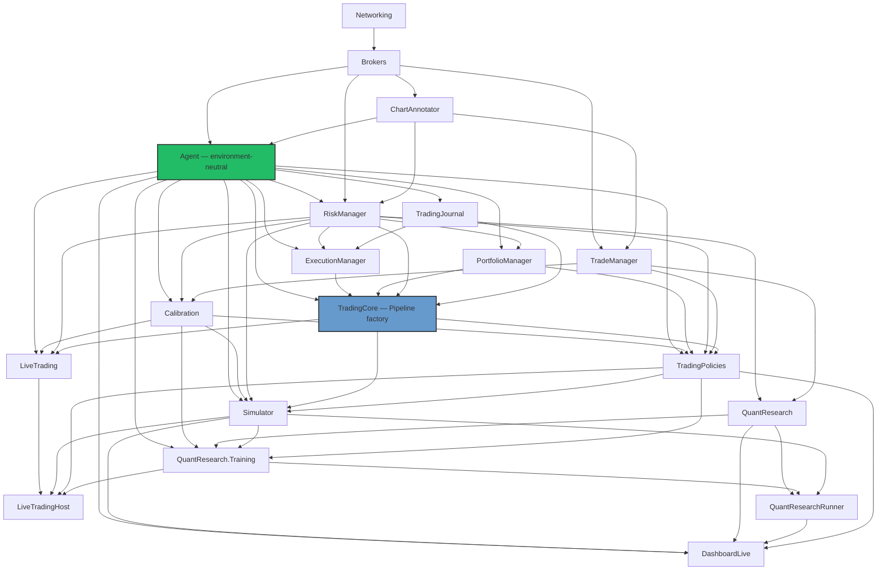
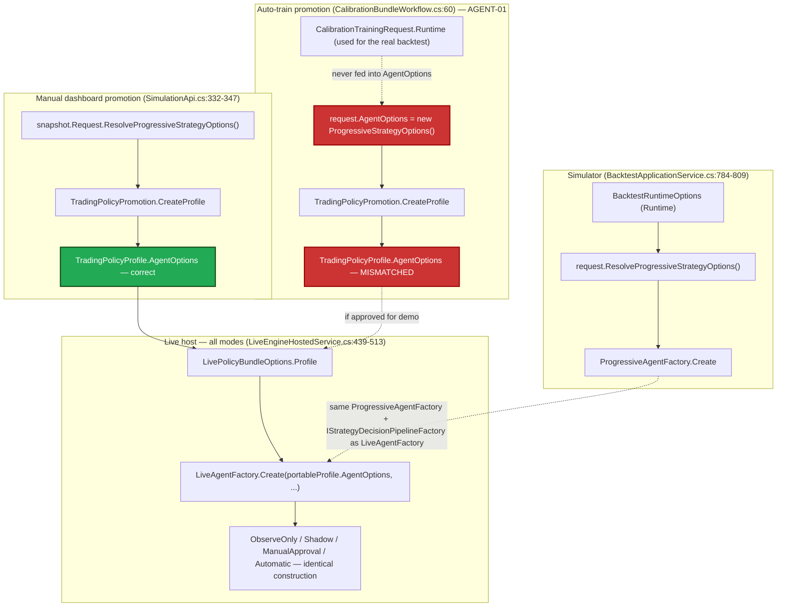
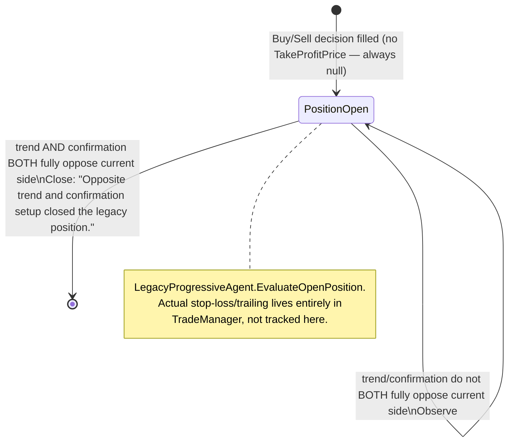
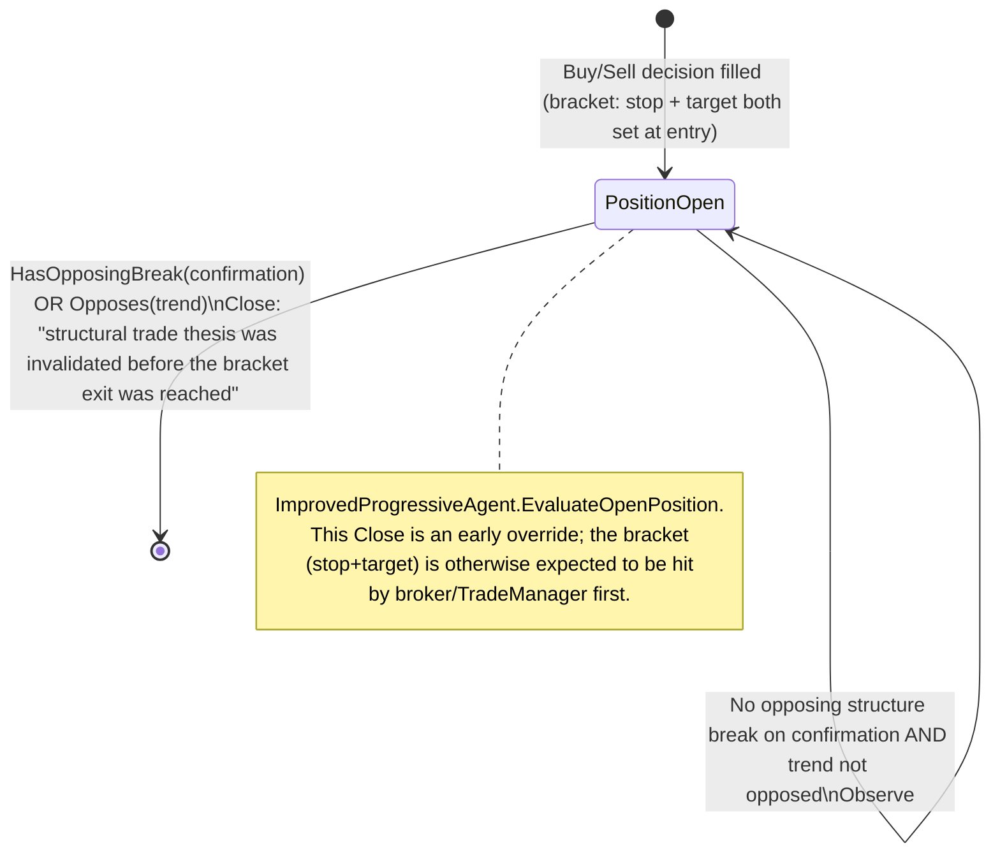
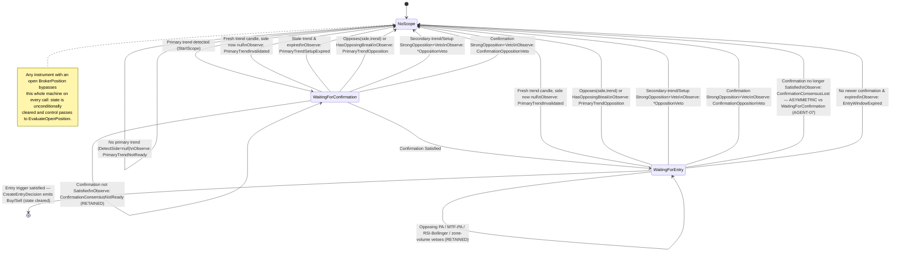
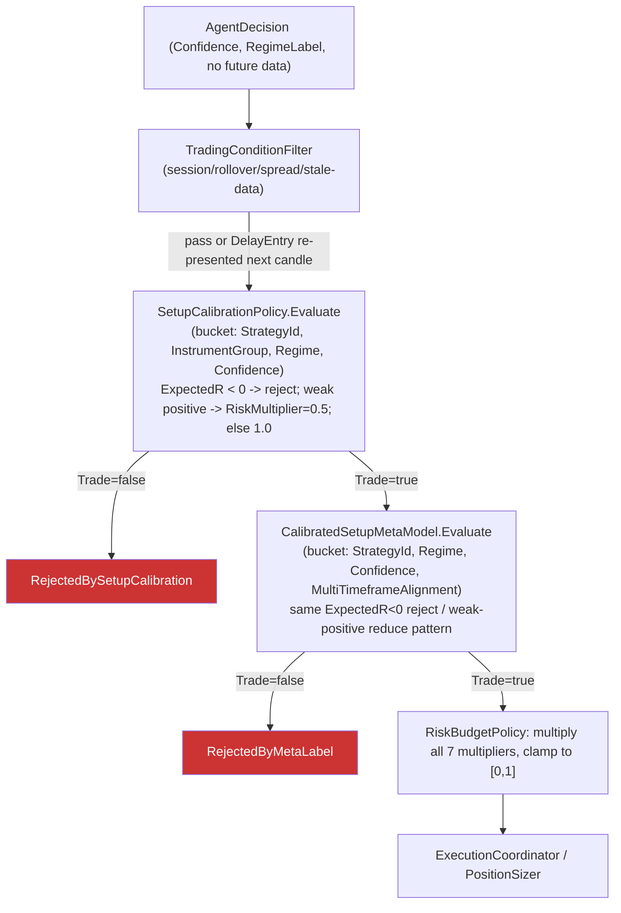
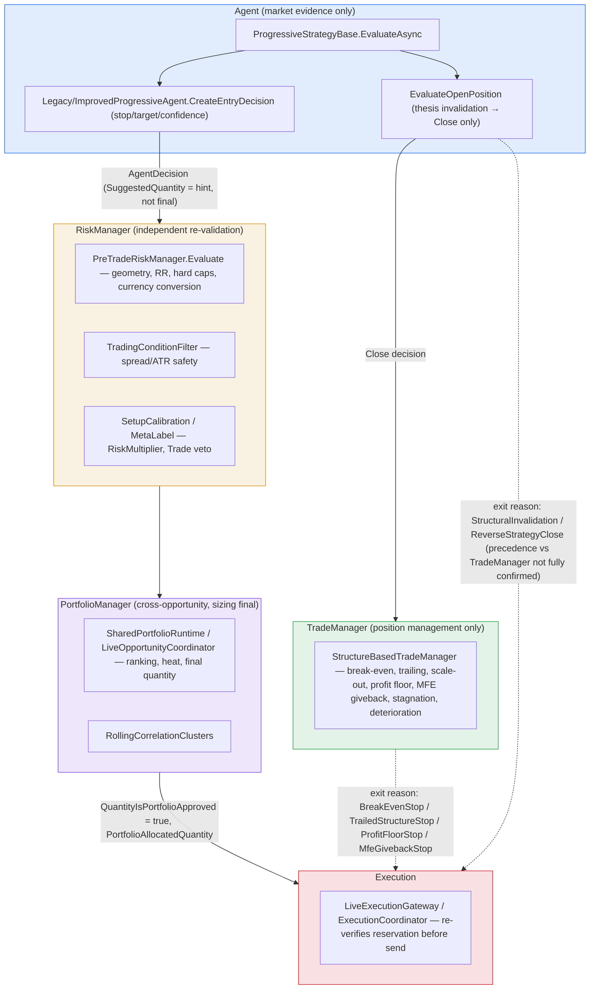

# TradingHub Agent Subsystem — Independent Foundation Audit

**Date:** 2026-07-17
**Scope:** The Agent subsystem and every component directly involved in producing an Agent decision — completed-candle handling → multi-timeframe aggregation → ChartAnnotator → indicators/structure → regime classification → Agent state machine → feature policy → setup calibration → meta-label model → trading-condition filter → neutral trade candidate — plus its boundaries with Simulator, LiveTrading, QuantResearch, RiskManager, PortfolioManager, TradeManager, and ExecutionManager.
**Method:** Direct source tracing against the working tree at `/home/mhn70/RiderProjects/TradingHub` (not documentation, comments, or test names alone), performed via six parallel deep-research passes over disjoint file sets, cross-referenced and reconciled into this report. All findings cite `file:line`.
**Companion document:** `TradingHub_Agent_Subsystem_Audit_Issue_Register_2026-07-17.md` (14 registered issues, ordered by severity).
**Fix-pass update (2026-07-17, same day):** AGENT-01 through AGENT-05 and AGENT-07 through AGENT-12 have been implemented and verified (each with a new deterministic regression test; zero regressions beyond the pre-existing TEST-01 failure). AGENT-06 was deferred at the user's explicit direction pending an offline empirical check. AGENT-13/AGENT-14 remain open. See the issue register for per-issue status and the exact code changes.

---

## 1. Executive verdict

The Agent subsystem's **core decision mechanism is sound**: the state machine is deterministic by construction (pure-function ID composition, no wall-clock/GUID dependency in candidate identity, no `await` inside the core transition method), the Agent project is **structurally environment-neutral** (no compiler-reachable project reference to Simulator, LiveTrading, or any broker-specific project), completed-candle discipline is enforced at multiple independent layers (aggregator, annotation engine, snapshot-availability gates), and the responsibility boundary with RiskManager is genuinely defense-in-depth (RiskManager re-derives geometry/risk/cost checks rather than trusting the Agent's own arithmetic).

However, the audit found **three High-severity defects that materially affect correctness or safety**, all outside the core state machine itself:

1. The newly-built automated calibration-training promotion path bakes bare-default strategy options into promoted policy profiles instead of the options actually used to generate the training data (**AGENT-01**).
2. Live construction does not check the meta-model's own `Enabled` flag, only artifact-ID presence, breaking simulator/live parity for one specific stale-configuration case (**AGENT-02**).
3. Trading-condition protection (session filtering, rollover blackout, spread/ATR gates, stale-data rejection) defaults to **off** everywhere except the one path the Dashboard UI happens to override explicitly (**AGENT-03**).

A fourth High-severity issue is a source-level defensive gap in `LegacyProgressiveAgent`'s stop construction (**AGENT-04**) — currently caught by an independent downstream check, but not safe by construction the way `ImprovedProgressiveAgent` is.

No confirmed lookahead/leakage, no confirmed cross-instrument state contamination, and no confirmed non-deterministic decision path were found — the Critical-severity bar was not met by anything discovered in this pass. The foundation is **conditionally safe to continue building on**, provided the four High-severity issues are fixed first and the Medium-severity findings (feature-policy hash enforcement, calibration/meta-model structural duplication, a state-retention asymmetry, and a diagnostics gap) are tracked for near-term follow-up. See §26 for the full verdict and §24 for the prioritized corrective plan.

---

## 2. Audited source identification

Single source tree, no archive selection ambiguity: the working directory at `/home/mhn70/RiderProjects/TradingHub`, git branch `main`, as it stood on 2026-07-17. No conflicting source archives were attached; this audit worked directly against the live repository.

Prior audit context consulted (not trusted without re-verification): `TradingHub_Independent_Audit_Report.md` / `TradingHub_Independent_Audit_Issue_Register.md` (2026-07-16 general audit, broader and shallower than this pass) — used only to confirm which prior findings (e.g., a meta-model construction bug, a spread-constant unification) had already been fixed, re-verified independently rather than assumed. Every claim in this report was re-derived from source in this pass.

---

## 3. Architecture map

### 3.1 Project layering

Traced from every `.csproj`'s `ProjectReference` graph (18+ projects). The graph is a clean DAG — **no circular dependencies found**.

| Project | References | Notes |
|---|---|---|
| `Brokers` | `Networking` | Leaf. |
| `ChartAnnotator` | `Brokers` | |
| `Agent` | `Brokers`, `ChartAnnotator` | **Structurally environment-neutral** — no reference path exists to `Simulator`, `LiveTrading`, `LiveTradingHost`, `RiskManager`, `TradingCore`, or `Calibration`. This is a compiler-enforced guarantee. |
| `RiskManager` | `Agent`, `Brokers`, `ChartAnnotator` | Downstream consumer of `Agent.Models`/`Agent.Abstractions`. |
| `TradeManager` | `Brokers`, `ChartAnnotator` | Does **not** reference `Agent` directly. |
| `PortfolioManager` | `Agent`, `Brokers`, `RiskManager` | |
| `Calibration` | `Agent`, `RiskManager`, `TradeManager` | Artifact storage/model project. |
| `TradingCore` | `Agent`, `Brokers`, `ChartAnnotator`, `ExecutionManager`, `PortfolioManager`, `RiskManager`, `TradingJournal` | Hosts the shared **pipeline construction layer**. |
| `TradingPolicies` | `Agent`, `Calibration`, `PortfolioManager`, `RiskManager`, `TradeManager`, `TradingCore` | Owns the portable, promoted `TradingPolicyProfile`. |
| `Simulator` | `Brokers`, `Calibration`, `ChartAnnotator`, `Agent`, `RiskManager`, `ExecutionManager`, `TradingCore`, `TradingJournal`, `TradeManager`, `PortfolioManager`, `TradingPolicies` | |
| `LiveTrading` | `Agent`, `Brokers`, `Calibration`, `ChartAnnotator`, `ExecutionManager`, `PortfolioManager`, `RiskManager`, `TradingCore`, `TradeManager`, `TradingJournal` | Notably does **not** reference `TradingPolicies` — deliberate decoupling. |
| `LiveTradingHost` | `LiveTrading`, `LiveTrading.Oanda`, `QuantResearch.Training`, `Simulator`, `TradingPolicies` | Only place `TradingPolicies` and `LiveTrading` meet. |
| `QuantResearch` | `RiskManager`, `TradeManager` | **No reference to `Agent` or `Simulator`** — confirms QuantResearch stays Simulator-free. |
| `QuantResearch.Training` | `Agent`, `Brokers`, `Calibration`, `QuantResearch`, `RiskManager`, `Simulator`, `TradeManager`, `TradingPolicies` | The one place `QuantResearch` touches `Simulator`/`Agent`. |
| `DashboardLive` | `Agent`, `Brokers`, `ChartAnnotator`, `DashboardContracts`, `Networking`, `QuantResearch`, `QuantResearchRunner`, `RiskManager`, `Simulator`, `TradeManager`, `TradingPolicies` | Widest fan-in. |

### 3.2 Core Agent-subsystem components

| Component | File:Line | Responsibility | Mutable state | Thread-safety | Shared sim/live |
|---|---|---|---|---|---|
| `ITradingAgent` | `Agent/Abstractions/ITradingAgent.cs:14-31` | Contract: `EvaluateAsync → AgentDecision`; declares `RequiredIntervals`, `TriggerInterval`, `ExitManagementMode` (no default — every strategy must declare it) | None | N/A | Yes |
| `AgentDecision` | `Agent/Models/AgentModels.cs:16-102` | Immutable output: action, sizing, stop/target, confidence, ~30 diagnostic/provenance fields | Immutable `sealed record` | Safe | Yes |
| `AgentMarketContext` | `Agent/Models/AgentModels.cs:131-143` | Immutable input: instrument, timestamp, `MultiTimeframeAnalysis`, `AccountSnapshot`, positions/orders, optional spread/currency-strength | Immutable | Safe | Yes |
| `ProgressiveStrategyOptions` | `Agent/Strategies/ProgressiveStrategyOptions.cs:25-233` | Immutable configuration: timeframe roles, alignment minimums, confidence thresholds, stop/target ATR buffers, price-action mode, indicator sub-options; self-validating `Validate()` | Immutable | Safe | Yes — identical type feeds both concrete Agents |
| `ProgressiveStrategyBase` | `Agent/Strategies/ProgressiveStrategyBase.cs` (965 lines) | Shared state-machine/evaluation logic for both concrete Agents | `Dictionary<InstrumentKey, ScopeState> _states`, instance field | Safe under the observed "one instance per instrument×strategy" construction discipline (§19) | Base class for both |
| `LegacyProgressiveAgent` / `ImprovedProgressiveAgent` | `Agent/Strategies/LegacyProgressiveAgent.cs`, `ImprovedProgressiveAgent.cs` | Concrete `ITradingAgent`s; differ only in `CreateEntryDecision` and `EvaluateOpenPosition` | Inherited from base | — | Both via one factory |
| `ProgressiveAgentFactory` | `Agent/Strategies/ProgressiveAgentFactory.cs:16-24` | Single authoritative factory: `(ProgressiveAgentKind, ProgressiveStrategyOptions) → ITradingAgent` | Static, stateless | Safe | Yes — sole non-test call sites are Simulator and LiveTrading |
| `IStrategyDecisionPipelineFactory` / `StrategyDecisionPipelineFactory` | `TradingCore/Pipeline/IStrategyDecisionPipelineFactory.cs:13-19`, `StrategyDecisionPipelineFactory.cs:19-58` | Second, higher-level shared construction path — wraps the raw Agent with execution, safety, calibration, meta-model, and trading-condition collaborators into a `SafeTradingPipeline` | Constructed once per session/host | — | Yes — same interface used by Simulator and LiveTrading |
| `RuntimeFeaturePolicy` | `TradingCore/Pipeline/RuntimeFeaturePolicy.cs:20-30` | Declared feature-toggle set; only `SetupCalibration` is functionally consumed by the pipeline factory today — the rest is audit/provenance only (own doc comment, confirmed by tracing, see **AGENT-05**) | Immutable | Safe | Yes |
| `ISetupMetaModel` / `MetaLabelFeatures` / `MetaLabelDecision` | `RiskManager/Calibration/MetaLabel.cs:11-56` | Decision-time-only meta-label inputs/outputs; `MetaLabelFeatureFactory.Create` actively throws on any future-timestamped snapshot | Immutable | Safe | Yes |
| `CalibratedSetupMetaModel`, `SetupCalibrationArtifact`, `MetaModelArtifact`, `ICalibrationArtifactRepository` | `Calibration/*.cs` | Artifact storage/lookup, consumed identically from both environments via the same repository abstraction | — | — | Yes (physical store identity across deployments not independently verified — open question) |
| `TradingConditionFilter` | `RiskManager/Conditions/TradingConditionFilter.cs:5-40+` | Session/rollover/pre-weekend/spread/stale-data gating; hard-throws at construction if economic-event filtering is enabled without a real provider | Stateless per evaluation | Safe | Yes |

### 3.3 Architecture-map flags

- **No circular project dependencies.** Positive finding.
- **`Agent` is compiler-enforced environment-neutral** — no reference path to any environment-specific project. Positive finding.
- **Orphaned dead configuration type** (`LiveAgentStrategyOptions`, **AGENT-09**) documents a construction path that does not exist and is never read.
- **`RuntimeFeaturePolicy` has functionally-inert fields** (**AGENT-05**) — hashed for provenance, not enforced by the shared pipeline factory.
- **Agent decision logic is not duplicated outside the Agent project** — `RiskManager`/`TradeManager`/`Calibration`/`PortfolioManager` consume `Agent.Models` types as downstream collaborators, not by reimplementing entry/exit logic (verified at the project-reference/type-usage level; see §7 for confirmation that TradeManager owns zero entry-decision logic).

### Diagram 1 — Agent subsystem dependency graph



---

## 4. Dependency findings

Summarized from §3: no circular dependencies; `Agent` is structurally isolated from all environment-specific projects; the shared `IStrategyDecisionPipelineFactory` correctly prevents the class of "each caller builds its own `SafeTradingPipeline` by hand" divergence its own doc comment cites as the reason it exists; one orphaned dead-code configuration type found (**AGENT-09**); `RuntimeFeaturePolicy` has functionally-inert fields (**AGENT-05**).

---

## 5. Construction parity

### 5.1 Method

Every non-test call site of `ProgressiveAgentFactory.Create`, `new LegacyProgressiveAgent`, `new ImprovedProgressiveAgent`, and `new ProgressiveStrategyOptions` was located and traced to its actual field sources.

### 5.2 Simulator (authoritative source of truth)

`Simulator/Models/BacktestConfiguration.cs:482-510`, `ResolveProgressiveStrategyOptions()` — its own doc comment states the intent directly: *"so OANDA Demo cannot silently reconstruct a different strategy from a second live-only settings model."* Every field is computed from `BacktestRequest.Runtime`. Called from `BacktestApplicationService.cs:784` (feeding both `:793-794` and `:808-809`) and from the manual dashboard promotion path, `DashboardLive/SimulationApi.cs:337`.

### 5.3 Live

`LiveTrading/Agents/LiveAgentFactory.cs:16-42` — doc comment: *"Builds one live strategy runtime the exact same way `StrategySimulationSession.Create` does: same `ProgressiveAgentFactory`, same `IStrategyDecisionPipelineFactory`."* Called from exactly one place, `LiveTradingHost/LiveEngineHostedService.cs:488-495`, using `portableProfile.AgentOptions` — a field on the promoted `TradingPolicyProfile`, frozen at promotion time. **This construction loop is unconditional and identical across all four `StrategyActivationMode` values** (`ObserveOnly`, `Shadow`, `ManualApproval`, `Automatic`) — mode only gates two extra validation checks, not construction itself. No Observe/Shadow-vs-Manual/Automatic parity gap found.

### 5.4 QuantResearch auto-train promotion — confirmed defect

`CalibrationBundleWorkflow.RunAndProposeAsync` (`QuantResearch.Training/Pipeline/CalibrationBundleWorkflow.cs:60`) builds its draft `TradingPolicyProfile` from a caller-supplied `AgentOptions` field that both current callers (`LiveCalibrationTrainingScheduler.cs:104`, `BacktestRunner/Program.cs:332`) populate with a bare `new ProgressiveStrategyOptions()` — structurally decoupled from the `Runtime.StrategyTimeframes`/feature settings that actually produced the calibration training data. See **AGENT-01**.

### 5.5 Construction-parity table

| Setting | Simulator | Live (all modes) | Auto-train → promotion | Manual dashboard promotion | Classification |
|---|---|---|---|---|---|
| `ProgressiveStrategyOptions` source | `request.ResolveProgressiveStrategyOptions()` | `portableProfile.AgentOptions` (frozen at promotion) | `request.AgentOptions` — bare default | `snapshot.Request.ResolveProgressiveStrategyOptions()` | Auto-train: **Implementation defect (AGENT-01)**. All others: Intentional. |
| Timeframe plan | From `Runtime.StrategyTimeframes` | Frozen profile value | Bare default, independent of actual `Runtime.StrategyTimeframes` used | From actual `Runtime.StrategyTimeframes` | Same as above |
| Calibration/meta-model artifacts | Resolved from `Runtime.SetupCalibration` | Resolved via `LivePolicyBundleFactory` from `profile.*ArtifactId` | Written by the training pipeline itself | Read via `promotion.*ArtifactId` | Intentional — all routed through the same `ICalibrationArtifactRepository` abstraction |
| `MetaModelPolicy.Enabled` enforcement at construction | Yes (`runtime.MetaModel.Enabled` gates construction) | **No — only `MetaModelArtifactId.HasValue` is checked** | N/A (writes the artifact) | N/A | **Implementation defect (AGENT-02)** |
| Position sizing / risk / conditions / safety | From `Runtime.*` via `TradingPolicyPromotion.CreateProfile` | Frozen profile value | Same `CreateProfile` call — correctly derived except `AgentOptions` | Correct | Intentional (frozen-at-promotion by design) |
| Agent kind (Legacy/Improved) | Per-assignment selection, one `ProgressiveStrategyOptions` instance shared by both kinds at each site | Frozen `portableProfile.AgentKind` | Caller-supplied | Derived from the promotion request | Intentional — legitimate per-deployment choice |
| Wrapping pipeline (`SafeTradingPipeline`) | `StrategyDecisionPipelineFactory`, simulator-owned collaborators | Same interface, live-host-owned collaborators | N/A | N/A | Intentional — same shape, different collaborator instances |

### Diagram 7 — Simulator/live construction parity



---

## 6. Legacy Agent analysis

`Agent/Strategies/LegacyProgressiveAgent.cs`. Shares the entire scoping state machine with Improved via `ProgressiveStrategyBase` — only `CreateEntryDecision` and `EvaluateOpenPosition` differ.

- **Entry decision** (`:18-60`): a reverse-signal strategy — no fixed target (`Trade(..., target: null, ...)`), so `ExpectedRewardRisk` is always `null` and there is no RR gate for Legacy trades by design.
- **Stop construction**: derives the stop algebraically from `setupLevel`/ATR so it lands on the correct side, but **has no defensive runtime check** equivalent to Improved's explicit side/positivity guards. Combined with an ATR fallback that only null-checks (not zero-checks), this is a confirmed source-level gap — **AGENT-04**. Caught downstream by `PreTradeRiskManager`, but not safe by construction.
- **Position management** (`EvaluateOpenPosition`, `:62-76`): a pure reverse-signal detector — `Close` only when both trend and confirmation timeframes fully oppose the current side; otherwise `Observe`. No trailing/break-even/scale-out logic (confirmed absent, see §20).
- **Symmetry**: buy/sell arithmetic mirrors correctly across both branches; no asymmetric magic numbers found.
- **Determinism**: no `Guid.NewGuid()`, no wall-clock read inside `CreateEntryDecision`/`EvaluateOpenPosition`.

### Diagram 3 — Legacy Agent state machine



(The pre-entry scoping portion of the state machine — identical for both Agents — is shown once in Diagram-set §8.)

---

## 7. Improved Agent analysis

`Agent/Strategies/ImprovedProgressiveAgent.cs`.

- **Correct-side guarantees, defensively enforced at runtime** (not just by construction): rejects immediately if the stop/target land on the wrong side (`:49-55`, `:85-91`, `ReasonCode`s `InvalidStopSide`/`InvalidTargetSide`), and rejects on non-positive risk (`:57-64`, `ReasonCode = "ZeroRisk"`).
- **ATR guard**: explicitly positivity-checked (`entry.Indicators.Atr is > 0m ? ... : Math.Max(price * 0.002m, 0.00000001m)`, `:35-37`) — correctly handles both null and zero ATR, unlike Legacy.
- **No candidate without a stop**: `SelectStop` (`:153-268`) always returns a value; worst case an unconditional ATR fallback.
- **Explicit fallback labelling**: every stop/target candidate carries a `Source` string. **Channel/trendline boundaries were deliberately removed as stop/target sources** (`:219-222`, `:329-331`) — in-code comments state RANSAC trendline/channel detection is "not considered reliable enough to anchor invalidation levels" — independent corroboration of the project's standing judgment that these signals are unreliable (see also **AGENT-08**, where the same signals still influence entry-gating confidence).
- **RR gate**: `rr = reward/risk` compared to `MinimumRewardRisk` with an epsilon to avoid floating-point-adjacent boundary rejection (`:93`).
- **Spread-aware stop distance**: not present in the Agent at all — correctly delegated to `RiskManager/Conditions/TradingConditionFilter.cs:85-88` (spread-to-ATR ratio, not stop-distance-to-spread ratio specifically — a real but narrow gap noted in §17, not registered as a defect).
- **Price precision/rounding**: correctly absent from the Agent; handled downstream, direction-aware, in `LiveOpportunityCoordinator.cs:417-422`.
- **Long/short symmetry**: every branch parameterized by a single `bool buy`; no asymmetric constants found.

### Diagram 4 — Improved Agent state machine



---

## 8. State-machine findings

The setup-scoping state machine lives entirely in `ProgressiveStrategyBase.cs:53-965` and is inherited unchanged by both Agents.

**States actually used** (`:13-23`): `SetupSide{Buy,Sell}`, `SetupStage{WaitingForTrend, WaitingForConfirmation, WaitingForEntry}` — plus the implicit "no scope" condition represented by the *absence* of a `_states[instrument]` entry, not a `SetupStage` value.

- **AGENT-12 (Informational):** `SetupStage.WaitingForTrend` is declared but never assigned — the "no scope" condition is represented structurally, not by this enum value.
- **AGENT-07 (Medium):** Asymmetric state retention on confirmation-evidence failure — retained while `WaitingForConfirmation`, cleared while `WaitingForEntry`, for the identical `!Satisfied` condition. Undocumented; may be intentional.
- **Candidate-ID / decision-ID determinism — confirmed, no leakage.** `SetupId = $"{Name}:{instrument.Value}:{trend.AvailableAt:O}:{side}"` (`:719`); `DecisionId = $"{state.SetupId}:{context.Timestamp:O}:{action}"` (`:765`). Pure functions of ordered inputs — no `Guid.NewGuid()`, no `DateTime.Now`, no dictionary-order dependency.
- **Long/short symmetry — confirmed, none found.** Every side-dependent check is a single generic method parameterized by `SetupSide`. RSI bands (`[45,75)` buy / `(25,55]` sell) are intentionally mirrored around 50, not accidentally asymmetric.
- **One-candle-multiple-invalidations — none found.** Every branch in `EvaluateCoreAsync` is a `return`; a single call produces at most one transition.
- **Position-open branch is orthogonal, not a `ScopeState.Stage` value** — detected structurally from `context.Positions` (broker-reported truth, `:168-179`), not Agent-owned bookkeeping. Correctly, `_states.Remove` is called unconditionally the moment a position is detected open.
- **Diagnostics lost on reset** — when state is removed, the returned `Observe` carries a reason string/code, but nothing about the prior scope (its `SetupId`, elapsed duration, stage reached) survives. Feeds into the diagnostics gap, **AGENT-10**.

### Diagram — pre-entry scoping state machine (shared by both Agents)



---

## 9. Multi-timeframe findings

Both Agents share one mechanism via `ProgressiveStrategyBase`/`ProgressiveStrategyOptions` — no per-Agent-type hardcoding. `TriggerInterval => Options.EntryInterval` (`:51`).

**Exact evaluation-triggering event:** the Agent is evaluated iff `!frame.IsWarmup && frame.ClosedIntervals.Contains(Strategy.TriggerInterval) && HasRequiredSnapshots(frame)` (`Simulator/Engine/StrategySimulationSession.cs:455-457`; live mirrors this in `MarketAnalysisActor.cs:157-165`). Evaluation fires exactly on entry-interval candle close — never per-tick, never off-cycle.

All ten required verification points were checked and confirmed:

1. **Every required interval available** — `ProgressiveStrategyOptions.Validate()` enforces unique, correctly-ordered intervals per role at construction time.
2. **Higher intervals built only from completed lower candles** — `MultiTimeframeAggregator.cs:76-155,244-287`, strictly sequential/gap-validated, purely causal.
3. **Higher-timeframe values invisible before close** — `AnalysisSnapshot.AvailableAt` = the candle's own `CloseTime`; `ChartAnnotationEngine.ProcessAsync` throws on any incomplete candle.
4. **Each interval close emitted once** — `AggregateState.Apply` emits exactly one `CandleClosedEvent` per close, plus an independent non-increasing-timestamp guard in `ChartAnnotationEngine.ProcessCore`.
5. **Timestamp alignment** — `IntervalMath.BucketStart/BucketEnd` floor on raw Unix-epoch seconds; all intervals share common boundaries at every UTC hour mark.
6. **Reconnect/catch-up dedup** — `MarketAnalysisActor.WarmUpAsync`/`ApplyCandleAsync` replay missing candles with `output: null` (no publish, no Agent evaluation); a separate `_lastAppliedOpenTime` guard drops duplicate/out-of-order candles before the aggregator.
7. **Warm-up satisfies dependencies** — the Agent is never evaluated while `frame.IsWarmup`; `WarmupDays` sizes the pre-window stream. Numeric *sufficiency* against the largest indicator lookback was not proven (open question, not a defect).
8. **Coherent snapshot versions** — `StrategySimulationSession.HasRequiredSnapshots` rejects the whole evaluation if any required snapshot's `AvailableAt > frame.AvailableAt`.
9. **Stale-but-legal snapshots correctly reused** — a not-yet-closed higher-timeframe candle legitimately keeps its prior value between its own closes; this is correct behavior, not leakage.
10. **DST-immune** — `IntervalMath` operates on raw UTC epoch seconds, independent of any civil calendar.

### Concrete timestamp example (Diagram 5)

Instant: **2026-03-29T02:00:00Z** (UK 2026 DST spring-forward date, chosen to demonstrate UTC-epoch math is unaffected). Config: entry=5m, confirmation=15m, trend=2h.

| Interval | Bucket | CloseTime / AvailableAt |
|---|---|---|
| 5m | `[01:55, 02:00)` | 02:00:00Z |
| 15m | `[01:45, 02:00)` | 02:00:00Z |
| 1h | `[01:00, 02:00)` | 02:00:00Z |
| 2h | `[00:00, 02:00)` | 02:00:00Z |

One minute earlier at 01:55:00Z (only 5m just closed), the 15m/1h/2h snapshots are correctly still their *previous* closes (15m: `[01:30,01:45)`@01:45Z; 1h: `[00:00,01:00)`@01:00Z; 2h: prior-day `[22:00,00:00)`@00:00Z) — never the not-yet-closed current buckets.

```mermaid
gantt
    title Multi-timeframe legal availability at 2026-03-29T02:00:00Z (UTC epoch-aligned, DST-neutral)
    dateFormat X
    axisFormat %H:%M
    section 2h trend
    [00:00–02:00) closes @02:00, available @02:00 : milestone, m1, 7200, 0
    section 1h
    [01:00–02:00) closes @02:00, available @02:00 : milestone, m2, 7200, 0
    section 15m confirmation
    [01:45–02:00) closes @02:00, available @02:00 : milestone, m3, 7200, 0
    section 5m entry/trigger
    [01:55–02:00) closes @02:00, Agent evaluates : milestone, m4, 7200, 0
```

---

## 10. ChartAnnotator and indicator findings (includes lookahead/leakage)

`ChartAnnotator/Engine/ChartAnnotationEngine.cs:82-288` (`ProcessCore`) is a single-pass DAG orchestrator, one computation per completed candle, fixed order: ATR → RSI → Bollinger → ADX → ATR-analysis → volume/Bollinger-analysis → Efficiency Ratio → Donchian → swings → RSI-analysis → market structure → zones/trendlines/channels (heavy-analysis cadence) → indicator snapshot → price action → composite setups → regime → anchored value references → `ConfidenceScorer.Calculate`.

### 10.1 Evidence table (abridged — see forks for full per-row detail)

| Evidence | Missing-data behaviour | Neutral or rejecting? |
|---|---|---|
| ATR | `null` until ready; consumers treat null/≤0 as skip | Neutral |
| RSI | `Rsi is null` → `DetectSide` returns `null` immediately | **Hard block** on side detection |
| Bollinger | Below `MinimumBollingerSamples=20` → all contributions neutral | Neutral |
| DMI/ADX | `null` → both support/oppose checks return `false` | Neutral |
| Efficiency Ratio / Donchian | Zero direct Agent references — reach the Agent only via regime and meta-label features | N/A directly |
| Swings | Empty until `left+right+1` candles accumulate | Neutral ("no evidence") |
| Zones (DBSCAN) | Zero swings/ATR → `[]` | Neutral |
| Trendlines/channels | No qualifying line → `[]` | Neutral for entry-gating (removed from stop/target, but see **AGENT-08**) |
| Market structure | Empty swings → `Direction=Unknown` | Neutral (not opposing) |
| Regime | Insufficient/contradictory evidence → `Unknown` | Neutral (tradeable by default policy) |

### 10.2 Leakage audit — per the required table

| Evidence type | First legal availability | Classification |
|---|---|---|
| Swings/pivots | `ConfirmedAt` (confirmation candle's close), only appended to state at that tick | **No leakage found** — `SwingDetector.cs:8-11,71,78-96` |
| RSI divergence/convergence | Same as the underlying swing pivot | **No leakage found** — `RsiAnalysisState.cs:9-11,81-123` |
| DBSCAN zones | Bounded to already-confirmed-swing input | **No leakage found** — `ChartAnnotationEngine.cs:163-171`, `SupportResistanceDetector.cs:86-95` |
| RANSAC trendlines/channels | Input bounded to confirmed swings only | **Possible but guarded** — internal fitting math (centered-window smoothing before fit, if any) not read line-by-line; open question, not confirmed leakage |
| Market structure | Same confirmed-swing-only input | **No leakage found** |
| Higher-timeframe candles | Guarded by `HasRequiredSnapshots`'s `AvailableAt > frame.AvailableAt` check | **No leakage found** — `StrategySimulationSession.cs:801-815` |
| Cross-market values | Explicitly bounded (`if (closeTime > marketCandle.AvailableAt) break;`) | **No leakage found** — `StreamingComparativeEngine.cs:495-497` |
| Unfinished candles | Hard-throws on `!IsComplete` at two independent layers | **No leakage found** |
| Future outcome fields | `AgentMarketContext`/`AnalysisSnapshot` carry no trade-outcome fields; spot-checked, not exhaustive | **No leakage found** (spot-check only) |
| Shared precomputed analysis | Snapshots keyed by `(Instrument, Interval)` only, always causally derived regardless of `AnalysisSharingMode` | **No leakage found** |
| Decision features vs fill-time values | `ReferencePrice`/`StopLossPrice`/`TakeProfitPrice` set once at decision time from the entry-interval snapshot's close, not fill price | **No leakage found** at the Agent layer |

**No confirmed or likely lookahead leakage was found anywhere in this audit.**

### 10.3 Overlap classifications (indicator-level)

Primary-vs-secondary trend, ATR-vs-volatility-regime, RSI-divergence-vs-momentum, price-action-vs-structure, and zones-vs-channels were all classified **Complementary/Intentional confirmation** — genuinely distinct information, non-contradictory, no duplication found. Two items merit specific note:

- **Bollinger squeeze vs volatility regime** — Partially overlapping by construction: regime's `Compression` state is *literally defined from* the same squeeze/ATR-low/width-contracting signals `ConfidenceScorer` also scores independently. Not a bug (Compression is authoritative and fully blocks entries when active), but the same evidence is represented twice through two paths — low-priority.
- **Trend filters vs DMI/ADX** — dual role: both a soft `ConfidenceScorer` contribution and a hard veto inside `DetectSide`, ordered so the hard veto runs first. See **AGENT-11** (diagnostics-only gap: no distinct "DMI vetoed" reason code).

**Finding AGENT-08** (registered in the issue register): trendlines/channels still contribute up to ~20 points to `ConfidenceScorer.Total`, gating `DetectSide` at every timeframe layer, despite being deliberately excluded from stop/target selection as unreliable.

---

## 11. Gate-stacking findings

Real decision funnel, exact code order (`ProgressiveStrategyBase.EvaluateAsync`/`EvaluateCoreAsync`):

Regime routing (pre-funnel, default **disabled**) → Primary trend detection/re-check/expiry → Structure opposition → Secondary trend consensus → Setup timeframe consensus → Confirmation timeframe consensus → Entry window expiry → Entry-trigger readiness → Opposing price-action veto → Multi-timeframe price-action gate → RSI/Bollinger indicator veto → Zone/volume veto → Final entry-trigger existence → *(post-decision, non-gating)* value-location/trend-quality/currency-strength confidence adjustments.

**Funnel-loss analysis:** the three consensus layers (secondary trend / setup / confirmation) apply the *same* `DetectSide` primitive three times across independent interval sets — genuine multi-timeframe selectivity by architectural design (this is the entire premise of a "progressive" strategy), not an obvious defect, but it means effective selectivity compounds across roughly four independent timeframe checks. This is the most likely source of any observed low trade frequency, and the audit explicitly does **not** recommend loosening it — it is valid selectivity, not a bug, pending explicit product-owner confirmation that the compounding effect is intended.

No dead feature switches were found in the funnel. No evidence of the same regime/condition filtering being applied twice *within the Agent itself* — regime is applied exactly once, before the state machine (whether `TradingConditionFilter` downstream duplicates any of this is addressed in §16, and was found to be a deliberate, non-duplicative, shared-constant design — see §16.2). No configuration drift found — every gate threshold traces to exactly one canonical `Options.*` field.

---

## 12. Collision and obscuration analysis (mandatory)

| Pair | Classification | Notes |
|---|---|---|
| Primary trend vs secondary trend | Complementary | Layered by design; primary gates scope existence, secondary is a separate alignment count over different intervals |
| Trend vs DMI/ADX | Intentional confirmation, dual-role | Hard veto (in `DetectSide`) and soft score (`ConfidenceScorer`) on the same signal; hard veto runs first. **AGENT-11**: diagnostics partially obscured (no distinct reason code) |
| Trend vs regime | Complementary, ordering-dependent | Regime is a single upstream gate that can pre-empt the entire funnel; distinct reason codes at each stage — both outcomes remain observable |
| ATR vs volatility regime | Complementary | Level vs history-relative classification — genuinely different information |
| Bollinger squeeze vs volatility regime | Partially overlapping | Regime's Compression is defined from the same signals `ConfidenceScorer` scores independently; regime is authoritative when active, so no double-penalty in practice, only double representation |
| RSI divergence vs momentum logic | Complementary, deliberately separated | `ConfidenceScorer` scores presence (0, neutral); `RsiBollingerSignalPolicy` scores direction (real ±) — clean separation, no double counting |
| Price action vs structure | Intentional confirmation | Structure has first and final invalidation authority; price action gates the entry trigger afterward |
| Zones vs channels | Complementary (same swing input, different geometry) | Channels no longer gate entry (removed from stop/target) but still feed `ConfidenceScorer` — see **AGENT-08** |
| Agent confidence vs setup calibration | Complementary — confirmed via cross-fork reconciliation | Setup calibration never reads/writes `Confidence`; it only bucket-keys on it as an input. Distinct fields, distinct effects (confidence is diagnostic/gating pre-decision; calibration's `RiskMultiplier` scales size post-decision) |
| Setup calibration vs meta-model | **Structurally near-duplicate — see AGENT-06** | Identical reject/reduce/pass-through thresholds and defaults; only the bucket-key axis differs (`InstrumentGroup` vs `MultiTimeframeAlignment`). Both condition on `Regime` and `Confidence`. Empirical population divergence unverified |
| Meta-model vs expected-R threshold | Complementary — confirmed | `ExpectedR < 0m` is the shared reject trigger for both setup calibration and meta-model; `WeakPositiveExpectedRThreshold` the shared reduce trigger. This *is* the mechanism, not a separate check layered on top |
| Regime spread limits vs trading-condition spread limits | **Confirmed non-duplicative — positive finding** | Both `MarketRegimeClassifier`'s `HardMaximumSpreadAtr` check and `TradingConditionFilter`'s equivalent check consume the *same* `spreadAtr` signal (`ChartAnnotationEngine.cs:230-233`, explicit in-code comment: "so both consumers read the same executable-spread signal instead of drifting apart"), and both use the identical `SpreadAtrSafetyDefaults` constants (`0.25`/`0.50`) — no stale `0.15`/`0.30` literals found anywhere. Two independent code paths, but genuinely unified constants and inputs, not drifted duplication |
| Session vs liquidity filtering | Complementary — confirmed via cross-fork reconciliation | No session logic exists in `ChartAnnotator`/`Agent` at all; both session gating and spread/liquidity gating live in `TradingConditionFilter`, applied together as part of one gate (see §16) |
| Agent invalidation vs TradeManager exits | **Unable to fully determine** | Agent-side confirmed: `_states.Remove` on position-open detection means the pre-entry state machine cannot race with post-entry management. `SimulatedTradeExitReason` cleanly distinguishes exit *source* after the fact. No single unified arbitration/precedence function was located for the case where Agent-Close, TradeManager-management, and account-safety could all be relevant in the same cycle — open question, not a confirmed defect (see issue register open-questions list) |
| Agent confidence vs downstream risk multiplier | Complementary — confirmed | `Confidence` (0-100) and every risk multiplier (0-1) are never summed/multiplied together in the same expression anywhere traced; they are combined only within their own like-scaled chains (confidence chain 0-100, risk-multiplier chain 0-1, multiplicatively combined and re-clamped to ≤1 in `RiskBudgetPolicy`) |

No incomparable-scale score mixing was found anywhere (targeted grep for `Confidence * `/`* Probability`/cross-scale arithmetic found none). No arbitrary score was found being treated as a calibrated probability outside its own type (`MetaLabelDecision.Probability` is the only field type-enforced to `[0,1]`, kept structurally separate from `Confidence`).

---

## 13. Feature-switch findings

Method: Configuration → mapper/construction → runtime policy → decision branch → diagnostics, traced for every `bool …Enabled` switch.

| Switch | Default | Clean bypass on `false`? |
|---|---|---|
| `StrongOppositionVeto` | `true` | Yes |
| `EnableDmiConfirmation` | `true` | Yes — doc comment confirmed accurate: disabling removes DMI's opinion entirely rather than inverting it |
| `RejectStrongOpposingPriceAction` | `true` | Yes |
| `PriceActionConfirmationMode` (enum) | `Soft` | Yes — `Disabled` short-circuits both the entry gate and the confidence adjustment |
| `RsiBollingerSignalOptions.Enabled` | `true` | Yes (default-**on**, an inconsistency vs. most other opt-in evidence layers — noted, not a bug) |
| `ZoneVolumeSignalOptions.Enabled` | `true` | Yes (same default-on inconsistency) |
| `MarketRegimePolicyOptions.Enabled` | `false` | Yes — `NeutralPassthrough` fully bypasses gating/confidence/risk-multiplier when off; diagnostics fields also don't populate when off (intentional per doc comment) |
| `ValueLocationEvidenceOptions.Enabled` | `false` | Yes — evaluator is skipped entirely, not just its effect |
| `TrendQualityEvidenceOptions.Enabled` | `false` | Yes |
| `CurrencyStrengthEvidenceOptions.Enabled` | `false` | Yes |
| `TradingConditionOptions.Enabled` | `false` (bare default) | **See AGENT-03 — construction-parity/default-value defect, not a wiring defect** |
| `TradingConditionOptions.EconomicEventFilterEnabled` | `false` | Yes — and verified **fail-fast**, not silent no-op: constructor throws if enabled without a real `IEconomicEventProvider`. No production implementation of that interface exists anywhere in the codebase, so enabling this flag in any real construction path throws immediately rather than silently doing nothing |
| `AdaptiveRiskOptions.Enabled` | `false` | Yes — full bypass, not partial |
| `SetupCalibrationPolicyOptions.Enabled` | `false` | Yes — double-gated (pipeline factory skips constructing the policy object at all when disabled) |
| `MetaModelPolicyOptions.Enabled` | `false` | **Simulator: yes. Live: no — see AGENT-02** |

**Simulator/live parity mechanism** (`RuntimeFeaturePolicy`): confirmed that `SetupCalibration` is the only member the shared pipeline factory functionally consumes; the rest (annotation options, regime routing, value-location, currency-strength, RSI/Bollinger, DMI) are audit/provenance-only, hashed but never enforced — see **AGENT-05**.

No dead or inverted switches were found. No cached-result-survives-disabling pattern was found. No unrelated-behavior-changed-by-a-switch pattern was found.

---

## 14. Setup-calibration findings

`RiskManager/Calibration/SetupCalibration.cs`, consumed at `TradingCore/Pipeline/SafeTradingPipeline.cs:174-206`.

- **Versioned schema, validated** — `SchemaVersion` must equal `1`; `Validate(requiredFeatureSchemaHash)` throws on mismatch. The hash actually supplied at the real call site is the fixed `MetaLabelFeatureFactory.SchemaVersion` constant, not a content hash of live options (ties into **AGENT-05** — a schema *version* mismatch is caught, a semantic *option* drift is not).
- **Decision-time-only bucket key** — `Evaluate(strategyId, instrumentGroup, regime, confidence)` takes only already-decided fields off the `AgentDecision`; no leakage risk at this boundary.
- **Neutral on insufficient samples/unavailable bucket** — both cases return `Trade=true, RiskMultiplier=1m` (genuinely neutral, not silently favorable or punitive).
- **Bounded effects, verified in the math** — `RiskMultiplier` clamped `[0,1]` unconditionally; can never exceed the strategy's own base sizing.
- **Explicit artifact-promotion requirement** — constructor throws if `Enabled && artifact is null`; an enabled-but-unpromoted config fails fast.
- **Simulator/live parity of consumption** — confirmed identical: both environments construct the same `SetupCalibrationPolicy` class through the same `SafeTradingPipeline`.
- **Walk-forward/purged validation** — implemented in the `QuantResearch.Training` pipeline built earlier this session (`CalibrationTrainingPipeline`, using `PurgedTimeSeriesCrossValidator`); this closes the prior audit's `LEAK-01` finding for the automated training path, though **AGENT-01** means the resulting artifact can still be paired with mismatched `AgentOptions` at promotion time.

**Does it reject / change confidence / change risk?** It can reject candidates outright (`ExpectedR < 0m`), never touches `Confidence`, and does change risk/quantity via `RiskMultiplier`, which flows multiplicatively into `RiskBudgetPolicy.Cap()`. Overlap with Agent confidence: none direct (confidence is only a bucket-key input). Overlap with the meta-model: structurally near-identical mechanism — see **AGENT-06**.

---

## 15. Meta-model findings

`RiskManager/Calibration/MetaLabel.cs` (types), `Calibration/CalibratedSetupMetaModel.cs` (impl), consumed at `SafeTradingPipeline.cs:208-247`.

- **Decision-time feature generation, actively enforced** — `MetaLabelFeatureFactory.Create` throws if any input snapshot's `AvailableAt > analysis.Timestamp` — a real runtime guard, not just a training-time discipline.
- **Clear label definition** — buckets by `WinRate`/`ExpectedR`, the same statistical basis as setup calibration; `Probability = Math.Clamp(bucket.WinRate, 0m, 1m)` — the class's own doc comment states it is "not a trained ML model... a bucket lookup," confirmed accurate.
- **Neutral on missing bucket/insufficient coverage** — `Trade=true, Probability=0.5m, RiskMultiplier=1m` (the genuinely uninformative prior).
- **Multiplier clamped `[0,1]`, triple-enforced**: at the model itself, at `MetaLabelDecision.Validate()` (called immediately post-evaluation), and again at `RiskBudgetPolicy.Cap()` — genuine defense-in-depth, not just a documented invariant.
- **No risk increase above base policy** — verified in the actual multiplication chain: every one of the seven multipliers is pre-capped to `[0,1]` before the product is computed and re-clamped; mathematically cannot exceed `1`.
- **Model version/artifact ID recorded** — on both the accept and reject result paths.
- **Simulator/live parity of consumption** — identical (the one asymmetry found, **AGENT-02**, is a *construction*-time gate difference, not a consumption-logic difference).
- **Controlled activation boundary / open-position policy retention** — `LivePolicyRegistry`'s append-only `_history` plus `TryResolveManagementByRevision` correctly let an already-open position keep resolving its original artifacts after a hot-swap (§19 for the concurrency-side confirmation).

**Complements setup calibration, or filters the same evidence twice?** Structurally near-identical decision tree (same thresholds, same defaults); differs only in bucket-key axis. This is a genuine open question requiring empirical population-divergence data to resolve definitively — registered as **AGENT-06** (Medium, Plausible).

---

## 16. Regime and trading-condition findings

### 16.1 Regime usage trace

- **Setup eligibility**: `RegimeRoutingPolicy.Evaluate`, called once per decision *before* the state machine runs; disabled by default (`MarketRegimePolicyOptions.Enabled = false`).
- **Confidence**: additive adjustment, clamped `[0,100]`, only when routing enabled.
- **Risk**: `RegimeRiskMultiplier` written onto the decision as data only — the Agent itself never multiplies by it; the actual risk effect happens downstream in `ExecutionCoordinator`, correctly composed into the same multiplicative chain as calibration/meta-model multipliers.
- **Management**: `RegimeManagementProfileId` recorded for visibility but — per the code's own doc comment — "not yet used to filter setup families or alter trade-management behaviour."
- **Stop/target**: no regime read found in stop/target computation.
- **Spread handling**: regime independently checks spread/ATR via `MarketRegimeClassifier`'s own hard limit — see §16.2 for the confirmed-non-duplicative relationship with `TradingConditionFilter`'s equivalent check.

### 16.2 Trading-condition audit

`RiskManager/Conditions/TradingConditionFilter.cs`. All required checks present and correctly implemented:

- **Allowed sessions** → `DelayEntry` when the current session isn't allowed.
- **Rollover blackout** — DST-aware via IANA broker timezone conversion (explicit in-code comment references a prior fixed-UTC-hour DST bug this design avoids).
- **Pre-weekend protection** — `PreWeekendMinutes` before `FridayCloseHourUtc`.
- **Spread/ATR soft and hard limits** — `RejectEntry` at hard limit, `AllowWithReducedRisk` at soft limit.
- **Stale-data limits** — rejects on both over-age *and* negative-age (future-timestamped) data.
- **Missing ATR/spread behaviour** — configurable, not hardcoded: `RejectWhenAtrUnavailable` (default `true`, rejects) vs `ReduceRiskWhenSpreadUnavailable` (default `true`, reduces) — a defensible, intentional asymmetry (ATR is required to even compute spread/ATR, so its absence is treated more strictly).
- **Economic-event filtering** — fail-fast confirmed (§13).
- **Risk multipliers** — clamped `[0,1]` at both `Validate()` and the `Decision()` factory.
- **`DelayEntry` semantics** — `SafeTradingPipeline` treats `DelayEntry`/`RejectEntry` identically for that call (neither submits an order); reconsideration happens only because `ProgressiveStrategyBase`'s own `ScopeState` persists across calls and may re-present the same setup on the next candle, bounded by the *strategy's own* unrelated `MaximumEntryCandles` timeout — not by anything in the trading-condition layer itself. This is a legitimate, transparent (traceable via `ReasonCode`) design, but means `DelayEntry` is a best-effort, not a guaranteed, reconsideration mechanism — worth noting as a cross-layer coupling, not registered as a defect.

### 16.3 Shared-default verification

| Field | Expected | Actual |
|---|---|---|
| `TradingConditionsEnabled` | `true` | **`false`** at both `TradingConditionOptions` bare default and CLI default — **AGENT-03** |
| `AllowedSessions` | Asian/London/NewYork/Overlap | Matches exactly |
| `ConditionSoftSpreadAtr` / `RegimeSoftSpreadAtr` | `0.25` | Matches, unified via `SpreadAtrSafetyDefaults.SoftMaximum` |
| `ConditionHardSpreadAtr` / `RegimeHardSpreadAtr` | `0.50` | Matches, unified via `SpreadAtrSafetyDefaults.HardMaximum` |
| `RolloverBlackoutMinutesBefore/After` | `15/15` | Matches exactly |
| `EconomicEventFilterEnabled` | `false` | Matches |

**No stale `0.15`/`0.30` literals found anywhere** in `RiskManager/`, `ChartAnnotator/Regime/`, `Agent/`, `TradingPolicies/`, or `LiveTradingHost/` — the spread-constant unification (a prior-audit fix) holds. The **one confirmed discrepancy** is `TradingConditionsEnabled` itself (**AGENT-03**) — everything else in the shared-defaults specification is verified correct.

**Empty `AllowedSessions` fails fast** — confirmed via `Validate()` throwing `ArgumentOutOfRangeException`, not silent permit-all or silent block-all.

### Diagram 6 — calibration and meta-label flow



---

## 17. Stop/target and confidence findings

### 17.1 Stop/target/reward-risk

Two production paths: `LegacyProgressiveAgent`, `ImprovedProgressiveAgent` (both, and only these, reachable via `ProgressiveAgentFactory`; a third file, `RuleBasedMultiTimeframeAgent.cs`, is dead/test-only code — **AGENT-13**).

- **Improved**: correct-side guarantees runtime-enforced (not just constructed correctly), positive-distance guaranteed, RR gated with epsilon, always returns a stop (ATR-fallback guarantee), channel/trendline sources deliberately excluded, long/short symmetric.
- **Legacy**: correct-side is guaranteed algebraically but **not defensively checked**; **no `risk <= 0m` guard**; ATR fallback only null-checks, not zero-checks — **AGENT-04**, confirmed defect, mitigated (not fixed) by an independent downstream `PreTradeRiskManager` check.
- **Edge cases traced (Improved)**: tiny/zero/negative ATR handled via an explicit positive floor; huge ATR discarded from structural candidates but the fallback is exempt (intentional); missing swing/zone → explicit fallback, no crash; narrow range → RR is scale-invariant so unaffected; decimal-rounding collapse at extreme tiny-ATR boundaries not traced end-to-end (open question); gap/open discontinuity requires no special handling given the structural/ATR-relative design; extreme spread handled downstream, correctly, in `TradingConditionFilter`.
- **Spread-aware minimum stop distance**: not present in the Agent; downstream check is spread-to-ATR ratio, not stop-distance-to-spread ratio specifically — a real but narrow gap (a very tight structural stop in a modest-ATR instrument could pass the spread/ATR gate while spread eats a large fraction of that specific stop's distance). Not registered as a defect — flagged for product-owner awareness, not confirmed as causing an actual bad trade.

### 17.2 Confidence and scoring

| Score | Range | Calibrated probability? | Can reject? | Risk effect |
|---|---|---|---|---|
| Raw Agent confidence | 0-100 | No — weighted blend + additive adjustments | Indirectly, via `PreTradeRiskManager.MinimumConfidence` floor | No direct sizing effect |
| Price-action score | ~0-100 | No | Yes (opposing-PA veto, MTF gate) | ±10-capped confidence adjustment |
| Regime score | ~0-100 | No | Yes, if routing enabled | `RegimeRiskMultiplier` |
| Setup-calibration result | `Trade`/`RiskMultiplier` | No — lookup-table decision | Yes | `RiskMultiplier` |
| Meta probability | **Strictly 0-1, enforced** | **Yes — the one genuinely calibrated probability in the pipeline** | Yes | `RiskMultiplier` |
| Expected R | Unbounded decimal | N/A (expectancy estimate) | Indirectly via reason codes | Feeds risk-multiplier decision |
| Risk multiplier(s) | 0-1 each | N/A | N/A directly | Combined into `FinalRiskBudgetMultiplier` |

**No incomparable-scale mixing found** (0-100 confidence and 0-1 probability/multiplier scales are never summed/multiplied together in the same expression anywhere traced). **No arbitrary score treated as a calibrated probability** outside `MetaLabelDecision.Probability`'s own type-enforced range. **One plausible duplicate-threshold instance** (not a bug): `MinimumPriceActionConfidence` is applied at three related-but-distinct call sites — a single configured floor reapplied across three sub-checks, which means one tuning change ripples through three gates simultaneously; a maintainability note, not a correctness issue. **No asymmetric long/short scoring found** anywhere traced.

---

## 18. Leakage findings

Consolidated from §9 and §10.2: **no confirmed or likely lookahead leakage was found**. The one **Possible-but-guarded** item (RANSAC trendline/channel internal fitting math not read line-by-line for subtler in-method lookahead) is an open question, not a confirmed finding, and does not change the overall leakage verdict. Completed-candle discipline is enforced redundantly at multiple independent layers (aggregator gap-validation, annotation-engine `IsComplete` throw, snapshot-availability `AvailableAt` bound, cross-market explicit timestamp bound) — no single point of failure protects this guarantee.

---

## 19. Concurrency and state findings

**Mutable state inventory:**

| Object | Owner | Sync |
|---|---|---|
| `ProgressiveStrategyBase._states` | One `ITradingAgent` instance | None — relies on (and, per construction tracing, correctly gets) single-threaded-per-instance access |
| `AgentSupervisor._instances` | DI singleton (live) | None needed — write-once at startup (`RegisterAgentsAsync`, fully awaited before workers start), read-only structure thereafter |
| `AgentInstanceState` mutable fields | One per `(Instrument, StrategyId)` | None — disjoint write sets across concurrent per-market tasks (each task only ever touches state keyed to its own instrument) |

**Simulator**: `CreateDefaultStrategies` and the `StrategyAssignments` branch both construct a **fresh** `ITradingAgent` per `(Id, Instrument)` tuple — never cached/pooled/singleton. Directly satisfies "one Agent instance per instrument × strategy assignment."

**Live**: `LiveEngineHostedService.ExecuteAsync` runs one `PumpAnalysisAsync` task per market concurrently; each only ever writes `AgentInstanceState` objects keyed to its own instrument. **No lock exists, and none appears to be needed** given the current partitioning — flagged as a **fragility risk**, not a defect: a future dynamic re-registration path, or two `AgentInstanceKey`s ever sharing an instrument+strategy pair, would silently break this safety with no compiler signal. No test currently asserts this invariant.

**No static mutable state found** anywhere in the Agent-decision path. **No singleton-Agent-reused-across-instruments pattern found.**

**Cancellation during a state transition** — `EvaluateCoreAsync` contains no `await` anywhere in its body; the entire state mutation is effectively atomic per call. No finding.

**Policy-activation racing with evaluation** — `AgentInstanceState.Runtime`/`PolicyBundle` are `required init`-only, never reassigned after `Register`, so a hot-swap cannot retroactively change what an existing instance's pipeline uses. Whether the broader system actually constructs a *new* instance on hot-swap, or requires a restart, is **AGENT-14** (open question, Informational).

### Diagram 8 — concurrency and state ownership

```mermaid
flowchart TB
    subgraph Simulator["Simulator — one fresh ITradingAgent per (StrategyId, Instrument)"]
      SS["StrategySimulationSession / StreamingComparativeEngine._strategies"]
      SA["ProgressiveStrategyBase._states — instance field, never shared"]
      SS -->|"calls EvaluateAsync"| SA
    end

    subgraph Live["LiveTradingHost"]
      AS["AgentSupervisor._instances — DI singleton, write-once at startup, read-only thereafter"]
      PA1["PumpAnalysisAsync (Instrument A)"]
      PA2["PumpAnalysisAsync (Instrument B)"]
      AIS_A["AgentInstanceState (A, strategy)"]
      AIS_B["AgentInstanceState (B, strategy)"]
      SA2["ProgressiveStrategyBase._states (owned by Agent instance for A)"]
      SA3["ProgressiveStrategyBase._states (owned by Agent instance for B)"]

      PA1 -->|"await ApplyAsync (filters instance.Key.Instrument==A)"| AS
      PA2 -->|"await ApplyAsync (filters instance.Key.Instrument==B)"| AS
      AS -->|"writes"| AIS_A
      AS -->|"writes"| AIS_B
      AIS_A -.owns.-> SA2
      AIS_B -.owns.-> SA3
    end

    N1["PumpAnalysisAsync tasks run concurrently (one per market) but only ever write\nAgentInstanceState objects keyed to their own instrument — disjoint write sets,\nno lock used and none appears to be required as currently structured."]
```



---

## 20. Downstream-boundary findings

### 20.1 Agent → RiskManager

The neutral candidate is `AgentDecision` itself (no separate translation DTO). Confirmed **absent**: account balance, final/portfolio-approved quantity as a trusted value, broker order IDs, environment mode, broker-specific request shapes, DB entities, retry state.

`SuggestedQuantity` is present but is explicitly a **hint, not a final quantity** — seeded from static config, overwritten downstream, and the record carries an explicit provenance pair (`PortfolioOriginalQuantity`/`PortfolioAllocatedQuantity`/`QuantityIsPortfolioApproved`) documented in-code as meaning "a central portfolio coordinator has already performed sizing... execution must still repeat broker/account safety checks but must not size the quantity a second time." `LiveExecutionGateway` independently re-verifies this before treating it as executable.

`PreTradeRiskManager` **independently re-derives** stop/target side validity, risk/reward distances, currency-conversion availability, and applies hard caps that have no Agent-side analog at all (`MaximumOpenPositions`, `MaximumAbsolutePositionQuantity`, `MaximumLossPerTrade`, `MaximumLossPercentageOfBalance`) — a clean, verified independent-validation boundary, not a rubber-stamp of Agent output.

### 20.2 Agent → TradeManager

**No management logic found inside Agent** — targeted search for `TrailingStop|BreakEven|ScaleOut|ProfitFloor|Giveback|Stagnation|Deterioration|Trailing` across all of `Agent/*.cs` returned zero matches. TradeManager confirmed to own all of it (`ManagementCalibration.cs`, `RegimePositionManagementProfiles.cs`, `StructureBasedTradeManager.cs`).

Both Agents' `EvaluateOpenPosition` only ever return `Close` (full exit, on thesis invalidation) or `Observe` — never partial exits, stop movement, or size changes.

**Precedence table — partially confirmed.** `SimulatedTradeExitReason` cleanly distinguishes exit *source* after the fact (broker-stop/target-hit reasons are distinct enum values from Agent-driven `ReverseStrategyClose`/`StructuralInvalidation`). However, **no single unified arbitration function was located** that resolves what happens if an Agent `Close`, a TradeManager management action, and an active account-safety pause could all be relevant within the same evaluation cycle for the same open position — open question, not a confirmed defect. What *is* confirmed: `context.Safety.CanOpenNewTrades: false` blocks new entries at the RiskManager level, but this doesn't by itself establish precedence over an already-open position's competing exit signals.

### 20.3 Agent → PortfolioManager

**No account-wide heat or cross-opportunity allocation logic found in Agent** — `AgentMarketContext` gives the Agent read-only context for the *current instrument only*; no code path inspects other instruments' positions or ranks/selects among simultaneous opportunities. Cross-opportunity sizing/ranking/reservation is confirmed to live entirely downstream (`RollingCorrelationClusters`, `SharedPortfolioRuntime`, `LiveOpportunityCoordinator`).

### Diagram 10 — Agent/RiskManager/TradeManager/PortfolioManager boundaries



---

## 21. Diagnostics findings

- **~50+ distinct `ReasonCode` string literals** across `Agent/`, `RiskManager/`, `LiveTrading/` — each rejection category individually and correctly labeled; **no cross-subsystem mislabeling found**.
- **No aggregated, queryable per-instance diagnostics object exists** — `SignalFunnel` only fires for decisions that already survived to Buy/Sell; there is no live counter for Evaluations/ObserveCount/per-category rejection counts/last-candidate/last-error. Reconstructing funnel statistics today requires re-scanning historical decisions and grouping by `ReasonCode` after the fact. **AGENT-10**, confirmed gap.
- **Diagnostics do not alter decision logic** — confirmed by construction: reason codes/status are assigned via `with { ... }` projections strictly after the branching decision is already made.
- **Fully persistable without DB coupling** — `AgentDecision`, `TradingPipelineResult`, `LiveTradeCandidate`, `SetupCalibrationAudit`, `MetaLabelAudit` are all plain records with only primitive/enum/string/decimal/`DateTimeOffset` members; no `DbContext`, no EF Core attributes anywhere in these types. Could be persisted to PostgreSQL via a mapping layer without coupling the Agent to a database.
- **DMI's dual hard-veto/soft-score role** partially obscures which mechanism actually rejected a candidate — **AGENT-11**, Low severity.

---

## 22. Build and test results

```
dotnet --info: .NET SDK 10.0.110, linuxmint 22.3 / ubuntu.24.04-x64 RID
dotnet build TradingHub.slnx -c Release: 0 warnings, 0 errors
dotnet test TradingHub.slnx -c Release:
  Brokers.IntegrationTests   — 13 skipped (broker-write tests correctly not run)
  TradingCore.Tests          — 12/12 passing
  TradingHub.UnitTests       — 60/60 passing
  LiveTrading.Tests          — 87/88 passing (1 known pre-existing failure, TEST-01, see below)
  QuantResearchRunner.Tests  — 67/67 passing
  Simulator.Tests            — 659/659 passing
```

**TEST-01 (pre-existing, not introduced by or in scope for this audit):** `HostRejectsBrokerWritesOutsideOandaPractice` fails because `LiveTradingHost/Program.cs` uses `Brokers.Abstractions.BrokerEnvironment.Demo` while the test string-matches the stale `Brokers.Models.BrokerEnvironment.Demo`. Documented in the prior 2026-07-16 audit's issue register; re-confirmed present, not touched (out of scope — a test-harness/naming mismatch, not an Agent-subsystem defect). No other failures found. No broker-write tests were run, per the audit prompt's instruction.

Full baseline log preserved at `/tmp/claude-1000/.../scratchpad/agent-audit/baseline-test.log` (this session).

---

## 23. Production-readiness matrix

| Area | Rating |
|---|---|
| Agent construction | Foundation-ready (simulator/manual-promotion paths); Wired but with a known defect on the auto-train path (**AGENT-01**) |
| Legacy Agent | Enabled but unverified for the zero-risk-stop edge case (**AGENT-04**); otherwise Verified in deterministic tests |
| Improved Agent | Verified in deterministic tests |
| State isolation | Verified in deterministic tests (fragility risk noted for future dynamic re-registration, not a current defect) |
| Multi-timeframe aggregation | Foundation-ready |
| Completed-candle timing | Foundation-ready |
| Chart annotation | Foundation-ready |
| Swing confirmation | Verified in deterministic tests |
| Zones/channels/trendlines | Implemented but with an unresolved scope question (**AGENT-08** — still influence entry-gating confidence despite exclusion from stop/target) |
| Regime classification | Wired but disabled by default; Verified in simulator/live parity for the parts checked |
| Feature switches | Verified in deterministic tests, with one confirmed default-value defect (**AGENT-03**) and one confirmed live-construction gap (**AGENT-02**) |
| Setup calibration | Foundation-ready; walk-forward/purged validation now implemented (this session's earlier work) |
| Meta-labeling | Foundation-ready; construction-time parity gap on live (**AGENT-02**) |
| Trading conditions | Implemented but wired-disabled-by-default outside one caller (**AGENT-03**) |
| Candidate generation | Verified in deterministic tests |
| Stop/target logic | Verified for Improved; Enabled but unverified for Legacy's edge case (**AGENT-04**) |
| Confidence scoring | Foundation-ready |
| Diagnostics | Implemented but not wired for aggregated counters (**AGENT-10**) |
| Shadow evaluation | Foundation-ready (construction identical to Manual/Automatic) |
| Simulator/live parity | Foundation-ready overall; two confirmed gaps (**AGENT-01**, **AGENT-02**) |
| Policy promotion | Foundation-ready for the manual path; defective for the auto-train path (**AGENT-01**) |
| Lookahead protection | Verified in deterministic tests; no confirmed leakage found |
| Concurrency safety | Verified as currently structured; fragility risk flagged for future dynamic re-registration |
| Warm-up readiness | Foundation-ready; numeric sufficiency of `WarmupDays` not independently proven (open question) |

---

## 24. Prioritized corrective plan

1. **AGENT-03** (High) — Fix `TradingConditionsEnabled` default to `true` across `TradingConditionOptions` and `BacktestCommandOptions`. Highest priority: a single default-value bug currently disables every trading-condition safety mechanism for any caller that isn't the Dashboard UI, including this session's own new `AutoTrainCalibration` CLI path.
2. **AGENT-04** (High) — Add the ATR-positivity check and `risk <= 0m` guard to `LegacyProgressiveAgent`, matching `ImprovedProgressiveAgent`. Removes a source-level unsafe-candidate construction path currently masked only by a downstream check.
3. **AGENT-02** (High) — Gate live meta-model construction on `MetaModelPolicy.Enabled`, not just artifact-ID presence; add the cross-field invariant to `TradingPolicyProfile.Validate()`. Closes a live-only simulator/live parity gap.
4. **AGENT-01** (High) — Fix the auto-train calibration promotion path to derive `AgentOptions` from the actual backtested runtime settings rather than a bare default. Directly affects the correctness of this session's own newly-built automated calibration pipeline before any bundle from it should be approved for live use.
5. **AGENT-05 / AGENT-06** (Medium) — Decide and either wire `RuntimeFeaturePolicy.ComputeHash()` into the real compatibility gate or document it as provenance-only; run the empirical bucket-population check for setup-calibration vs meta-model redundancy. Both are "close the loop on what's already built" items rather than urgent safety fixes.

Lower-priority (Medium/Low/Informational) items — **AGENT-07** (state-retention asymmetry documentation), **AGENT-08** (trendline/channel confidence-scoring scope decision), **AGENT-09** (dead-code removal), **AGENT-10** (diagnostics counters), **AGENT-11** (DMI reason code), **AGENT-12**/**AGENT-13** (dead code) — should be tracked but do not block continued foundation-building. **AGENT-14** and the open-questions list should be resolved opportunistically alongside related work (especially **AGENT-14**, given its direct relevance to the calibration hot-swap plan already in progress this session).

---

## 25. Diagrams

All ten required diagrams are included inline at their most relevant section: Dependency graph (§3), complete decision pipeline / candidate funnel (§11, gate table serves as the funnel; see also §16's calibration/meta-label flow diagram for the post-funnel continuation), Legacy state machine (§6), Improved state machine (§7), multi-timeframe availability (§9), calibration/meta-label flow (§16), construction parity (§5), concurrency/state ownership (§19), Agent/RiskManager/TradeManager/PortfolioManager boundaries (§20). The shared pre-entry scoping state machine is included once in §8 (both concrete Agents inherit it identically; only the post-entry diagrams in §6/§7 differ).

---

## 26. Final verdict

1. **Is the Agent subsystem fundamentally sound?** Yes, with four High-severity issues to fix first (**AGENT-01** through **AGENT-04**), none of which are in the core state-machine/decision logic itself — all four are in construction/configuration/defensive-guard layers around it.
2. **Are Legacy and Improved Agents deterministic?** Yes. Candidate/decision IDs are pure functions of ordered inputs; no `Guid.NewGuid()`/wall-clock dependency in ID composition; no `await` inside the core state-transition method, so cancellation cannot land mid-transition.
3. **Are Agent instances isolated by instrument and strategy?** Yes, confirmed in both Simulator (fresh instance per tuple, always) and Live (disjoint per-instrument write sets, no shared mutable state found).
4. **Are simulator and live construction paths equivalent?** Mostly — the core `ProgressiveAgentFactory`/`IStrategyDecisionPipelineFactory` path is genuinely shared and equivalent across Observe/Shadow/Manual/Automatic modes. Two confirmed exceptions: the auto-train promotion path (**AGENT-01**) and meta-model `Enabled`-flag enforcement (**AGENT-02**).
5. **Are the Agents environment-neutral?** Yes — compiler-enforced (no project-reference path to any environment-specific project) and confirmed at the type level (`AgentDecision`/`AgentMarketContext` carry no environment-mode flags, no broker-specific IDs beyond read-only context).
6. **Is completed-candle timing correct?** Yes, verified redundantly at multiple independent layers (aggregator, annotation engine, snapshot-availability gate).
7. **Is there confirmed or likely lookahead leakage?** No. One item classified **Possible but guarded** (RANSAC internal fitting math not read line-by-line) — an open question, not a finding.
8. **Are swings, divergence, zones, channels, and trendlines exposed only when legally available?** Yes, for all types checked.
9. **Do the decision subsystems complement each other?** Mostly yes. One confirmed structural near-duplication (setup calibration vs meta-model, **AGENT-06**) and one confirmed non-duplicative-but-doubly-represented pair (Bollinger squeeze vs volatility regime) were found; everything else classified Complementary or Intentional confirmation.
10. **Which components duplicate, contradict, or obscure one another?** Setup calibration vs meta-model (structural duplication, **AGENT-06**); DMI's hard-veto/soft-score dual role (diagnostics obscuration, **AGENT-11**); trendline/channel evidence still influencing confidence-gating after being excluded from stop/target for reliability reasons (**AGENT-08**). No contradictions found.
11. **Is gate stacking causing accidental trade starvation?** Not confirmed as accidental — the compounding selectivity across trend/secondary-trend/setup/confirmation layers is architecturally intentional (the core premise of a progressive multi-timeframe strategy), but its compounding *effect* was not independently confirmed as product-intended at its current parameter values. Recommend explicit product-owner sign-off, not a code change.
12. **Are all feature switches wired correctly?** Nearly all — one confirmed default-value defect (**AGENT-03**) and one confirmed live-construction gap (**AGENT-02**); every other switch traced was cleanly wired.
13. **Are setup calibration and meta-labeling complementary?** Unresolved — structurally near-identical mechanism, differing bucket-key axis; requires empirical data to confirm complementary vs redundant (**AGENT-06**).
14. **Are regime and trading-condition rules consistent?** Yes for the numeric constants (unified via `SpreadAtrSafetyDefaults`, no drift found) — but **AGENT-03** means trading-condition rules are silently off by default outside the Dashboard path.
15. **Are stops, targets, and reward/risk valid for both directions?** Yes for Improved (runtime-enforced). Legacy has a confirmed construction gap (**AGENT-04**), currently caught downstream but not safe by construction.
16. **Can every final candidate be fully explained?** Yes for individual decisions (rich, distinctly-labeled `ReasonCode`s and audit trail fields). No for aggregate/operational visibility (**AGENT-10** — no queryable funnel-counter object).
17. **Does the Agent avoid RiskManager, PortfolioManager, ExecutionManager, and TradeManager responsibilities?** Yes, confirmed by direct code search (zero management-logic keywords found in Agent; zero cross-instrument portfolio logic found in Agent).
18. **What are the five highest-priority corrections?** See §24: AGENT-03, AGENT-04, AGENT-02, AGENT-01, then AGENT-05/AGENT-06 jointly.
19. **What must be fixed before implementing PostgreSQL persistence around this subsystem?** Nothing structurally blocks persistence — every candidate record type traced is already a plain, DB-agnostic record. Recommend fixing AGENT-03/AGENT-04 first only because they're safety-relevant regardless of persistence, not because persistence itself is blocked by them.
20. **Is the Agent foundation strong enough to continue building the complete agentic trading platform?** **Yes, conditionally** — the core decision mechanism (state machine, determinism, environment neutrality, leakage discipline, responsibility boundaries) is solid and well-architected. Continued building should proceed in parallel with fixing the four High-severity issues (AGENT-01 through AGENT-04), none of which require redesigning the foundation itself — all four are localized, well-understood fixes to construction/configuration/defensive-guard code around an otherwise sound core.
