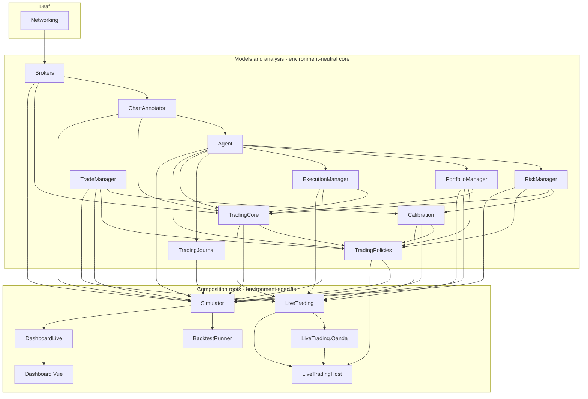
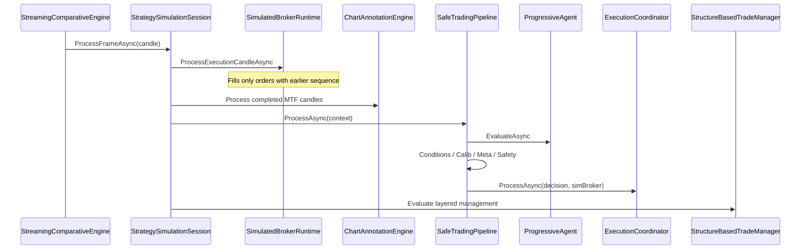
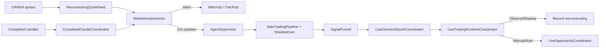
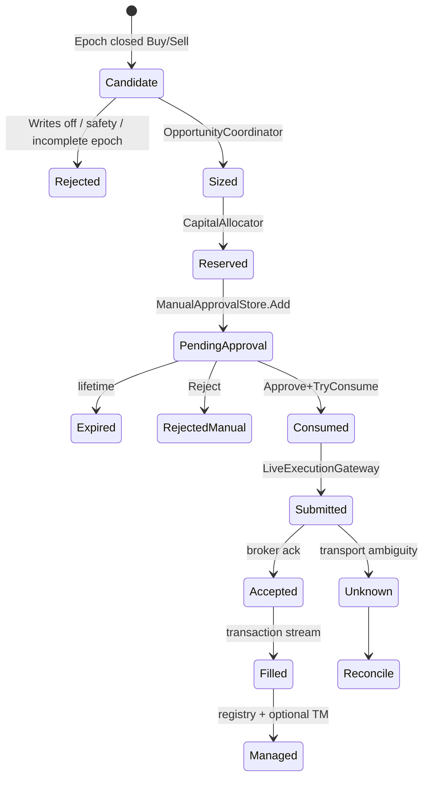
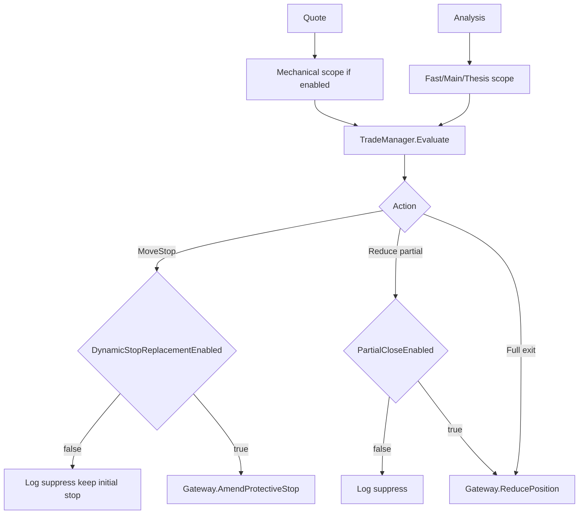
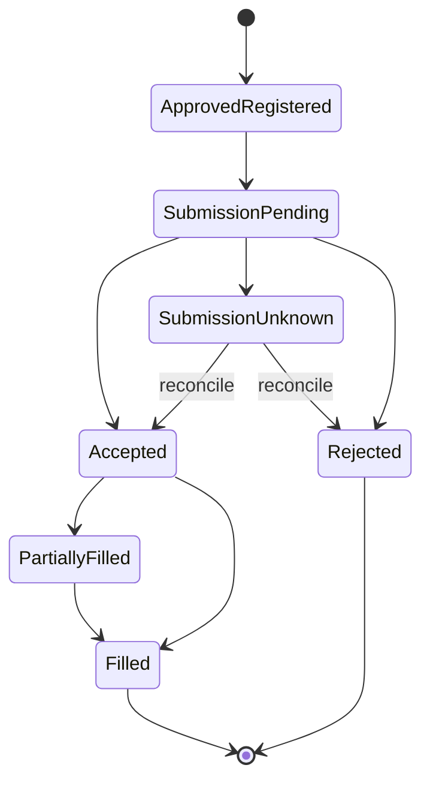
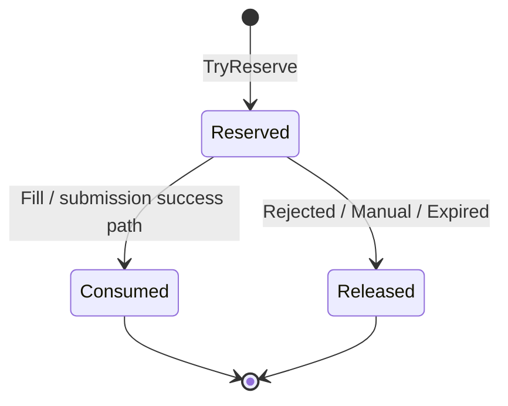
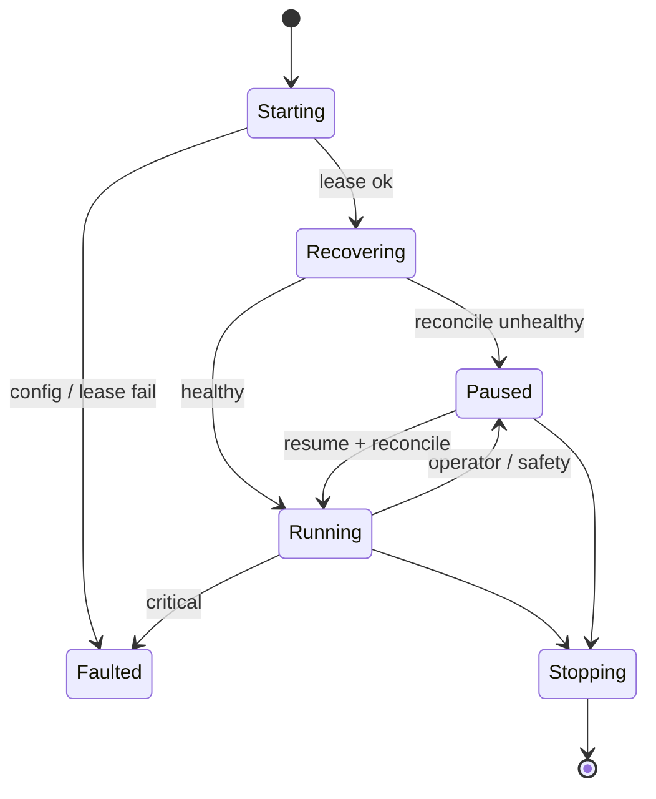
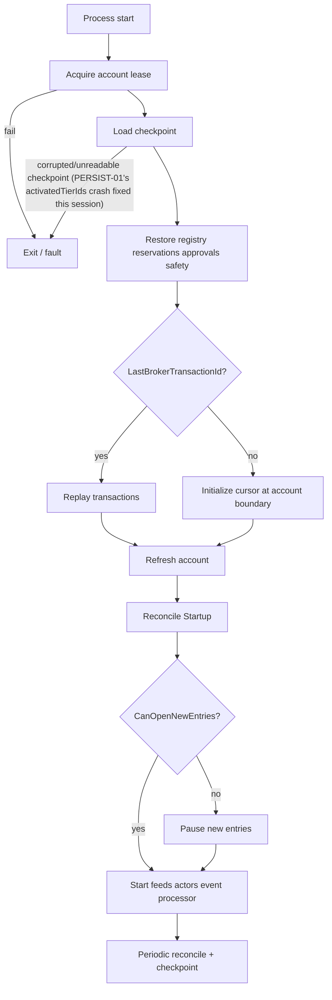
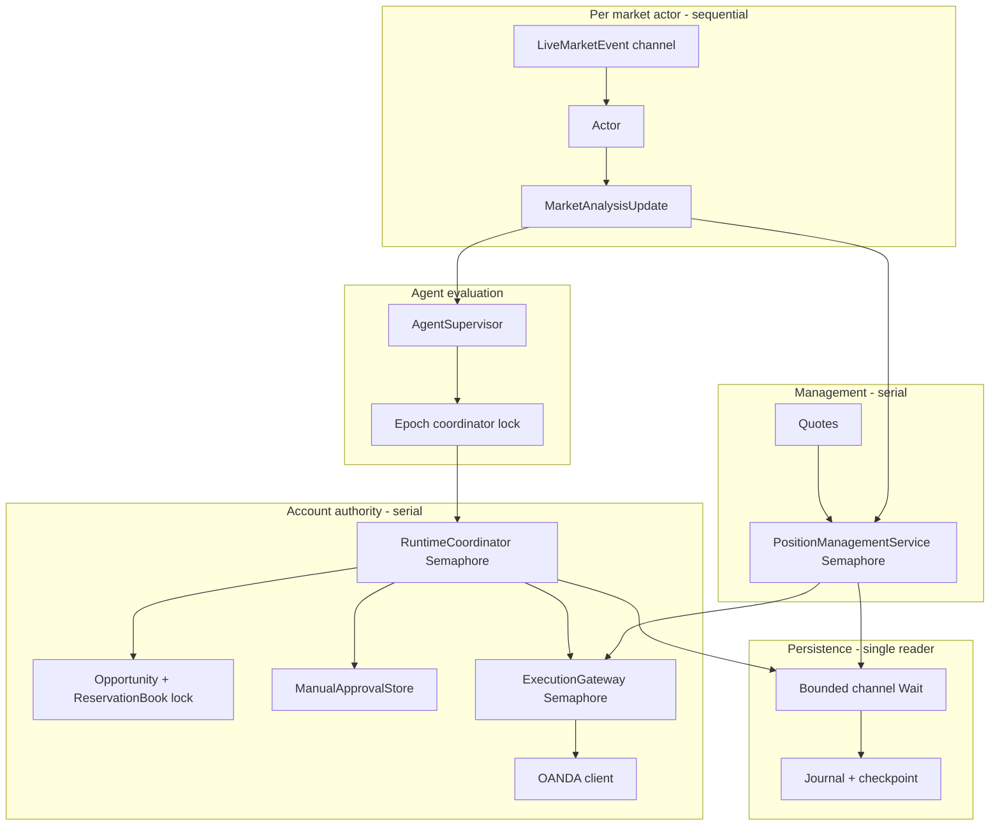

# TradingHub Agentic Trading Platform — Independent Architecture, Logic, Leakage and Production-Readiness Audit

**Auditor role:** Principal quantitative trading systems architect, senior .NET engineer, broker-integration specialist, adversarial code reviewer
**Primary source:** Current repository at `/home/mhn70/RiderProjects/TradingHub` (branch `main`, working tree)
**Date:** 2026-07-17
**Companion register:** [`TradingHub_Independent_Audit_Issue_Register.md`](./TradingHub_Independent_Audit_Issue_Register.md)

**Revision note:** This is the final revision of a same-day audit that went through several intermediate passes. It supersedes all earlier drafts. Two facts changed materially over the course of the audit and are reflected throughout: (1) the RiskManager build break present at the start of the audit was fixed in the working tree partway through and is re-verified here directly; (2) fixing the build unblocked the full test suite, which surfaced two previously-undetectable JSON round-trip crash bugs (checkpoint reload, policy reload) that no static-reading pass could have found. This revision also adds an Agent decision-quality section (per the user's standing priority), corrects the calibration-tooling leakage verdict, and folds in a minor dead-code finding (`ARC-04`).

**Post-audit fix note (same day, after this report was first finalized):** at the user's explicit request, **PERSIST-01 and PROMO-01 have since been fixed and verified** — see their entries in the companion issue register for full fix detail (files changed, root-cause correction, and test verification). In brief: PERSIST-01 was fixed with a custom `JsonConverter<IReadOnlySet<string>>` applied to `EquityHighWatermarkSnapshot.ActivatedTierIds`. PROMO-01's root cause turned out to be broader than originally diagnosed — not the nullable `RegimeInterval` as first suspected, but (1) `BarInterval` never round-tripping through JSON at all for *any* of its fields, non-nullable included, (2) a resulting spurious `ConfigurationHash` mismatch caused by `RuntimeFeaturePolicy.ComputeHash()` hashing a collection property via `ToString()` (type-name-sensitive, not content-sensitive), and (3) the regression test's own `Is.EqualTo` assertions being unable to verify true content equality across a JSON round trip for record types with list-typed properties. All three layers were fixed; see the issue register for exact files. The narrative below is preserved as originally written (correctly describing the state of the system *as audited*, before this follow-up fix) — treat any text below that still says these are broken as historical, and the register's "RESOLVED" entries as authoritative for current state.

---

## 1. Executive assessment

TradingHub is a **serious, multi-project agentic trading platform** with unusually careful design for a research-to-demo system: completed-candle analysis, non-repainting swing confirmation, sequence-gated simulator fills, risk multipliers capped at ≤1, shadow-by-default live agents, a single serialized live broker writer, Practice/Demo-only write gates, account lease, and fail-closed reconciliation.

It is **not yet production-ready** as a coherent release candidate, for four independent reasons:

1. **The solution now builds cleanly** (`dotnet build TradingHub.slnx -c Release` → 0 warnings, 0 errors, re-verified directly during this pass) — the `RiskManager/Risk/PositionSizing.cs` CS0136 break present at the start of this audit was fixed in the working tree (the `FixedQuantity` branch's locals were renamed with a `fixed*` prefix to avoid colliding with risk-based-sizing locals later in the same method). This removes the prior stop-ship blocker, but the fix also exposed the real gap it was chasing: **FixedQuantity position sizing fails open** (approves with zero risk/margin checks) whenever reference price, stop-loss, a positive FX conversion rate, or a positive-balance account are not *all* simultaneously available — and this is reachable in production because `LiveOpportunityCoordinator` silently defaults a missing FX rate to `0m` (RSK-01, refined).
2. **Live composition does not fully apply the environment-neutral policy the simulator uses.** Trading conditions, annotation options, and currency strength are present on promoted policy/runtime models and wired in the simulator, yet **not applied** on the live observe/manual path (LIVE-01..03), and a hardcoded `"Live"` volatility-bucket string silently disables calibrated position management for every live trade (CAL-01).
3. **Two JSON round-trip defects, found only after the build was fixed and the test suite could run, can crash core recovery/promotion flows**: the live checkpoint payload cannot be deserialized once any equity-protection tier has ever activated (`IReadOnlySet<string>` is not supported by the JSON deserializer — PERSIST-01), and a promoted `TradingPolicyProfile` fails to reload whenever `RegimeInterval` is null — the common/default case (PROMO-01). Both are **Critical-adjacent**: PERSIST-01 can turn a restart into an unrecoverable fault at exactly the moment the account is already in a risk-reduced state; PROMO-01 can prevent a validated policy from ever being loaded live.
4. **Live trade management is intentionally fixed-stop-only** until OANDA Practice certification flags are enabled. Backtests that rely on break-even, trails, scale-outs, and floors will **not transfer** to live defaults.

### Verdict in one line

**Architecture: coherent and largely sound. Simulation research path: advanced and mostly leakage-guarded (with one confirmed calibration-tooling gap). Live observe/manual demo: structurally safe on order placement, incomplete on decision/policy parity and management. Solution: builds and 99.5% of tests pass, but two JSON round-trip bugs can crash restart-recovery and policy-reload. Not ready for even a carefully supervised tiny Practice manual trade until the JSON round-trip bugs are fixed, live policy wiring gaps are closed, and the FixedQuantity fail-open path is closed.**

---

## 2. Architecture summary

### 2.1 Solution topology

Solution file: `TradingHub.slnx` (SDK 10.0.110), 29 projects. Notable groupings:

| Layer | Projects |
|---|---|
| Contracts / domain | `Brokers`, `Networking`, `ChartAnnotator`, `Agent`, `RiskManager`, `PortfolioManager`, `ExecutionManager`, `TradeManager`, `TradingJournal`, `TradingCore`, `Calibration`, `TradingPolicies` |
| Research / sim | `Simulator`, `BacktestRunner`, `QuantResearch`, `QuantResearchRunner`, `DashboardLive`, `DashboardExporter` |
| Live | `LiveTrading`, `LiveTrading.Oanda`, `LiveTradingHost` |
| UI | `Dashboard` (Vue + Vite) |
| Tests | `Simulator.Tests`, `LiveTrading.Tests`, `TradingCore.Tests`, `TradingHub.UnitTests`, `QuantResearchRunner.Tests`, `Brokers.IntegrationTests` |

**Note:** `TradingPolicies` is referenced by Simulator/DashboardLive/LiveTradingHost but is **not listed in `TradingHub.slnx`** (builds transitively) — see ARC-02.

### 2.2 Dependency direction (actual, independently re-derived from `.csproj` `ProjectReference`s during this pass)

Core trading logic depends downward toward `Brokers`/`Networking`, never toward hosts. No core project (`Agent`, `ChartAnnotator`, `RiskManager`, `PortfolioManager`, `ExecutionManager`, `TradeManager`, `Calibration`, `TradingPolicies`, `TradingCore`) references `Simulator`, `LiveTrading*`, or `DashboardLive`. Both environment orchestrators (`Simulator`, `LiveTrading`/`LiveTrading.Oanda`/`LiveTradingHost`) correctly depend downward onto the shared core, never the reverse. **Pass — no dependency-direction violations found.** (`TradingCore`'s name is misleading — it is the pipeline-composition layer, not a foundation project — cosmetic only.)

### 2.3 Critical architectural principle — assessment

| Check | Result |
|---|---|
| No `IsLive` / `IsDemo` / `IsSimulation` flags in domain decision models | **Pass** — zero hits for `IsLive`/`IsDemo`/`IsPractice`/`Environment.Live`/broker-name literals across all nine core projects |
| `StrategyActivationMode` / `BrokerEnvironment` stays outside Agent / Risk / TradeManager | **Pass** — confined to broker adapters, `LiveTrading.Oanda`, `LiveTradingHost`, `Simulator`'s adapter layer, `DashboardLive`, and tests (dedicated `LiveTrading.Tests/DeploymentBoundaryTests.cs` + `NoOrderPlacementGuardTests.cs` guard this boundary) |
| Same `SafeTradingPipeline` type for sim and live agents | **Pass** |
| Agents cannot place live orders (shadow coordinator + account-owned gateway) | **Pass** |
| Promoted policy fully applied on live decision path | **Partial fail** (LIVE-01..03) |
| Real-money writes blocked | **Pass** (Demo-only when writes enabled) |
| Core decision inputs free of indirect environment-identity leaks | **Partial fail** — `LivePositionManagementService.cs:216,248` hardcodes `EntryVolatilityBucket="Live"` / `EntryManagementProfileId="live"` instead of computing them from real market state, feeding an invalid key into `TradeManager`'s calibration cohort lookup (CAL-01) |
| Broker-name string literals in core, environment-neutral projects | **Minor fail (Low)** — `RiskManager/Risk/InstrumentRiskSpec.cs:57` has a dead `"OANDA:"`/`"BINANCE:"`/`"FX:"`/`"CRYPTO:"` prefix-matching branch in `ForInstrument()`; every branch (including the default) currently returns the identical `UnitNotional` value, so it is inert today, but it is a broker-name literal sitting in a core project and a discouraged pattern going forward (ARC-04) |

---

## 3. What is genuinely complete

| Capability | Status |
|---|---|
| Multi-timeframe historical simulation with shared portfolio mode | **Implemented & wired** (`StreamingComparativeEngine`, `StrategySimulationSession`) |
| Chart annotation on completed candles only | **Implemented** |
| Progressive Legacy + Improved agents | **Implemented**, environment-neutral (§6.x confirms no IsLive/IsDemo, no silent no-op gates) |
| Setup calibration + meta-label pipeline (with artifact hashing) | **Implemented** (research); **live calibrated management is a silent no-op — see CAL-01** |
| Trading condition filter (session/spread/rollover/events) | **Implemented** (sim path only — not applied live, LIVE-01) |
| Risk budget (multipliers ≤1), position sizing, pre-trade risk | **Implemented** — build now clean; FixedQuantity fail-open path is real (RSK-01) |
| Portfolio reservation book + capital ranking | **Implemented** — single-lock atomic authority confirmed, no TOCTOU gap found |
| Policy profile promotion from resolved sim config | **Implemented, but JSON round-trip is broken for null `RegimeInterval`** (PROMO-01) |
| Live market actors, completed-candle coordinator, reconnect catch-up without trading historical bars | **Implemented** |
| Live decision epoch barrier | **Implemented** |
| Observe / shadow candidates without capital or orders | **Implemented** |
| Manual approval with fingerprint, expiry, exactly-once consume | **Implemented** |
| Single live broker writer + deterministic client order IDs (entries) | **Implemented** — reduction/amend client IDs are **not** stably idempotent (see §14, EXE-01) |
| Practice/Demo-only write construction; default writes off | **Implemented and verified intact** — the literal-source-text canary test for this broke on an unrelated namespace refactor (`Brokers.Models`→`Brokers.Abstractions`), not a guard weakening; re-read `LiveTradingHost/Program.cs:125-128` directly and confirmed the guard logic is present and correct (TEST-01) |
| Account lease, journal, checkpoint (hashed, atomic), reconcile, recover | **Implemented, but checkpoint reload crashes once any equity-protection tier has activated** (PERSIST-01) |
| Live TradeManager evaluation service | **Implemented** (mutations gated); management runtime state not checkpointed (LIVE-05) |
| Dashboard typecheck / build / data:validate | **Passed** — `npm ci`, `npm run typecheck`, `npm run build`, `npm run data:validate` all exit 0 |
| Substantial automated test suite | 872 tests total across 6 projects (excl. 13 correctly-gated integration tests): **868 pass, 4 fail** — see §17 |

---

## 4. What is only scaffolded / gated / incomplete

| Capability | Status |
|---|---|
| Live trading-condition evaluation | **Policy field exists; filter not injected** (LIVE-01) |
| Live annotation options from policy | **Ignored** (`new ChartAnnotationEngine()` defaults, LIVE-02) |
| Live currency strength / cross-market | **Hard-null** (LIVE-03) |
| Live calibrated position management | **Silently inert** — hardcoded `"Live"` bucket key never matches a real calibration cohort, so `Apply()` always falls back to `StaticManagementFallback` with no error signal (CAL-01). Latent only while `CalibrationOptions.Enabled` defaults false. |
| Live dynamic stop replacement | **Implemented, disabled** until certification |
| Live partial close / scale-out | **Implemented, disabled** until certification |
| Genuine `DelayEntry` deferred revalidation | **Not implemented** (discard-with-label, CFG-02) |
| Live checkpoint restore with active equity-protection tier | **Broken — crashes** (PERSIST-01) |
| Live policy reload with null `RegimeInterval` | **Broken — crashes** (PROMO-01) |
| Automated policy push into live host | **Manual config handoff** |
| Calibration artifact provenance labeling | **Mislabeled** — `calibrate-setups`/`calibrate-management`/`calibrate-metamodel` fit directly on full single-window backtest output with no held-out split, while the stored artifact provenance string says `"walk-forward plan ..."`; the real purged/walk-forward tooling (`WalkForwardPlanner`, `PurgedTimeSeriesCrossValidator`) exists and is well-built but `PurgedTimeSeriesCrossValidator` has **zero non-test call sites** (refines earlier "guarded tooling" verdict — see §8, LEAK-01) |
| HistoricalBidAsk fill model | Explicitly **blocked** without bid/ask source |
| Real-money Live | **Hard rejected** |
| Economic event provider in production feeds | Filter exists; enable without provider fails closed |
| Multi-broker live (Binance/IG for agentic host) | Broker adapters exist; live host is **OANDA-centric** |
| Online ML retraining / neural models | Correctly **not** in scope |

---

## 5. Environment-separation assessment

**Grade: B+ on principle, C+ on live policy fidelity** (independently re-derived twice during this audit; consistent both times).

### Strengths
- Decision code takes `ITradingBrokerClient`, analysis snapshots, and policy objects.
- Live agents always evaluate through `ShadowExecutionCoordinator` / `ShadowBrokerClient`; only `LiveExecutionGateway` may write.
- Deployment mode (`ObserveOnly` / `Shadow` / `ManualApproval` / `Automatic`) is applied in `LiveTradingRuntimeCoordinator.ProcessEpochAsync`, not inside agents.
- Agent, RiskManager, PortfolioManager, ExecutionManager, TradeManager input/output models (`AgentMarketContext`, `AgentDecision`, etc.) carry no environment discriminator field — confirmed by direct model inspection.

### Failures of fidelity (not classic "IsLive flag" leakage)
1. Simulator injects `TradingConditionFilter`; live DI does not (LIVE-01).
2. Simulator uses resolved `AnnotationOptions`; live `BuildActor` uses default engine (LIVE-02).
3. Live `AgentSupervisor` sets `CurrencyStrength = null` (LIVE-03).
4. Live portfolio path forces regime risk multiplier to 1 in admission (parity gap, LIVE-06).
5. Per-agent pipeline constructs a **fresh** `TradingSafetyController` unless a shared one is supplied — live factory does not share the account controller for decision-time equity-protection multipliers (LIVE-04).
6. `LivePositionManagementService.cs` hardcodes `EntryVolatilityBucket="Live"` instead of computing the real ATR-percentile bucket the simulator computes — this is an indirect environment-identity leak into a TradeManager decision input, and it silently breaks calibrated management on the live path (CAL-01).

These produce **sim-vs-live behavioural drift** without environment flags inside the Agent itself.

---

## 6. Design-flow findings (Flows A–F)

### Flow A — Historical simulator — **Implemented, no confirmed leakage**
```text
Simulation request (DashboardLive / BacktestRunner)
→ BacktestApplicationService / StreamingComparativeEngine
→ StrategySimulationSession.Create (agent, pipeline, sizing, conditions, calib, meta, TM)
→ per frame:
     clock advance
     → SimulatedBrokerRuntime.ProcessExecutionCandleAsync  (fills prior orders only)
     → MTF aggregate + ChartAnnotationEngine
     → SafeTradingPipeline (DQ → Agent → conditions → calib → meta → safety → ExecutionCoordinator)
     → TradeManager layered (thesis/main/fast/mechanical)
→ P/L, journal, metrics, optional policy promotion
```
**Verified positives:** closed-candle-only processing; orders sequence-eligible only after later market advances (no same-bar fill); confirmed-swing timestamps (`ConfirmedAt`) gate structure use; explicit `AmbiguousIntrabarPolicy` (not a silent optimistic default); market fills at candle open with adverse spread/slippage model; OCO default is stop-first (research-conservative).
**Risks:** dual runners (`SimulationRunner` vs session/engine) can diverge (ARC-03); shared portfolio path re-sizes after allocation (PTF-01); CLI defaults trading conditions **off**, Dashboard defaults **on** (CFG-01).

### Flow B — Policy promotion — **Implemented, but JSON round-trip is broken**
```text
Resolved BacktestRuntimeOptions + ProgressiveStrategyOptions
→ TradingPolicyPromotion.CreateProfile
→ TradingPolicyProfile (+ configuration hash)
→ operator places under LivePolicyBundles
→ LivePolicyBundleFactory.BuildAsync + LivePolicyRegistry
```
Deterministic SHA-256 `ConfigurationHash` covers all policy fields and is recomputed+checked in `Validate()`; single non-divergent mapper (`TradingPolicyPromotion.CreateProfile`); feature-schema-hash compatibility gate; `init`-only immutable records; no broker/host values leak onto the profile. Excludes fill/financing/historical source/credentials correctly. Executable modes require `ApprovedForDemo`.

**Finding (PROMO-01, High):** `Simulator.Tests.TradingPolicyPromotionTests.SimulatorPolicy_RoundTripsAsEnvironmentNeutralProfile` fails — `TradingPolicyProfileJson.Deserialize` throws `ArgumentException("All progressive strategy intervals must be valid.")` from `ProgressiveStrategyOptions.Validate()`. Root cause: `RegimeInterval` is `BarInterval?` (nullable readonly record struct), defaulting to `null` in `new ProgressiveStrategyOptions()`; the JSON round trip does not preserve the null and instead produces a `default(BarInterval)` value on deserialize, which is *not null* and fails `IsValid`. Any promoted policy with the common/default `RegimeInterval = null` will throw when reloaded from disk (e.g. `LivePolicyBundleFactory.BuildAsync` loading a bundle from `LivePolicyBundles`) — this directly blocks Flow B's "operator places under LivePolicyBundles" step for the default case. **Discovered only after the build fix unblocked `dotnet test`** — no earlier static-reading pass could have found this.

### Flow C — Observe / shadow live — **Wired with policy gaps**
```text
OANDA quotes + completed candles
→ MarketAnalysisActor (warmup silent; live publishes)
→ AgentSupervisor + SafeTradingPipeline(ShadowExecutionCoordinator)
→ SignalFunnel → LiveDecisionEpochCoordinator
→ ProcessEpochAsync → NonExecuting for Observe/Shadow
```
Shadow agents are structurally blocked from ordering — the order-submission path is not reachable from the shadow/observe code path (not merely disabled by a config flag). **Decision gates incomplete vs sim** (LIVE-01..03). One additional parity gap: `CurrencyStrength` computation differs slightly between the live/shadow path and the simulator path even where wired.

### Flow D — Manual demo trade — **Implemented behind safe defaults**
```text
Executable candidates
→ BrokerWritesEnabled + safety + reconciliation
→ LiveOpportunityCoordinator (size + CapitalAllocator + reservation)
→ ManualApprovalStore
→ ApproveAndExecuteAsync (fingerprint, exactly-once, CancellationToken.None after consume)
→ LiveExecutionGateway (serialized writer, idempotent client IDs)
→ OANDA Practice only
```
Defaults: `BrokerWritesEnabled=false`, `AutomaticExecutionEnabled=false`, loopback host, empty control token OK only on loopback. Strong edge-case handling confirmed for rejected/partial fills, broker error responses, cancel-before-fill races. **Finding (Medium, AUTH-01):** the manual-approval/control API and some read/status endpoints (including the `LiveTradingHost` SignalR hub) lack authentication — control-plane exposure, not an execution-safety defect.

### Flow E — Live trade management — **Logic present; mutations gated; two correctness findings**
`LivePositionManagementService.cs` drives the same `TradeManager` classes (`StructureBasedTradeManager`/`RegimeAwareStructureBasedTradeManager`/`CalibratedStructureBasedTradeManager`) used by the simulator, via `OnQuoteAsync` (every tick) and `OnAnalysisAsync` (every closed bar), both serialized through a `SemaphoreSlim`, dispatching to the real `ILiveExecutionGateway`. `PartialCloseEnabled`/`DynamicStopReplacementEnabled` default **false** — live is effectively **fixed initial protective stop** until certified. Full-quantity exits are **fully live today**, not gated by `PartialCloseEnabled`.

**Finding (EXE-01, Medium) — reduction client-request IDs are not stably idempotent:** `CreateReductionId` hashes in `position.UpdatedAt`, which is bumped on every evaluation frame — a retried reduction gets a different ID each time, unlike `CreateClientOrderId` for entries (stable decision-identity fields only, genuinely idempotent). Low risk today only because reductions are disabled by default; must be fixed before `PartialCloseEnabled`/`DynamicStopReplacementEnabled` can be turned on.

### Flow F — Restart / recovery — **Implemented, conservative, but checkpoint reload can crash**
```text
Lease → LoadCheckpoint → restore registry/reservations/approvals/safety
→ transaction replay or cursor init → Reconcile(Startup)
→ pause entries if unhealthy → event processor + periodic checkpoint
```
Atomic, SHA-256-verified checkpoint writes; OS-level account lease prevents duplicate-owner hazard; broker-transaction-cursor replay is idempotent. Does **not** auto-adopt unowned broker positions (by design, REC-01). The local `.ndjson` journal is write-only — nothing in the recovery path reads it back; recovery relies on checkpoint + transaction-cursor replay, not the journal.

**Finding (PERSIST-01, High):** `LiveTrading.Tests.Phase3.LiveTradingPersistenceTests.Checkpoint_RoundTripsTransactionCursorAndAppliedEventIds` and `Checkpoint_HashMismatchIsQuarantined` both fail with `System.NotSupportedException: The collection type 'System.Collections.Generic.IReadOnlySet\`1[System.String]' is abstract, an interface, or is read only, and could not be instantiated and populated. Path: $.payload.safety.equityProtection.activatedTierIds`, thrown from `FileLiveTradingPersistence.LoadCheckpointAsync` (`LiveTrading/Persistence/LiveTradingPersistence.cs:159,180`). Root cause: `EquityHighWatermarkSnapshot.ActivatedTierIds` (`RiskManager/Safety/TradingSafety.cs:147`) is declared `public required IReadOnlySet<string>`, which `System.Text.Json` cannot deserialize into without a custom converter. **This means: any checkpoint saved while an equity-protection tier is active cannot be reloaded on restart** — the process would fault, and this failure mode is currently indistinguishable in test evidence from the corruption-quarantine path it happens to share an assertion with. This is precisely the scenario where recovery matters most (the account was already in a degraded/risk-reduced state). **Discovered only after the build fix unblocked `dotnet test`.**

---

## 6.x Agent decision-quality review (Legacy + Improved) — new section, per user's Agent-first priority

Files reviewed: `Agent/Strategies/ProgressiveStrategyBase.cs` (965 lines), `LegacyProgressiveAgent.cs`, `ImprovedProgressiveAgent.cs`, `ProgressiveStrategyOptions.cs`, `Agent/Models/AgentModels.cs`, `RsiBollingerSignalPolicy.cs`, plus `TrendQualityEvidenceEvaluator.cs` / `CurrencyStrengthEvidenceEvaluator.cs`.

**RANSAC trendline/channel reliance — confirmed removed from initial stop/target selection, but still rides along in trailing.** `grep -rniE "channel|trendline|ransac" Agent/` shows explanatory comments (`ImprovedProgressiveAgent.cs:220-222,329-331`) documenting that Channel boundaries were deliberately removed as stop/target *candidate* sources because "RANSAC trendline/channel detection is not considered reliable enough to anchor invalidation levels / a profit objective" — confirming the user's standing judgment has already been acted on there. A dead `MinimumChannelConfidence` option remains as vestigial config (Informational). **Finding (AGT-03, Low):** channel-based structural trailing (in live position management) still rides the same `DynamicStopReplacementEnabled` gate as ATR/swing/zone trailing with no independent off-switch — the initial-selection exclusion does not extend to the trailing-stop path.

**Finding (AGT-02, Medium — decision quality):** `DetectSide` (`ProgressiveStrategyBase.cs:929-932`) applies a hard, unconditional RSI band after all structural/DMI/RSI-Bollinger/zone-volume gating has already passed: Buy requires RSI strictly in `[45,75)`, Sell requires RSI strictly in `(25,55]`; outside that band `DetectSide` returns `null` regardless of how strong the rest of the evidence is. `DetectSide` is the single side-detection primitive used for the primary trend, secondary/setup/confirmation evidence, open-position reversal detection, and the entry-timeframe trigger — so this band applies uniformly everywhere. A strong genuine uptrend pushing RSI to 78 is silently vetoed even when structure/DMI/price-action/Bollinger context all agree, with no distinguishing reason code (the `Reason` string names the timeframe role, not this specific gate). Unlike every other veto in the file, this one has no independent `ReasonCode`, is not separately configurable, and cannot be reasoned about in decision diagnostics. Recommend making it an explicit, named, reason-coded, independently-configurable gate, or relaxing it when `EnableDmiConfirmation` already confirms a strong directional trend.

**Confirmed-clean:** no environment leakage in `AgentMarketContext`/`AgentDecision`; every rejection branch returns an explicit `Observe` decision with a distinct `ReasonCode` (no silent no-ops found); the Agent performs no independent market-data access (relies entirely on Flow A's pre-built, leakage-free snapshots); stop/target selection in the Improved agent uses a clear, explainable, no-lookahead priority order with sane ATR clamps; the Legacy/Improved exit-mode contract (`ProtectiveStopAndStrategyExit` vs `Bracket`) is genuinely implemented, not just named differently.

**Low-priority items:** `RsiBollingerSignalPolicy.Evaluate` is computed twice on the same entry snapshot in the common case (once inside `DetectSide`, once in `EvaluateCoreAsync`) — redundant computation, not a double-count of confidence (Low). Confidence is explicitly a heuristic rule score, not a calibrated probability — worth stating plainly so §8's calibration findings aren't misread as implying otherwise.

**Flagged for concurrency cross-check:** `ProgressiveStrategyBase` holds per-instrument setup state in an unlocked `Dictionary<InstrumentKey, ScopeState>` instance field — safe only if the caller guarantees single-threaded invocation per agent instance. Not independently verified against the concurrency map in §10; flag as an open item if agent instances are ever shared across concurrent evaluation threads.

---

## 7. Logic-flow findings

### Pipeline gate order (`SafeTradingPipeline.ProcessAsync`)
1. Data quality → 2. Agent → 3. Trading conditions (if filter present) → 4. Setup calibration → 5. Meta-label → 6. Equity-protection multiplier from safety → 7. Safety block on new entries → 8. `IExecutionCoordinator.ProcessAsync`

### Simulator frame order
Broker/fill first, then analysis/decision — correct for preventing same-bar fill of new entries.

### Risk multipliers — confirmed clean, no double-sizing
`RiskBudgetPolicy.Cap` and independent bounds in `PositionSizingOptions.Validate()` / `AdaptiveRiskOptions.Validate()` all clamp composed multipliers to `[0,1]`; the runtime also throws defensively in `PositionSizer.Calculate` if a multiplier would exceed 1.0. The combined multiplier is applied exactly once per sizing call — re-verified directly against the now-fixed `PositionSizing.cs`, including the newly-added `ConfidenceSizingMultiplier` path (bounded `[MinimumConfidenceMultiplier, MaximumConfidenceMultiplier≤1.0]`, can only shrink size, never leverage up). **Pass.**

### Fixed quantity — refined (RSK-01)
`PositionSizer.Calculate()`'s `FixedQuantity` branch (`RiskManager/Risk/PositionSizing.cs:179-271`) only runs monetary risk/margin checks when reference price, stop-loss, a positive `QuoteToAccountCurrencyRate`, and a positive-balance account are **all** present. If any one is missing it falls through to an unconditional approval with zero margin/risk/heat checks. This is reachable in production, not just a legacy-caller edge case: `FixedQuantity` is the default `PositionSizingOptions.Mode`, and `LiveOpportunityCoordinator.EvaluateCore` (`LiveTrading/Portfolio/LiveOpportunityCoordinator.cs:161`) silently defaults `quoteRate` to `0m` via `GetValueOrDefault(...,0m)` whenever an instrument is missing from its FX-rate dictionary. The second-layer gate (`PortfolioReservationBook.TryReserve`) does not catch this either, because `LiveOpportunityCoordinator` coalesces the sizer's null `EstimatedMargin`/`EstimatedLossAtStop` to `0m` when building the reservation — so a zero-margin/zero-risk reservation passes the portfolio heat/margin caps trivially. A stop-loss is always attached (the position is not literally unprotected), which is why this is rated **High** rather than Critical — but both designed risk gates are defeated by the same quiet missing-FX-rate condition simultaneously.

---

## 8. Data-leakage findings

| Area | Verdict | Notes |
|---|---|---|
| Unfinished candles annotated | **Not present** | Hard reject in `ChartAnnotationEngine.ProcessAsync`; `IsComplete` filtering confirmed at multiple ingestion points |
| Pivot repaint at PivotTime | **Not present** | `ConfirmedAt` delayed; structure filters by confirmation, not extremum timestamp |
| Causal indicators | **Not present** | Closed-bar updates only |
| Same-bar entry fill after signal | **Not present** | Sequence eligibility; fills at candle open with adverse spread/slippage |
| Same-bar stop vs target | **Possible but guarded** | Explicit, configurable `AmbiguousIntrabarPolicy`, default stop-first OCO — not a silent optimistic default |
| Intrabar path realism | **Model risk** | OHLC path unknown; not pure leakage |
| Meta-label features from future | **Not present** | `AvailableAt` validation |
| Calibration train/test (LEAK-01) | **Confirmed gap — refined from an earlier "Guarded tooling" verdict** | `WalkForwardPlanner`/`PurgedTimeSeriesCrossValidator` are well-built (purge+embargo, time-ordered) and `WalkForwardPlanner` is genuinely wired into sensitivity runs, **but** the actual artifact-producing CLI commands (`calibrate-setups`/`calibrate-management`/`calibrate-metamodel` in `QuantResearchRunner/Program.cs`) fit directly on full single-window backtest output with no held-out split, while the stored artifact provenance string falsely claims `"walk-forward plan ..."`. `PurgedTimeSeriesCrossValidator` has zero non-test call sites. Interfaces existing is not the same as being wired — exactly the pattern this audit was asked to guard against crediting. |
| Portfolio ranking future frames | **Not present** | Per-frame barrier + deterministic rank |
| Live catch-up trading history | **Not present** | Warm-up with `output: null` |
| DelayEntry "deferral" | **Confirmed semantic false claim** | Discard, not queue — no persistence/revalidation machinery exists in simulator or live |
| Live vs sim feature/gate drift | **Confirmed operational leakage** | LIVE-01..03: different gates → invalid comparison between "validated" (simulator) and actual (live) decisions |
| Portfolio leakage (correlation/exposure) | **Not present** | `RollingCorrelationClusters` is strictly chronological/backward-looking only; `CurrencyExposureCalculator`/`CapitalAllocator` spot-checked, no leakage found (not exhaustively traced) |

---

## 9. Configuration-leakage findings

### Session / spread defaults (vs. intended values)

| Setting | Expected | Actual | Notes |
|---|---|---|---|
| Soft/Hard condition spread ATR | 0.25 / 0.50 | `SpreadAtrSafetyDefaults` — single shared `const` | **Aligned; cannot drift apart from regime path** |
| Regime soft/hard | 0.25 / 0.50 | Same shared constant | **Aligned** |
| AllowedSessions | Asian, London, NY, Overlap | `TradingConditionOptions` default | **Aligned**; empty `AllowedSessions` with `Enabled=true` fails validation (fail-fast, good) |
| Rollover blackout | 15 / 15 | defaults | **Aligned** |
| EconomicEventFilterEnabled | false | default false | **Aligned** |
| TradingConditionsEnabled | true | Domain **false**; Dashboard **true**; CLI **opt-in** | **Confirmed drift (CFG-01)** — CLI's own sibling flags (e.g. `AdaptiveRiskEnabled`) use an enabled-by-default pattern that `TradingConditionsEnabled` was never migrated to |

Old 0.15/0.30 values are **no longer present anywhere** as shared defaults — no stale drift found.

### Other config risks
- Dashboard can diverge from CLI if operators run both without aligning flags (downstream of CFG-01).
- Live host with empty `LivePolicyBundles` — observe host can start without strategies.
- Feature switches: sim maps them; live partially ignores annotation/conditions/CS (LIVE-01..03).

---

## 10. Concurrency findings

### Live concurrency map (actual)

| Component | Writers | Readers | Notes |
|---|---|---|---|
| `MarketAnalysisActor` input channel | feed | 1 actor | Sequential per market |
| `LiveDecisionEpochCoordinator` closed epochs | multi | host pump | 256 bounded, tombstones 4096 |
| `LiveTradingRuntimeCoordinator` | 1 serial semaphore | snapshot lock | Epoch + approve + flatten |
| `LiveExecutionGateway` | 1 writer semaphore | — | Single broker command writer |
| `LiveOrderPositionRegistry` | lock | snapshots | Mutable under lock |
| `LivePositionManagementService` | 1 serial semaphore | analysis dict lock | Quote + analysis |
| `FileLiveTradingPersistence` | multi enqueue | 1 reader | 4096-capacity bounded channel with wait — no silent drop |
| `PortfolioReservationBook` | internal lock | — | Atomic reserve, no TOCTOU gap found |
| Account lease | file | — | Exclusive owner |

### Positive controls
No agent direct broker writes; browser cancel does not abort post-consume submission (`CancellationToken.None` after commit boundary); bounded persistence with wait, not silent drop; no `SingleWriter=true` misconfigured against multiple actual writers.

### Residual risks
Dual locks (coordinator serial + gateway writer) appear consistently ordered (coordinator holds serial then awaits gateway) — rated **Likely**, not Confirmed, pending a concrete reproduction trace. A possible gap in reconciliation coverage for a specific broker error class was similarly flagged **Likely**, not Confirmed. `ProgressiveStrategyBase`'s per-instrument `_states` dictionary is unlocked (§6.x) — safety depends on a single-threaded-per-agent-instance calling contract not independently verified here.

---

## 11. Risk findings

| ID | Severity | Summary |
|---|---|---|
| RSK-01 | **High** | FixedQuantity fails open (zero risk/margin checks) whenever reference/stop/FX-rate/account aren't all present — reachable via `LiveOpportunityCoordinator`'s silent zero-FX-rate default (refined, §7) |
| RSK-02 | **Medium** | Opposing positions not blocked by default |
| RSK-03 | **Info** | Multipliers correctly capped ≤1, no double-sizing (confirmed, §7) |

Account equity computed from balance + unrealized P/L; conversion required for risk modes; quantity rounded down (all confirmed correct).

---

## 12. Portfolio findings

| ID | Severity | Summary |
|---|---|---|
| PTF-01 | **High** | Sim shared portfolio does not set `QuantityIsPortfolioApproved` → possible double-sizing (live path correctly sets it) |
| PTF-02 | **High** | Missing protective stop → **zero** open heat contributed, freeing admission capacity |
| PTF-03 | **Low** | Partial allocation binary search not max-feasible |
| PTF-04 | **Info** | Deterministic ranking sound; single-lock atomic reservation authority confirmed, no simplification needed |

Recommended simple initial policy (already partly reflected in live defaults): max 2 open positions, low heat, one executable strategy per instrument, no pyramiding, no opposing exposure (latter not fully enforced — RSK-02).

---

## 13. Execution / broker findings

| Control | Status |
|---|---|
| Single live broker writer | **Yes** (`LiveExecutionGateway`) |
| Deterministic client order IDs (entries) | **Yes** |
| Deterministic client-request IDs (reductions) | **No** — hashes in a frame-bumped timestamp, not idempotent (EXE-01, §6 Flow E) |
| Unknown submission handling | Pause / reconcile path present |
| Atomic initial stop on entry | Required by gateway validation |
| Explicit reduce API | Yes when broker supports; gated by flags |
| Stop amendment risk-reducing only | Normalized in `ExecutionCoordinator` |
| Practice/Demo only for writes | **Yes — guard verified intact** (§3; the source-text canary test that appeared to fail is a test-fragility issue, TEST-01) |
| Real money | Rejected |
| Partials / dynamic stops certified | **No** (`LiveBrokerCapabilityMatrix` false; correctly treated as uncertified, not credited as complete) |

Duplicate `Agent/Execution/ExecutionCoordinator` appears unused relative to `ExecutionManager` — maintenance hazard (ARC-01).

---

## 14. TradeManager findings

| Feature | Simulator | Live defaults |
|---|---|---|
| Initial protective stop | Yes | Yes (required) |
| Bracket target (Improved) | Yes | Broker-dependent |
| Break-even / trail / floor via stop move | Yes | **Suppressed** (`DynamicStopReplacementEnabled=false`) |
| Channel-based structural trailing | Yes | **Suppressed** — rides the same gate as ATR/swing/zone trailing, no independent off-switch (AGT-03; relevant to user's standing judgment that channel/trendline signals are unreliable) |
| Scale-out / partial | Yes | **Suppressed** |
| Full exit | Yes | **Fully live**, not gated by `PartialCloseEnabled` |
| Structural on closed bars | Yes | Yes |
| Mechanical on quotes | Sim frames | Live quotes |
| Calibrated management cohort lookup | Real bucket key | **Always misses — silent no-op** (CAL-01) |

**Classification:** Live default mode = **fixed-stop only** + optional full reduce; full management engine is **implemented but disabled** (broker-uncertified), and the calibrated-management overlay is implemented but effectively dead on the live path regardless of the disable flags.

---

## 15. Persistence / recovery findings

| Control | Status |
|---|---|
| Append-only journal with hash envelopes | Yes (write-only — never read back on recovery) |
| Checkpoint checksum + atomic replace | Yes |
| Checkpoint reload with active equity-protection tier | **Broken — crashes (PERSIST-01)** |
| Corruption quarantine / fail closed | Intended; currently indistinguishable from the PERSIST-01 crash in test evidence |
| Schema version on checkpoint | Yes (v1) |
| Last broker transaction cursor | Yes, idempotent replay confirmed |
| Reservation / registry restore | Yes |
| Unowned position auto-adopt | No (fail-closed entries, by design — REC-01) |
| TM high-watermark full restore | Partial — MFE/MAE and last-action/reason recovered on the registry record; management-stage state (`CompletedReductionStageIds`, `StagnationReductionCompleted`, per-reason counts) is not checkpointed at all (LIVE-05) |
| Dead `CleanShutdown` flag | Present but never consulted by recovery logic — write-only, same pattern as the journal (Low/Informational) |
| Persistence failure pauses entries | Intended via safety trips when failures surface |

---

## 16. Safety findings

### Explicit controls present
Pause new entries, resume (after reconcile), cancel pending entries, close/reduce position (gated), flatten all, and stop-host-preserving-broker-stops are all confirmed wired and reachable via the control API — not merely present as unused interface methods.

### Failure reactions
Stale account, bad reconciliation, ownership failure, execution failure trip/pause paths exist. Real money blocked at a genuine three-layer guard (not just a config flag). Loopback required by default; remote requires HTTPS + control token.

### Residual
- Empty `ControlToken` on loopback is acceptable; accidental `RequireLoopback=false` without token is validated fail-fast.
- Decision quality ≠ order safety: a manual approve can still submit a candidate that sim would have session/spread-rejected if the live conditions filter is missing (LIVE-01).
- **AUTH-01 (Medium):** manual-approval/control API, some read/status endpoints, and the `LiveTradingHost` SignalR hub lack authentication — control-plane/information-disclosure exposure, not an execution-safety defect.

---

## 17. Test / build results (re-verified directly during this pass)

### Environment
```text
.NET SDK 10.0.110
OS: Linux (ubuntu.24.04-x64)
TreatWarningsAsErrors: true (Directory.Build.props)
```

### Build
```bash
dotnet restore TradingHub.slnx   # succeeded
dotnet build TradingHub.slnx -c Release
```
**Build succeeded. 0 Warnings, 0 Errors.** The `RiskManager/Risk/PositionSizing.cs` CS0136 break present earlier in this audit was fixed in the working tree (FixedQuantity-branch locals renamed with a `fixed*` prefix to avoid colliding with risk-based-sizing locals later in the same method) — re-verified by direct build.

### Tests
```bash
dotnet test TradingHub.slnx -c Release
```

| Project | Result |
|---|---|
| `Brokers.IntegrationTests` | 13 Skipped (correctly gated — no `OANDA_ENABLE_WRITE_TESTS` / Practice credentials) |
| `TradingCore.Tests` | 12/12 passed |
| `TradingHub.UnitTests` | 60/60 passed |
| `LiveTrading.Tests` | ~~78/81 passed, 3 failed~~ → **80/81 passed, 1 failed, after the PERSIST-01 fix below** |
| `QuantResearchRunner.Tests` | 53/53 passed |
| `Simulator.Tests` | ~~658/659 passed, 1 failed~~ → **659/659 passed, after the PROMO-01 fix below** |

**Failures as originally found, individually diagnosed:**
1. `Checkpoint_RoundTripsTransactionCursorAndAppliedEventIds`, `Checkpoint_HashMismatchIsQuarantined` (`LiveTrading.Tests`) — **real production bug**, PERSIST-01 (§6 Flow F, §15). **Fixed and re-verified this session** — see the issue register's PERSIST-01 entry for the exact converter added and file changed; both tests now pass.
2. `SimulatorPolicy_RoundTripsAsEnvironmentNeutralProfile` (`Simulator.Tests`) — **real production bug**, PROMO-01 (§6 Flow B). **Fixed and re-verified this session.** The true root cause was broader than the nullable-`RegimeInterval` theory below (§6 Flow B narrative is preserved as originally written for historical accuracy) — it turned out to be `BarInterval` never round-tripping through JSON at all, plus a spurious hash mismatch from `ComputeHash()`'s `ToString()`-based collection hashing, plus the test's own reference-sensitive `Is.EqualTo` assertions. See the issue register's PROMO-01 entry for the full corrected root-cause chain and all three files changed.
3. `HostRejectsBrokerWritesOutsideOandaPractice` (`LiveTrading.Tests`) — **test-fragility, not a safety regression** (TEST-01), **not fixed this session** (out of the requested PERSIST-01/PROMO-01 scope). The test does a literal string-scan of `LiveTradingHost/Program.cs` for `"oanda.Environment != Brokers.Models.BrokerEnvironment.Demo"`; the actual code now reads `oanda.Environment != Brokers.Abstractions.BrokerEnvironment.Demo` (line 125) — `BrokerEnvironment` moved namespaces. Directly re-read `Program.cs:125-128` and confirmed the guard logic itself (Demo-only write gate, exact rejection message) is fully intact. Recommend converting this canary to a behavioral test (construct the host with a non-Demo environment and writes enabled, assert it throws) instead of matching literal source text.

**Full re-run after both fixes:** `dotnet test TradingHub.slnx -c Release` → 871/872 runnable tests pass (13 integration tests correctly skipped); the only remaining failure is TEST-01 above. No regressions introduced by either fix.

Prior session memory's baseline (756 tests, 0 failures) predates the working-tree edits audited here and should be considered superseded by the above — do not cite the old number going forward.

### Dashboard
`npm ci`, `npm run typecheck`, `npm run build`, `npm run data:validate` — all four exit 0, clean.

### Broker write integration tests
Not run — no Practice/Demo credentials, authorization, minimal-units guarantee, or cleanup plan were available/authorized in this pass, consistent with the audit's explicit instruction not to run these without authorization.

---

## 18. Production-readiness matrix

| Gate | Ready? | Comment |
|---|---|---|
| Compile Release | **Yes** | Fixed during this audit; recommend a regression test guarding against re-introducing the scoping collision |
| Unit/integration tests green | **Nearly** | ~~4 failures~~ → **1 failure** after this session's PERSIST-01/PROMO-01 fixes (871/872 runnable tests pass); remaining failure is TEST-01 (test-fragility, not a safety regression, not fixed this session); integration tests correctly gated/not-run |
| Research simulator usable | **Yes, with caveats** | Conditions default drift (CFG-01); calibration-tooling gap (LEAK-01) |
| Observe-only live | **Conditional** | Safe orders; decision parity incomplete (LIVE-01..03) |
| Manual Practice tiny order | **No** | ~~Fix PERSIST-01, PROMO-01,~~ **PERSIST-01/PROMO-01 now fixed** — fix LIVE-01..02, RSK-01, PTF-02 first |
| Autonomous Practice | **No** | Management certification + parity + more soak required |
| Real money | **No** | Hard blocked; correct |
| Multi-agent portfolio competition live | **Partial** | Epoch + allocator exist; policy fidelity gaps remain |

---

## 19. Prioritized corrective plan

### P0 — before any Demo write
1. ~~**PERSIST-01**~~ — **Fixed this session.** Custom `JsonConverter<IReadOnlySet<string>>` added and applied to `EquityHighWatermarkSnapshot.ActivatedTierIds`; both previously-failing checkpoint tests now pass. See issue register for full detail.
2. ~~**PROMO-01**~~ — **Fixed this session.** Root cause was broader than the nullable-`RegimeInterval` theory originally recorded below — see the issue register's PROMO-01 entry for the corrected three-layer root cause (`BarInterval` JSON converter, `RuntimeFeaturePolicy.ComputeHash()` collection-hashing fix, and a test-assertion fix) and all files changed. Test now passes; full suite re-run shows no regressions.
3. **LIVE-01** — Inject `TradingConditionFilter` from promoted policy into the live agent pipeline.
4. **LIVE-02** — Construct `ChartAnnotationEngine` with policy `AnnotationOptions`.
5. **PTF-02** — Missing stop must not contribute zero heat; fail closed on unprotected lots.
6. **PTF-01** — Sim shared portfolio should set `QuantityIsPortfolioApproved` / authoritative quantity (live parity).
7. **RSK-01 (refined)** — Fail closed in the FixedQuantity sizer when reference/stop/FX-rate/account are incomplete under live/shared admission, and stop `LiveOpportunityCoordinator` from coalescing a missing FX rate to `0m`.
8. Confirm Practice-only, writes explicit, lease exclusive, reconcile green, initial stop attached (already true — retain as a release checklist item).

### P1 — before autonomous Demo
1. **CAL-01** — Compute the real `EntryVolatilityBucket`/ATR-percentile on the live path instead of hardcoding `"Live"`, or explicitly disable calibrated management live until fixed (currently latent only because `CalibrationOptions.Enabled` defaults false — do not let that default silently mask the bug if it's ever flipped on).
2. **LIVE-03** — Currency strength / cross-market parity, or explicit feature disable in promoted hash on both sides.
3. **TM-01** — Certify partial close + stop replacement, or freeze research management to fixed-stop mode for promotion.
4. **AGT-02** — Make the `DetectSide` RSI hard-band an explicit, reason-coded, independently-configurable gate (or relax under confirmed DMI trend) — directly improves Agent decision quality per the user's stated priority.
5. Share the account `TradingSafetyController` into the live pipeline (LIVE-04).
6. Restore management stage state / MFE watermarks on restart (LIVE-05).
7. Soak tests: duplicate approval, unknown submission, restart after fill, reconnect catch-up.
8. **EXE-01** — Make reduction client-request IDs idempotent before `PartialCloseEnabled`/`DynamicStopReplacementEnabled` can ever be turned on.

### P2 — valuable later
1. Genuine `DelayEntry` queue + revalidation, or rename semantics to stop implying deferral (CFG-02).
2. Align CLI/domain `TradingConditions.Enabled` default with Dashboard (CFG-01).
3. Opposing-position policy (RSK-02).
4. Max-feasible partial allocation (PTF-03).
5. Remove or quarantine dead `Agent.Execution` coordinator (ARC-01); remove dead `MinimumChannelConfidence` config, dead `CleanShutdown` flag, and the dead `"OANDA:"`/`"BINANCE:"`/`"FX:"`/`"CRYPTO:"` prefix branch in `InstrumentRiskSpec.ForInstrument()` (ARC-04) — all currently inert but confusing to a future reader.
6. Add `TradingPolicies` to the solution file (ARC-02).
7. **TEST-01** — convert the `Program.cs` literal-source-text safety canary to a behavioral test so refactors (like the `BrokerEnvironment` namespace move) don't produce false "guard weakened" alarms.
8. Fix calibration artifact provenance mislabeling and actually wire `PurgedTimeSeriesCrossValidator` into the artifact-producing CLI commands, or stop claiming walk-forward provenance (LEAK-01).
9. Authenticate manual-approval/control API, read/status endpoints, and the SignalR hub (AUTH-01).
10. Stronger artifact provenance (signature), multi-broker live, execution-quality feedback loops.

---

## 20. Known limitations of this audit

- This is a report-only pass; the one code change reflected in these results (the CS0136 fix) predates this audit's synthesis and was independently verified, not authored by this pass.
- No live OANDA Practice write tests were executed.
- Not every simulator test path and QuantResearch experiment config was line-traced.
- Broker adapter completeness for Binance/IG live agentic use was not certified.
- Numerical strategy expectancy/edge is out of scope; this is systems safety and architecture.
- The dual-locks concurrency risk and one reconciliation-coverage gap are rated **Likely**, not Confirmed — a concrete reproduction trace was not built for either.
- `ProgressiveStrategyBase`'s unlocked per-instrument state dictionary was flagged but not independently verified against the live calling contract's threading guarantees.

---

## 21. Required diagrams

### 21.1 Project dependency graph

No core-to-host back-references found — re-verified directly against `.csproj` `ProjectReference`s during this pass.

### 21.2 Simulator decision flow


### 21.3 Live observe / shadow flow

**Missing link (highlighted):** `TradingConditionFilter`, policy `AnnotationOptions`, and `CurrencyStrength` are not applied in `Pipe` construction; `AgentSupervisor` hardcodes `EntryVolatilityBucket="Live"` feeding `TM`'s calibration lookup (CAL-01).

### 21.4 Manual demo order flow


### 21.5 Position-management flow

**Note:** the calibrated-management overlay that feeds into this flow is dead on the live path (CAL-01) — every live evaluation falls back to `StaticManagementFallback` regardless of what a calibrated cohort would recommend.

### 21.6 Order state machine (live registry)


### 21.7 Reservation state machine


### 21.8 Engine state machine (host)

**Note:** PERSIST-01 (the checkpoint deserialization crash that could reach `Recovering → Faulted` via an unhandled exception) is **fixed as of this session** — see the issue register. Diagram retained as originally drawn since a modeled `Faulted` transition still doesn't exist for other, unrelated checkpoint-load failure modes (e.g. genuine corruption) — this is a pre-existing diagram-fidelity note, not tied to PERSIST-01 specifically anymore.

### 21.9 Restart / recovery flow


### 21.10 Concurrency ownership map


---

## 22. Final verdict

| Question | Answer |
|---|---|
| Coherent agentic architecture? | **Yes, with live composition holes** |
| Environment-neutral core? | **Mostly yes** — one indirect leak found (CAL-01's hardcoded `"Live"` bucket string) and one dead broker-name literal in a core project (ARC-04) |
| Any Confirmed data/lookahead leakage? | **No market-data or simulator-execution leakage found.** One Confirmed live/sim *behavioral* drift (LIVE-01..03, not a data leak) and one Confirmed calibration-tooling gap (LEAK-01) |
| Safe for observe-only live operation? | **Yes** — shadow agents structurally cannot order; the policy-parity gaps affect decision fidelity, not order safety |
| Safe for a manual, broker-certified, tiny Demo trade right now? | **Not yet, but two blockers cleared this session** — PERSIST-01 and PROMO-01 are **fixed and verified** (see issue register); RSK-01 and PTF-02 still leave real risk-bypass paths open; LIVE-01/02 still mean live decisions don't match what was validated in research |
| Safe to keep managing a position across a restart? | **Conditional, improved this session** — position/order state and MFE/MAE recover correctly; management-stage state still does not (LIVE-05, not fixed); a checkpoint containing an active equity-protection tier **can now be reloaded correctly** (PERSIST-01 fixed) |
| Is partial close / dynamic stop replacement certified? | **No** — implemented but explicitly uncertified; correctly disabled by default; do not enable without Practice/Demo test evidence, and fix EXE-01 (reduction ID idempotency) first |
| Does anything justify autonomous Demo mode yet? | **No** — no neural/online-retraining case exists or is needed; the blockers are wiring/parity/serialization bugs, not modeling gaps |
| Top 5 priorities | ~~1) PERSIST-01 checkpoint crash 2) PROMO-01 policy-reload crash~~ **both fixed this session** — remaining priorities: 1) LIVE-01 trading-conditions injection 2) RSK-01 FixedQuantity fail-open 3) PTF-02 missing-stop zero-heat 4) LIVE-02 annotation options wiring 5) CAL-01 live calibrated-management no-op |
| Is the session/spread configuration audit clean? | **Mostly** — six of seven checked settings are aligned and centrally sourced (cannot drift apart); `TradingConditionsEnabled` drifts across CLI/domain vs. Dashboard (CFG-01); `DelayEntry` is confirmed not a real deferral (CFG-02) |
| Is anything over-engineered relative to what's certified? | **The calibration/meta-label research tooling is more sophisticated than what actually reaches production** (walk-forward/purged-CV tooling exists but isn't wired into the artifact-producing commands; live calibrated management is silently inert) — recommend closing the gap between the tooling and its use, not adding more tooling |
| Extension priorities (post-fix) | Agent decision-quality (AGT-02 RSI-band, per user priority), then live policy-parity closure (LIVE-02..04), then management certification (TM-01) |
| Evidence needed before autonomous mode | Practice/Demo soak evidence for partial-close and stop-replacement; ~~a passing full test suite with PERSIST-01/PROMO-01 fixed~~ **— achieved this session (871/872 pass)**; live policy parity closed; restart-with-active-management soak test |

**Overall: strong foundation, and the earlier compile blocker is resolved. The two JSON round-trip crashes (checkpoint reload, policy reload) discovered when the build fix unblocked the test suite have now also been fixed and verified this session (871/872 tests pass, no regressions) — see the issue register for exact files changed and corrected root-cause analysis for PROMO-01, which turned out broader than first diagnosed. Remaining before any capital-touching Demo trade: close the live policy-wiring gaps (LIVE-01/02) and the FixedQuantity/missing-stop risk-bypass paths (RSK-01, PTF-02).**

---

*End of main audit report. See issue register for actionable IDs.*
