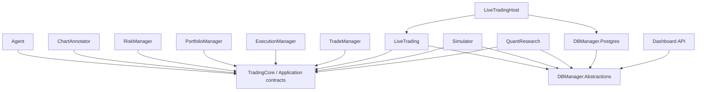
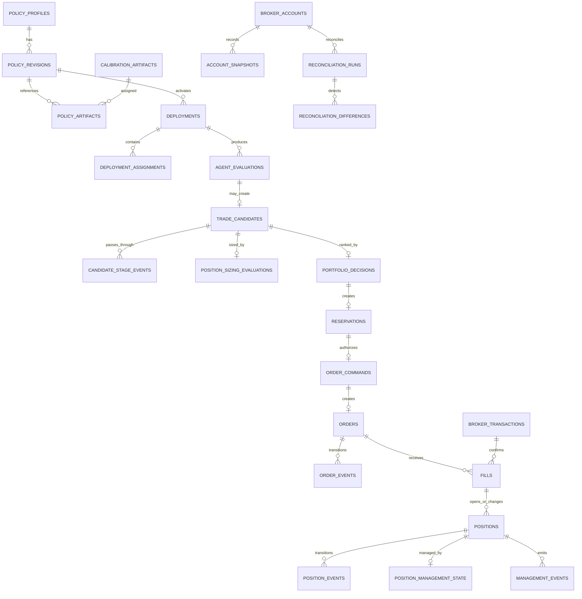
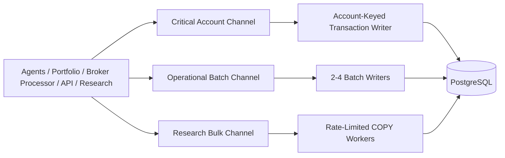
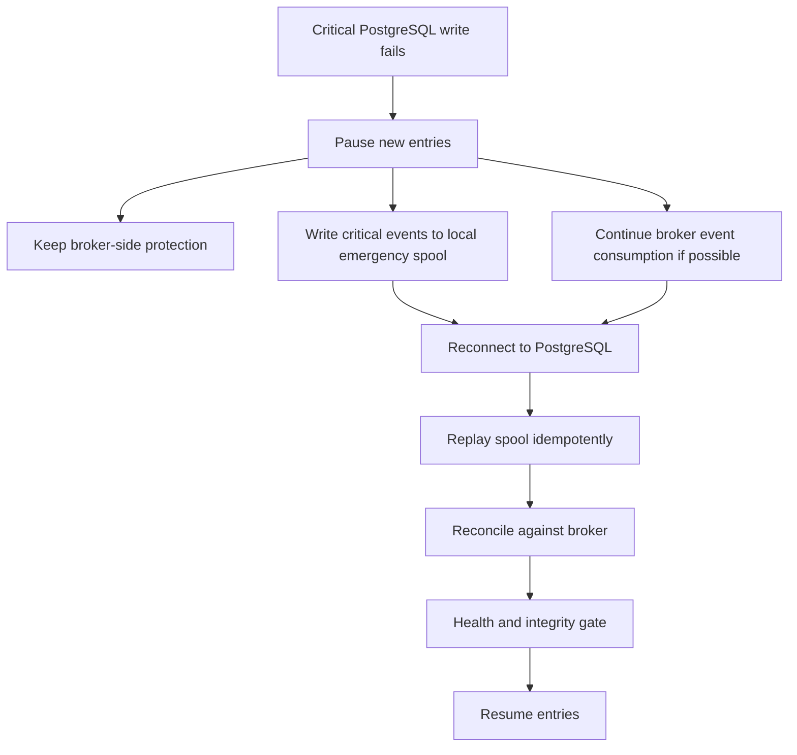
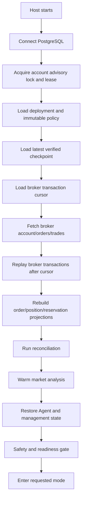
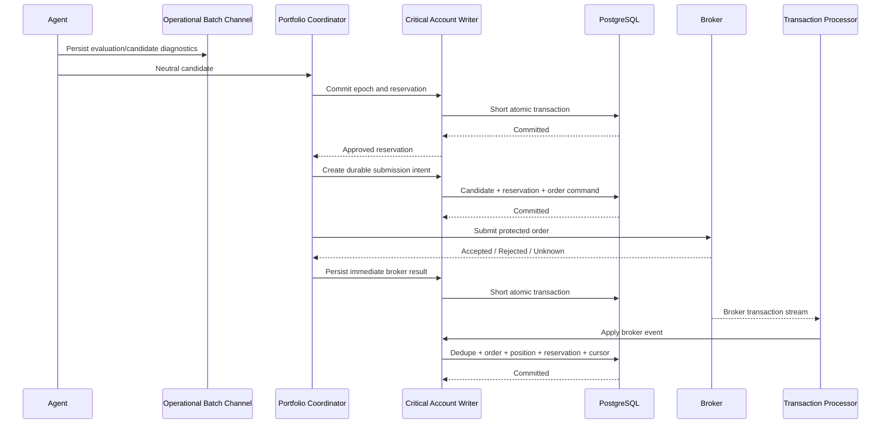

# TradingHub PostgreSQL Persistence and Logging Architecture

## Status

**Purpose:** Define the production database, persistence, concurrency, logging, recovery, and performance architecture for TradingHub.

**Primary database:** PostgreSQL 16 or newer  
**Primary .NET provider:** Npgsql  
**Application model:** Async I/O, bounded channels, short transactions, account-keyed serialization, batched analytical writes  
**Initial deployment:** One TradingHub host, one OANDA Practice account, local PostgreSQL  
**Future deployment:** Remote PostgreSQL server, multiple broker accounts, optional read replica

---

# 1. Executive design decision

TradingHub should use PostgreSQL as its durable operational memory, but PostgreSQL must not be placed directly in the Agent's decision loop.

The design separates persistence into two classes.

## 1.1 Critical durable state

These writes must complete successfully before the system performs the next dangerous external action:

- policy activation;
- portfolio reservation;
- manual approval consumption;
- order submission intent;
- unknown-submission state;
- broker transaction application;
- order and position projection changes;
- transaction cursor advancement;
- safety directives;
- reconciliation corrections;
- account ownership lease;
- controlled shutdown checkpoint.

For these operations:

```text
create short database transaction
→ persist state
→ commit
→ perform or continue the external action
```

A failure pauses new entries.

## 1.2 High-volume observational state

These records should not block Agent evaluation:

- Agent Observe decisions;
- indicator and funnel diagnostics;
- shadow candidates;
- periodic account snapshots;
- market-data health samples;
- execution-quality measurements;
- candidate outcomes;
- research fold metrics;
- model-monitoring windows.

For these operations:

```text
producer creates immutable persistence record
→ enqueue in bounded channel
→ async batch writer
→ PostgreSQL
```

Backpressure and queue limits must be visible. Records must not be silently dropped unless a specific low-priority data class explicitly permits sampling.

## 1.3 Core rule

```text
No database call on every quote.

No shared DbContext between threads.

No database transaction held open during broker HTTP calls.

No order submission before its reservation and submission intent are durable.

No new entry while critical persistence is unhealthy.
```

---

# 2. Goals

The persistence layer must answer these questions completely:

```text
What market information was available?
What did the Agent decide?
Which policy and artifacts produced that decision?
Why was the candidate accepted or rejected?
How was monetary risk calculated?
How did simultaneous opportunities compete for capital?
What did TradingHub ask the broker to do?
What did the broker actually do?
How was the position managed?
Can state be recovered safely after a crash?
Did the filters, model and execution process improve results?
```

The system must support:

- deterministic audit replay;
- exact policy lineage;
- idempotent broker-event processing;
- restart recovery;
- portfolio and reservation recovery;
- rejected-candidate outcome analysis;
- live versus simulator comparison;
- operational safety;
- future migration from local PostgreSQL to a dedicated server;
- future multi-account concurrency without redesigning the domain projects.

---

# 3. Non-goals

The first operational database should not:

- store every quote or tick;
- replace compressed candle or Parquet research storage;
- train models inside SQL;
- contain broker API secrets;
- become a direct dependency of Agent, RiskManager, PortfolioManager, ExecutionManager, or TradeManager;
- use distributed microservices merely for appearance;
- use a generic event-sourcing framework for every object;
- allow Dashboard queries to compete without limits with broker-state writes.

---

# 4. Architectural boundaries

## 4.1 Dependency direction



The domain systems return records and decisions. The application layer decides what must be persisted.

## 4.2 Recommended projects

Reuse and extend the existing `DBManager` area rather than creating many small projects.

```text
DBManager.Abstractions
    Storage contracts
    Persistence command records
    Query contracts
    Transaction result contracts
    No EF Core
    No Npgsql

DBManager.Postgres
    NpgsqlDataSource
    EF Core DbContext and migrations
    High-throughput Npgsql writers
    Repository implementations
    Transaction coordinators
    Partition maintenance
    Health checks

DBManager.Tests
    PostgreSQL integration tests
    Concurrency tests
    Recovery tests
    Migration tests
```

If the existing `DBManager` project is already referenced by domain projects, refactor the dependency so the domain layer does not depend on EF entities or PostgreSQL types.

---

# 5. PostgreSQL logical schemas

Use one PostgreSQL database initially with logical schemas:

```text
reference
config
runtime
decision
risk
execution
management
operations
research
analytics
integration
```

## 5.1 Schema responsibilities

| Schema | Responsibility |
|---|---|
| `reference` | Brokers, accounts, instruments and broker metadata |
| `config` | Immutable policy profiles, revisions, artifacts and deployments |
| `runtime` | Current account, market, Agent and engine projections |
| `decision` | Agent evaluations, candidates, funnel stages and shadow decisions |
| `risk` | Position sizing, risk audits, portfolio decisions and reservations |
| `execution` | Commands, orders, fills, broker transactions and positions |
| `management` | Trade-management state and append-only management events |
| `operations` | Leases, checkpoints, safety events, reconciliation and operator audit |
| `research` | Walk-forward, calibration, ablation, sensitivity and Monte Carlo runs |
| `analytics` | Outcomes, execution quality, drift and aggregated metrics |
| `integration` | Durable inbox/outbox and failed-message quarantine |

---

# 6. Identifier and datatype standards

## 6.1 Identifiers

Use UUIDs generated by the application for distributed identities:

```text
policy_id
deployment_id
decision_id
candidate_id
reservation_id
order_id
position_id
reconciliation_id
research_run_id
artifact_id
```

Use `bigint generated always as identity` for append-only local event sequence numbers.

Use the broker's identifiers in separate constrained columns:

```text
broker_transaction_id text
broker_order_id text
broker_trade_id text
client_order_id text
```

## 6.2 Time

Use:

```text
PostgreSQL: timestamptz
.NET: DateTimeOffset
```

All timestamps are UTC.

Store separate timestamps when their meanings differ:

- `decision_time`;
- `received_at`;
- `persisted_at`;
- `submitted_at`;
- `broker_time`;
- `filled_at`;
- `closed_at`.

Do not overwrite an event timestamp with persistence time.

## 6.3 Numeric values

Recommended starting types:

```text
price           numeric(28,12)
quantity        numeric(28,12)
money           numeric(28,8)
ratio           numeric(18,10)
percentage      numeric(12,8)
sequence        bigint
```

Use .NET `decimal`, not `double`, for money, prices, quantities, P/L, risk, margin and conversion rates.

Research-only statistical arrays may use `double precision` when they do not represent monetary state and the model contract explicitly permits it.

## 6.4 Status values

Prefer `smallint` status codes mapped to stable .NET enums.

Use check constraints where practical.

Avoid PostgreSQL enum types for frequently evolving workflow states because changing application workflow should not require fragile database enum operations.

## 6.5 JSONB

Use `jsonb` for:

- immutable full policy documents;
- detailed diagnostic payloads;
- model metrics;
- broker raw payload snapshots;
- non-query-critical extensible fields.

Promote frequently filtered fields into normal typed columns.

Do not store the entire operational model only as JSON.

---

# 7. Core table design

The following table catalog is the recommended production model.

---

## 7.1 Reference schema

### `reference.brokers`

```text
broker_id bigint PK
code text UNIQUE
display_name text
created_at timestamptz
```

### `reference.broker_accounts`

```text
broker_account_id uuid PK
broker_id bigint FK
external_account_key_hash text
masked_account_name text
environment smallint
account_currency char(3)
enabled boolean
created_at timestamptz
```

Never store API tokens in this table.

### `reference.instruments`

```text
instrument_id bigint PK
canonical_key text UNIQUE
asset_class smallint
base_currency char(3) NULL
quote_currency char(3) NULL
display_name text
```

### `reference.broker_instruments`

```text
broker_account_id uuid FK
instrument_id bigint FK
broker_symbol text
minimum_quantity numeric(28,12)
quantity_step numeric(28,12)
maximum_quantity numeric(28,12) NULL
price_precision smallint
quantity_precision smallint
pip_location smallint NULL
margin_rate numeric(18,10)
tradeable boolean
metadata_revision bigint
valid_from timestamptz
valid_to timestamptz NULL
PRIMARY KEY (broker_account_id, instrument_id, metadata_revision)
```

Broker metadata is versioned because size and margin rules may change.

---

## 7.2 Configuration schema

### `config.policy_profiles`

Represents the stable logical policy identity.

```text
policy_id uuid PK
strategy_id text
strategy_version text
feature_schema_hash text
created_at timestamptz
created_by text
description text
```

### `config.policy_revisions`

Immutable configuration revision.

```text
policy_revision_id uuid PK
policy_id uuid FK
revision integer
configuration_hash text UNIQUE
status smallint
policy_document jsonb
created_at timestamptz
created_by text
approved_at timestamptz NULL
approved_by text NULL
retired_at timestamptz NULL
UNIQUE (policy_id, revision)
```

Statuses:

```text
Research
Reviewed
ApprovedForDemo
Retired
```

Never update `policy_document` after insertion.

Promotion changes status through an append-only promotion event and a constrained projection update.

### `config.calibration_artifacts`

```text
artifact_id uuid PK
artifact_type smallint
strategy_id text
strategy_version text
feature_schema_hash text
content_hash text UNIQUE
storage_uri text
status smallint
training_from timestamptz
training_to timestamptz
validation_from timestamptz
validation_to timestamptz
test_from timestamptz NULL
test_to timestamptz NULL
sample_count bigint
metrics jsonb
created_at timestamptz
approved_at timestamptz NULL
approved_by text NULL
```

Artifact content should normally remain in server-owned file/object storage. PostgreSQL stores lineage, compatibility and integrity metadata.

### `config.policy_artifacts`

```text
policy_revision_id uuid FK
artifact_id uuid FK
role smallint
PRIMARY KEY (policy_revision_id, role)
```

Roles:

```text
SetupCalibration
MetaModel
ManagementCalibration
```

### `config.deployments`

```text
deployment_id uuid PK
broker_account_id uuid FK
policy_revision_id uuid FK
host_instance_id text
execution_mode smallint
status smallint
started_at timestamptz
stopped_at timestamptz NULL
started_by text
stop_reason text NULL
deployment_hash text
```

### `config.deployment_assignments`

```text
deployment_id uuid FK
instrument_id bigint FK
strategy_id text
agent_mode smallint
enabled boolean
PRIMARY KEY (deployment_id, instrument_id, strategy_id)
```

---

## 7.3 Runtime projections

These tables represent current state for fast recovery and Dashboard reads. They are not the only historical record.

### `runtime.engine_instances`

```text
host_instance_id text PK
deployment_id uuid FK
state smallint
started_at timestamptz
last_heartbeat_at timestamptz
last_checkpoint_at timestamptz NULL
critical_persistence_healthy boolean
entries_paused boolean
pause_reason text NULL
version bigint
```

### `runtime.account_state`

One current row per broker account.

```text
broker_account_id uuid PK
broker_snapshot_version bigint
balance numeric(28,8)
equity numeric(28,8)
unrealised_pnl numeric(28,8)
realised_pnl numeric(28,8)
margin_used numeric(28,8)
margin_available numeric(28,8)
margin_closeout_ratio numeric(18,10) NULL
high_watermark numeric(28,8)
daily_high_watermark numeric(28,8)
drawdown_ratio numeric(18,10)
broker_time timestamptz
received_at timestamptz
version bigint
```

### `runtime.market_state`

```text
deployment_id uuid
instrument_id bigint
state smallint
last_quote_time timestamptz NULL
last_completed_m1 timestamptz NULL
last_processed_sequence bigint
last_decision_epoch timestamptz NULL
quote_stale boolean
candle_stale boolean
gap_count bigint
duplicate_count bigint
version bigint
PRIMARY KEY (deployment_id, instrument_id)
```

### `runtime.agent_state`

Only persist restart-essential Agent state, not every indicator buffer.

```text
deployment_id uuid
instrument_id bigint
strategy_id text
agent_state_version bigint
state_code smallint
setup_id text NULL
setup_direction smallint NULL
setup_started_at timestamptz NULL
setup_expires_at timestamptz NULL
last_evaluated_epoch timestamptz NULL
last_decision_id uuid NULL
state_payload jsonb
updated_at timestamptz
version bigint
PRIMARY KEY (deployment_id, instrument_id, strategy_id)
```

Prefer rebuilding indicator buffers from candles during warm-up. Persist only the minimum required to avoid duplicate or lost setup state.

---

## 7.4 Decision schema

Large decision tables should be partitioned by `decision_time`, monthly initially.

### `decision.agent_evaluations`

```text
evaluation_sequence bigint identity
decision_id uuid
deployment_id uuid
policy_revision_id uuid
instrument_id bigint
strategy_id text
decision_time timestamptz
received_at timestamptz
action smallint
state_before smallint
state_after smallint
trigger_interval smallint
snapshot_version bigint
raw_confidence numeric(18,10) NULL
mtf_alignment numeric(18,10) NULL
regime smallint NULL
primary_reason_code text
diagnostics jsonb
persisted_at timestamptz
PRIMARY KEY (decision_time, evaluation_sequence)
```

Important indexes per partition:

```text
(decision_id) UNIQUE where partitioning rules permit
(deployment_id, strategy_id, instrument_id, decision_time DESC)
(primary_reason_code, decision_time DESC)
BRIN(decision_time)
```

Because global unique indexes across time partitions have partition-key requirements, maintain a separate small idempotency table when necessary.

### `decision.decision_keys`

```text
decision_id uuid PK
decision_time timestamptz
deployment_id uuid
```

Insert into this table first or in the same transaction to guarantee global decision uniqueness.

### `decision.trade_candidates`

```text
candidate_sequence bigint identity
candidate_id uuid
decision_id uuid
setup_id text
deployment_id uuid
policy_revision_id uuid
instrument_id bigint
strategy_id text
direction smallint
decision_time timestamptz
reference_bid numeric(28,12) NULL
reference_ask numeric(28,12) NULL
reference_mid numeric(28,12)
stop_price numeric(28,12)
target_price numeric(28,12) NULL
raw_confidence numeric(18,10)
mtf_alignment numeric(18,10)
regime smallint
setup_calibration_audit jsonb
meta_label_audit jsonb
trading_condition_audit jsonb
status smallint
expires_at timestamptz
created_at timestamptz
PRIMARY KEY (decision_time, candidate_sequence)
```

### `decision.candidate_keys`

```text
candidate_id uuid PK
decision_id uuid UNIQUE
candidate_time timestamptz
current_status smallint
```

### `decision.candidate_stage_events`

Append-only funnel history.

```text
event_id bigint identity
candidate_id uuid
occurred_at timestamptz
stage smallint
outcome smallint
reason_code text
risk_multiplier numeric(18,10) NULL
confidence_before numeric(18,10) NULL
confidence_after numeric(18,10) NULL
details jsonb
PRIMARY KEY (occurred_at, event_id)
```

This prevents one final rejection reason from obscuring earlier component results.

---

## 7.5 Risk schema

### `risk.position_sizing_evaluations`

```text
sizing_id uuid PK
candidate_id uuid UNIQUE
broker_account_id uuid
account_snapshot_version bigint
instrument_metadata_revision bigint
evaluated_at timestamptz
equity numeric(28,8)
base_risk_amount numeric(28,8)
stop_distance numeric(28,12)
expected_spread numeric(28,12)
expected_slippage numeric(28,12)
expected_commission numeric(28,8)
conversion_rate numeric(28,12)
conversion_path text
raw_quantity numeric(28,12)
normalized_quantity numeric(28,12)
estimated_stop_loss numeric(28,8)
estimated_margin numeric(28,8)
approved boolean
reason_code text
audit jsonb
```

### `risk.portfolio_decisions`

```text
portfolio_decision_id uuid PK
decision_epoch timestamptz
broker_account_id uuid
candidate_id uuid UNIQUE
rank integer
requested_risk numeric(28,8)
approved_risk numeric(28,8)
requested_quantity numeric(28,12)
approved_quantity numeric(28,12)
estimated_margin numeric(28,8)
approved boolean
reason_code text
portfolio_snapshot jsonb
created_at timestamptz
```

### `risk.reservations`

Current reservation projection.

```text
reservation_id uuid PK
candidate_id uuid UNIQUE
broker_account_id uuid
portfolio_decision_id uuid UNIQUE
state smallint
reserved_risk numeric(28,8)
reserved_margin numeric(28,8)
reserved_quantity numeric(28,12)
created_at timestamptz
expires_at timestamptz
updated_at timestamptz
version bigint
```

Indexes:

```text
(broker_account_id, state, expires_at)
partial index WHERE state IN (Created, SubmissionPending, BrokerAccepted, PartiallyFilled)
```

### `risk.reservation_events`

Append-only state transitions.

```text
event_id bigint identity
reservation_id uuid
occurred_at timestamptz
from_state smallint
to_state smallint
reason_code text
related_order_id uuid NULL
details jsonb
PRIMARY KEY (occurred_at, event_id)
```

---

## 7.6 Execution schema

### `execution.order_commands`

The durable intent to contact the broker.

```text
command_id uuid PK
idempotency_key text UNIQUE
candidate_id uuid
reservation_id uuid
command_type smallint
client_order_id text UNIQUE
requested_quantity numeric(28,12)
requested_stop numeric(28,12) NULL
requested_target numeric(28,12) NULL
status smallint
created_at timestamptz
started_at timestamptz NULL
completed_at timestamptz NULL
attempt_count integer
last_error text NULL
version bigint
```

### `execution.orders`

Current order projection.

```text
order_id uuid PK
command_id uuid UNIQUE
candidate_id uuid
reservation_id uuid
broker_account_id uuid
instrument_id bigint
strategy_id text
client_order_id text UNIQUE
broker_order_id text NULL
broker_trade_id text NULL
direction smallint
requested_quantity numeric(28,12)
filled_quantity numeric(28,12)
average_fill_price numeric(28,12) NULL
initial_stop_price numeric(28,12)
initial_target_price numeric(28,12) NULL
state smallint
submission_certainty smallint
created_at timestamptz
submitted_at timestamptz NULL
accepted_at timestamptz NULL
filled_at timestamptz NULL
closed_at timestamptz NULL
version bigint
```

Indexes:

```text
(broker_account_id, state)
(instrument_id, state)
(strategy_id, state)
partial index WHERE state IN (SubmissionPending, SubmissionUnknown, Accepted, PartiallyFilled, Filled)
```

### `execution.order_events`

```text
event_id bigint identity
order_id uuid
occurred_at timestamptz
event_type smallint
from_state smallint NULL
to_state smallint NULL
broker_transaction_id text NULL
quantity numeric(28,12) NULL
price numeric(28,12) NULL
reason_code text NULL
details jsonb
PRIMARY KEY (occurred_at, event_id)
```

### `execution.broker_transactions`

Partition monthly by `broker_time`.

```text
event_id bigint identity
broker_account_id uuid
broker_transaction_id text
broker_time timestamptz
received_at timestamptz
transaction_type smallint
client_order_id text NULL
broker_order_id text NULL
broker_trade_id text NULL
instrument_id bigint NULL
quantity numeric(28,12) NULL
price numeric(28,12) NULL
reason_code text NULL
raw_payload jsonb
applied_at timestamptz NULL
PRIMARY KEY (broker_time, event_id)
```

### `execution.broker_transaction_keys`

```text
broker_account_id uuid
broker_transaction_id text
broker_time timestamptz
PRIMARY KEY (broker_account_id, broker_transaction_id)
```

This small table provides global idempotency independent of partition layout.

### `execution.fills`

```text
fill_id uuid PK
order_id uuid
broker_account_id uuid
broker_transaction_id text
broker_fill_id text NULL
quantity numeric(28,12)
price numeric(28,12)
commission numeric(28,8)
financing numeric(28,8)
spread_cost numeric(28,8) NULL
slippage_cost numeric(28,8) NULL
broker_time timestamptz
received_at timestamptz
UNIQUE (broker_account_id, broker_transaction_id)
```

### `execution.positions`

Current strategy-owned projection.

```text
position_id uuid PK
broker_account_id uuid
instrument_id bigint
strategy_id text
policy_revision_id uuid
management_artifact_id uuid NULL
broker_trade_id text
direction smallint
state smallint
original_quantity numeric(28,12)
remaining_quantity numeric(28,12)
average_entry_price numeric(28,12)
initial_stop_price numeric(28,12)
current_stop_price numeric(28,12)
target_price numeric(28,12) NULL
original_risk numeric(28,8)
remaining_risk numeric(28,8)
realised_pnl numeric(28,8)
unrealised_pnl numeric(28,8)
commission numeric(28,8)
financing numeric(28,8)
opened_at timestamptz
closed_at timestamptz NULL
version bigint
UNIQUE (broker_account_id, broker_trade_id, strategy_id)
```

For the initial release enforce one executable strategy per instrument through deployment validation.

### `execution.position_events`

Append-only fill, reduction, close and broker projection events.

---

## 7.7 Management schema

### `management.position_management_state`

```text
position_id uuid PK
management_policy_revision_id uuid
stage smallint
mfe_price numeric(28,12)
mae_price numeric(28,12)
mfe_r numeric(18,10)
mae_r numeric(18,10)
highest_profit_floor numeric(28,12) NULL
last_fast_interval_at timestamptz NULL
last_main_interval_at timestamptz NULL
last_thesis_interval_at timestamptz NULL
last_action_at timestamptz NULL
state_payload jsonb
updated_at timestamptz
version bigint
```

### `management.management_events`

Partition monthly by `occurred_at`.

```text
event_id bigint identity
position_id uuid
occurred_at timestamptz
evaluation_clock smallint
action_type smallint
reason_code text
reference_bid numeric(28,12) NULL
reference_ask numeric(28,12) NULL
current_r numeric(18,10)
mfe_r numeric(18,10)
mae_r numeric(18,10)
previous_stop numeric(28,12) NULL
requested_stop numeric(28,12) NULL
confirmed_stop numeric(28,12) NULL
requested_reduction numeric(28,12) NULL
confirmed_reduction numeric(28,12) NULL
broker_command_id uuid NULL
details jsonb
PRIMARY KEY (occurred_at, event_id)
```

---

## 7.8 Operations schema

### `operations.account_leases`

Observability projection for account ownership.

```text
broker_account_id uuid PK
host_instance_id text
lease_generation bigint
acquired_at timestamptz
heartbeat_at timestamptz
expires_at timestamptz
status smallint
```

Use a dedicated session-level PostgreSQL advisory lock as the actual process-exclusion mechanism and this table as the visible lease projection.

### `operations.broker_stream_cursors`

```text
broker_account_id uuid PRIMARY KEY
last_applied_transaction_id text
last_applied_broker_time timestamptz
connection_generation bigint
last_heartbeat_at timestamptz
updated_at timestamptz
version bigint
```

Cursor advancement must occur in the same transaction as broker-event projection updates.

### `operations.reconciliation_runs`

```text
reconciliation_id uuid PK
broker_account_id uuid
trigger smallint
started_at timestamptz
completed_at timestamptz NULL
broker_snapshot_time timestamptz NULL
status smallint
entries_paused boolean
summary jsonb
```

### `operations.reconciliation_differences`

```text
difference_id uuid PK
reconciliation_id uuid
difference_type smallint
severity smallint
instrument_id bigint NULL
order_id uuid NULL
position_id uuid NULL
local_value jsonb
broker_value jsonb
action smallint
resolved_at timestamptz NULL
resolution_note text NULL
```

### `operations.safety_events`

Partition monthly.

```text
event_id bigint identity
deployment_id uuid
broker_account_id uuid
occurred_at timestamptz
severity smallint
source smallint
directive smallint
reason_code text
instrument_id bigint NULL
order_id uuid NULL
position_id uuid NULL
automatic_action jsonb
resolved_at timestamptz NULL
resolved_by text NULL
PRIMARY KEY (occurred_at, event_id)
```

### `operations.operator_commands`

```text
operator_command_id uuid PK
idempotency_key text UNIQUE
deployment_id uuid
operator_identity text
command_type smallint
target_id text NULL
reason text
requested_at timestamptz
status smallint
completed_at timestamptz NULL
result jsonb
```

### `operations.checkpoints`

```text
checkpoint_id uuid PK
deployment_id uuid
checkpoint_type smallint
sequence bigint
content_hash text
payload jsonb
created_at timestamptz
UNIQUE (deployment_id, checkpoint_type, sequence)
```

Keep only the newest N checkpoints per type after a verified backup window.

### `operations.account_snapshots`

Partition monthly.

Store periodic snapshots and event-driven snapshots after fills, closes, reconciliations and safety directives.

---

## 7.9 Research schema

### `research.research_runs`

```text
research_run_id uuid PK
run_type smallint
strategy_id text
strategy_version text
configuration_hash text
dataset_hash text
status smallint
requested_at timestamptz
started_at timestamptz NULL
completed_at timestamptz NULL
random_seed bigint NULL
parameters jsonb
summary_metrics jsonb
failure_reason text NULL
```

### `research.time_series_folds`

```text
fold_id uuid PK
research_run_id uuid
fold_number integer
training_from timestamptz
training_to timestamptz
validation_from timestamptz
validation_to timestamptz
test_from timestamptz NULL
test_to timestamptz NULL
purge_duration interval
embargo_duration interval
sample_counts jsonb
metrics jsonb
```

### `research.calibration_runs`

Separate setup, meta-model and management stages with input artifact lineage.

### `research.ablation_results`

### `research.sensitivity_results`

### `research.monte_carlo_results`

Bulk result details may be stored in Parquet with PostgreSQL metadata and summaries.

---

## 7.10 Analytics schema

### `analytics.candidate_outcomes`

Partition monthly by original decision time.

```text
outcome_id uuid
candidate_id uuid UNIQUE
decision_time timestamptz
horizon_end timestamptz
target_reached boolean
stop_reached boolean
first_terminal_event smallint
mfe_price numeric(28,12)
mae_price numeric(28,12)
mfe_r numeric(18,10)
mae_r numeric(18,10)
maximum_achievable_r numeric(18,10)
time_to_mfe interval
time_to_mae interval
spread_adjusted_r numeric(18,10)
outcome_version integer
calculated_at timestamptz
PRIMARY KEY (decision_time, outcome_id)
```

### `analytics.execution_quality`

```text
execution_quality_id uuid PK
order_id uuid UNIQUE
decision_bid numeric(28,12)
decision_ask numeric(28,12)
submission_bid numeric(28,12)
submission_ask numeric(28,12)
expected_fill_price numeric(28,12)
actual_fill_price numeric(28,12)
expected_spread numeric(28,12)
actual_spread numeric(28,12)
expected_slippage numeric(28,12)
actual_slippage numeric(28,12)
submission_latency_ms integer
ack_latency_ms integer NULL
fill_latency_ms integer NULL
session smallint
regime smallint
calculated_at timestamptz
```

### `analytics.model_monitoring_windows`

Store aggregated drift and calibration metrics, not every feature vector twice.

---

## 7.11 Integration schema

### `integration.inbox_messages`

Used for idempotent external message application where an explicit inbox is helpful.

```text
source text
message_id text
received_at timestamptz
processed_at timestamptz NULL
status smallint
payload_hash text
error text NULL
PRIMARY KEY (source, message_id)
```

Broker transaction identity should still use the dedicated broker transaction key table.

### `integration.outbox_messages`

```text
outbox_id uuid PK
aggregate_type smallint
aggregate_id uuid
event_type text
occurred_at timestamptz
payload jsonb
status smallint
attempt_count integer
next_attempt_at timestamptz
created_at timestamptz
published_at timestamptz NULL
```

The outbox is for SignalR updates, metrics, notifications and other downstream effects.

Do not use it to delay broker-critical state changes.

### `integration.failed_messages`

Quarantine messages that exceed retry policy.

---

# 8. Entity relationship overview



---

# 9. Async and concurrency architecture

## 9.1 Important principle

`async` improves I/O scalability; it does not make one mutable unit of work safe for parallel use.

Use:

- one singleton `NpgsqlDataSource`;
- pooled database connections;
- one short-lived DbContext per unit of work;
- `IDbContextFactory` or pooled DbContext factory for EF Core paths;
- independent contexts/connections for operations that truly run concurrently;
- immediate `await` before reusing a context;
- no `Task.Run` around database I/O.

## 9.2 Persistence lanes



### Lane A — critical account state

Examples:

- reservation creation;
- approval consumption;
- submission intent;
- broker event application;
- order/position update;
- cursor advancement;
- safety pause;
- reconciliation repair.

Concurrency rule:

```text
Sequential per broker account
Parallel across independent broker accounts
```

Use an account-keyed actor or dispatcher.

For one OANDA Practice account this means one critical writer.

### Lane B — operational diagnostics

Examples:

- evaluations;
- funnel events;
- periodic health;
- account snapshots;
- management diagnostics.

Use 2–4 batch workers initially.

Each worker owns its own connection/context.

Batch by:

```text
maximum rows: 100–500
maximum delay: 10–50 ms
```

Tune from measurements.

### Lane C — research and analytical bulk import

Use:

- Npgsql binary COPY;
- one worker per destination table or partition;
- bounded concurrency;
- lower database priority;
- explicit rate limiting;
- no competition with critical live writes.

Run large imports outside peak live periods where practical.

---

# 10. Bounded channel design

## 10.1 Critical channel

```text
Capacity: 10,000–20,000 commands
Full mode: Wait
Readers: one per account shard
Writers: many
Drop policy: never
Health alarm: >50% capacity
Safety pause: sustained >80% or writer failure
```

Every command carries:

```text
CommandId
AccountId
CorrelationId
CreatedAt
Deadline
IdempotencyKey
Completion TaskCompletionSource
```

Callers may await completion when durability is required.

## 10.2 Operational channel

```text
Capacity: 50,000–100,000 records
Full mode: Wait initially
Readers: 2–4
Batching: enabled
Drop policy: none for decision/candidate events
Optional sampling: only high-frequency non-critical health samples
```

## 10.3 Research channel

```text
Capacity: based on memory budget
Full mode: Wait
Readers: 1–2 COPY workers
Cancellation: graceful
Priority: lowest
```

## 10.4 Completion semantics

Use `ValueTask` where an operation commonly completes synchronously, but do not complicate public APIs without evidence.

Use `Task` for durable completion APIs.

A persistence call should return a result that distinguishes:

```text
Committed
Duplicate
RejectedByConcurrency
RetryableFailure
PermanentFailure
```

---

# 11. Account-keyed serialization

A global single writer is simple but eventually limits multi-account scaling.

Use keyed serialization:

```text
Account A command stream → sequential
Account B command stream → sequential and concurrent with A
Account C command stream → sequential and concurrent with A/B
```

Implementation options:

1. one bounded channel per active account;
2. a partitioned channel array using stable account hashing;
3. a keyed asynchronous lock plus short transactions.

For the first implementation, one account channel is sufficient. Design the interface so it can later shard without changing callers.

Do not serialize independent Agent evaluation records through the account-critical writer.

---

# 12. Transaction and consistency model

## 12.1 Default isolation

Use `READ COMMITTED` for most short transactions.

## 12.2 Portfolio admission and reservations

Use one of these safe approaches:

### Preferred initial approach

Lock the account state row:

```sql
SELECT *
FROM runtime.account_state
WHERE broker_account_id = @account_id
FOR UPDATE;
```

Then:

```text
load active reservations
load current positions/exposures
evaluate the deterministic epoch
insert portfolio decisions
insert reservations
commit
```

All candidate ranking for one decision epoch should be committed together.

### Alternative

Use a transaction-level advisory lock keyed by account ID.

Row locking is easier to observe and reason about initially.

## 12.3 Serializable transactions

Use `SERIALIZABLE` only for workflows that need it and implement bounded retries for SQLSTATE `40001`.

Do not make every insert Serializable.

## 12.4 Optimistic concurrency

Current projections use explicit `version bigint`.

Example:

```sql
UPDATE execution.positions
SET remaining_quantity = @quantity,
    version = version + 1
WHERE position_id = @position_id
  AND version = @expected_version;
```

Zero affected rows means stale state and requires reload/revalidation.

## 12.5 No transaction across broker I/O

Correct order submission sequence:

```text
DB transaction:
    consume approval
    validate active reservation
    create order command
    create local order in SubmissionPending
commit

broker call outside transaction

DB transaction:
    apply Accepted / Rejected / Unknown result
    update order
    update reservation
    write events
commit
```

For `Unknown`:

```text
retain reservation
mark SubmissionUnknown
pause entries if policy requires
reconcile by deterministic client order ID
never retry blindly
```

---

# 13. Critical atomic workflows

## 13.1 Broker transaction application

One PostgreSQL transaction must:

1. insert the broker transaction key;
2. return `Duplicate` if it already exists;
3. insert raw normalized transaction;
4. update order projection;
5. update position projection;
6. update reservation;
7. append order/position/reservation events;
8. update management state if relevant;
9. advance the broker transaction cursor;
10. insert outbox notifications;
11. commit.

Cursor advancement must never occur without applying all related state.

## 13.2 Manual approval

One transaction:

1. lock candidate key/current status;
2. verify status is `AwaitingApproval`;
3. verify expiry;
4. verify candidate fingerprint;
5. verify policy and deployment revision;
6. verify reservation state;
7. mark approval consumed;
8. create durable submission command;
9. commit.

A duplicate approval returns the existing command/result rather than creating another order.

## 13.3 Reconciliation repair

One transaction per coherent repair group:

- insert reconciliation difference;
- update projection;
- append correction event;
- update safety state;
- insert outbox notification.

Do not automatically adopt an unknown broker position without an explicit policy and audit event.

## 13.4 Policy activation

One transaction:

- verify artifact compatibility;
- verify `ApprovedForDemo` where execution is enabled;
- close previous active deployment revision;
- activate new revision;
- append activation event;
- update current deployment projection.

New candidates use the new revision after a controlled decision boundary.

Open positions retain their original management policy revision.

---

# 14. Npgsql and EF Core usage strategy

## 14.1 NpgsqlDataSource

Create one `NpgsqlDataSource` at host startup and register it as a singleton.

It owns connection pooling and type configuration.

Use separate connection strings/data sources where isolation is valuable:

```text
TradingCritical
TradingRead
ResearchBulk
LeaseConnection
```

They may point to the same PostgreSQL server but use different pool sizes, timeouts and application names.

## 14.2 EF Core responsibilities

Use EF Core for:

- configuration entities;
- deployments;
- migrations;
- administrative CRUD;
- current projections;
- moderate-volume queries;
- relationship mapping;
- Dashboard read models.

Use:

- `AddPooledDbContextFactory`;
- short-lived contexts;
- `AsNoTracking` for reads;
- projections rather than loading full entities;
- compiled queries only after profiling.

## 14.3 Direct Npgsql responsibilities

Use direct Npgsql for:

- broker-event atomic application;
- portfolio epoch admission;
- high-volume append-only batches;
- `INSERT ... ON CONFLICT`;
- binary COPY;
- cursor pagination queries;
- partition maintenance;
- advisory lock ownership;
- commands where exact SQL locking semantics matter.

This hybrid keeps maintainability without sacrificing critical-path control.

## 14.4 Do not share DbContext

Never:

```text
inject one DbContext into a singleton background service
use it from multiple channel workers
run Task.WhenAll with several queries on one context
```

Each parallel worker creates its own context or opens its own pooled connection.

---

# 15. Representative .NET contracts

```csharp
public interface ITradingPersistence
{
    Task<DurableResult> PersistDecisionAsync(
        PersistAgentDecision command,
        CancellationToken cancellationToken);

    Task<PortfolioAdmissionResult> CommitPortfolioEpochAsync(
        CommitPortfolioEpoch command,
        CancellationToken cancellationToken);

    Task<OrderSubmissionIntentResult> CreateSubmissionIntentAsync(
        CreateOrderSubmissionIntent command,
        CancellationToken cancellationToken);

    Task<BrokerEventApplyResult> ApplyBrokerEventAsync(
        ApplyBrokerEvent command,
        CancellationToken cancellationToken);

    Task<RecoveryState> LoadRecoveryStateAsync(
        BrokerAccountId accountId,
        CancellationToken cancellationToken);
}
```

Separate query contracts:

```csharp
public interface ITradingReadStore
{
    Task<LiveOperationsSnapshot> ReadLiveSnapshotAsync(
        DeploymentId deploymentId,
        CancellationToken cancellationToken);

    Task<CursorPage<AgentDecisionSummary>> ReadDecisionsAsync(
        DecisionQuery query,
        CancellationToken cancellationToken);
}
```

Separate bulk contracts:

```csharp
public interface IResearchBulkStore
{
    Task WriteCandidateOutcomesAsync(
        IAsyncEnumerable<CandidateOutcomeRecord> outcomes,
        CancellationToken cancellationToken);
}
```

---

# 16. Background writer example

Conceptual implementation:

```csharp
public sealed class OperationalBatchWriter : BackgroundService
{
    private readonly ChannelReader<OperationalRecord> _reader;
    private readonly NpgsqlDataSource _dataSource;

    protected override async Task ExecuteAsync(
        CancellationToken stoppingToken)
    {
        var batch = new List<OperationalRecord>(capacity: 250);
        using var timer = new PeriodicTimer(TimeSpan.FromMilliseconds(25));

        while (!stoppingToken.IsCancellationRequested)
        {
            batch.Clear();

            while (batch.Count < 250 &&
                   _reader.TryRead(out var record))
            {
                batch.Add(record);
            }

            if (batch.Count == 0)
            {
                var readTask = _reader.WaitToReadAsync(stoppingToken).AsTask();
                var timerTask = timer.WaitForNextTickAsync(stoppingToken).AsTask();

                await Task.WhenAny(readTask, timerTask).ConfigureAwait(false);
                continue;
            }

            await WriteBatchAsync(batch, stoppingToken)
                .ConfigureAwait(false);
        }
    }
}
```

Production implementation must:

- drain on graceful shutdown;
- preserve failed batches;
- split retryable and permanent errors;
- use jittered retry;
- expose queue depth and batch latency;
- avoid duplicating records through idempotency keys.

---

# 17. Connection pool design

Initial local server starting point:

```text
Critical pool:
    Minimum Pool Size = 2
    Maximum Pool Size = 20

Read/API pool:
    Minimum Pool Size = 2
    Maximum Pool Size = 30

Research bulk pool:
    Minimum Pool Size = 0
    Maximum Pool Size = 4
```

These are starting values, not targets.

Do not set hundreds of connections merely because tasks are asynchronous.

PostgreSQL uses server resources per connection. Measure:

- pool wait duration;
- active connections;
- query latency;
- lock wait;
- CPU;
- I/O;
- transaction duration.

When PostgreSQL moves to a Raspberry Pi or small server, reduce pool sizes.

A dedicated account-lease connection stays open and is not returned to the normal pool while ownership is held.

---

# 18. Query performance rules

## 18.1 Pagination

Use keyset/cursor pagination:

```sql
WHERE (decision_time, evaluation_sequence) < (@time, @sequence)
ORDER BY decision_time DESC, evaluation_sequence DESC
LIMIT @page_size;
```

Do not use large `OFFSET` values.

## 18.2 Dashboard reads

Build read projections that answer the Dashboard directly.

Avoid joining raw event tables for every refresh.

Examples:

- `runtime.live_operations_snapshot`;
- active orders;
- active positions;
- latest Agent state;
- latest safety state;
- current reservations.

## 18.3 N+1 prevention

Project exact columns and fetch child summaries with explicit queries.

Do not lazy-load.

## 18.4 Query timeouts

Use different command timeouts:

```text
Critical writes: short and strict
Dashboard reads: short
Research queries: longer, separate pool
Migrations: explicit maintenance window
```

## 18.5 Prepared statements

Use stable parameterized SQL. Npgsql automatic preparation may be enabled after measuring query shape stability.

Never concatenate SQL values.

---

# 19. Batch and bulk strategies

## 19.1 Normal batches

Use `NpgsqlBatch` or multi-row inserts for:

- Agent evaluations;
- stage events;
- periodic account snapshots;
- management diagnostics.

## 19.2 Binary COPY

Use binary COPY for:

- imported candles;
- candidate outcomes;
- research samples;
- fold-level result details;
- historical execution-detail records.

COPY workers should commit bounded chunks so one failure does not lose an enormous import.

Example chunk targets:

```text
10,000–100,000 rows per COPY chunk
```

Tune by row size and server memory.

## 19.3 Upsert rules

Use `ON CONFLICT DO NOTHING` for immutable idempotent events.

Use `ON CONFLICT ... DO UPDATE` only for explicit projections where last-write rules are deterministic and version-checked.

Avoid blind last-write-wins updates to orders, positions or reservations.

---

# 20. Partitioning

Partition only large append-only tables.

Start with monthly range partitions for:

```text
decision.agent_evaluations
decision.trade_candidates
decision.candidate_stage_events
execution.broker_transactions
execution.order_events
execution.position_events
management.management_events
operations.safety_events
operations.account_snapshots
analytics.candidate_outcomes
```

Do not partition small current-state tables.

## 20.1 Partition maintenance

A scheduled maintenance service should:

- create partitions 2–3 months ahead;
- verify required indexes;
- detect rows in a default partition;
- detach/archive expired partitions;
- update statistics.

Partition creation should not happen in the critical write path.

## 20.2 Indexes

Use:

- B-tree for IDs, statuses and recent account/instrument queries;
- BRIN for very large append-only timestamp-correlated tables;
- partial indexes for active states;
- GIN on JSONB only for demonstrated queries.

Every index adds write cost. Add indexes from real query plans, not speculation.

---

# 21. Retention and archiving

Recommended initial retention:

| Data | PostgreSQL hot retention | Archive |
|---|---:|---|
| Current projections | Indefinite | Backups |
| Broker transactions | Indefinite or 7 years | Optional compressed export |
| Orders/fills/positions | Indefinite | Backups |
| Safety/operator audit | Indefinite | Backups |
| Agent evaluations | 6–12 months | Parquet |
| Candidate stage events | 12–24 months | Parquet |
| Account snapshots | 6–12 months | Aggregated/Parquet |
| Market health samples | 1–3 months | Aggregates |
| Candidate outcomes | 2+ years | Parquet copy |
| Detailed research rows | Project-specific | Parquet/object storage |
| Research summaries/artifact lineage | Indefinite | Backups |

Archiving a partition:

```text
verify checksum
→ export to compressed Parquet
→ store manifest in PostgreSQL
→ detach partition
→ retain for safety window
→ drop after verification
```

---

# 22. Logging architecture

PostgreSQL stores trading facts, not every technical log line.

## 22.1 Structured technical logging

Use:

```text
Serilog
→ console
→ rolling files
→ OpenTelemetry
→ Seq/Loki/another backend later
```

Required fields:

```text
HostInstanceId
DeploymentId
PolicyRevisionId
BrokerAccountIdMasked
Instrument
StrategyId
DecisionId
CandidateId
ReservationId
CommandId
ClientOrderId
BrokerOrderId
BrokerTradeId
BrokerTransactionId
PositionId
ReconciliationId
```

## 22.2 Database audit

Store durable facts:

- policy promoted;
- candidate rejected;
- reservation created;
- order submission became unknown;
- broker fill received;
- stop replacement rejected;
- safety pause activated;
- operator requested flatten.

## 22.3 Logging performance

- Logging calls must not synchronously block the quote or Agent path.
- Use bounded asynchronous log sinks.
- Never log broker credentials or complete connection strings.
- Critical safety and execution events must also exist as database records.
- If the technical logging backend fails, trading state persistence remains independent.

---

# 23. Database outage behaviour



## 23.1 Emergency local spool

Use an append-only local file only for bounded emergency continuity:

```text
sequence
event type
idempotency key
payload
created time
SHA-256/checksum
```

It is not a second normal database.

When the spool reaches its configured size/time limit, escalate safety. Do not allow unlimited unpersisted operation.

## 23.2 Execution policy during outage

Recommended initial policy:

```text
new entries:
    prohibited

existing broker positions:
    broker stop remains active
    continue safety-only monitoring where possible

new management mutations:
    allow only according to explicit outage policy
    full close may remain permitted
    dynamic stop/partial close should normally require persistence
```

---

# 24. Restart recovery

Startup sequence:



Entries remain paused until every hard recovery condition passes.

---

# 25. Security

Create separate PostgreSQL roles:

```text
trading_migrator
trading_runtime
trading_reader
trading_research
trading_backup
```

## 25.1 Runtime role

May:

- read configuration approved for deployment;
- read/write runtime, decision, risk, execution, management and operations tables needed by the host;
- execute approved database functions.

May not:

- alter schema;
- drop tables;
- change artifact content;
- read secrets;
- grant permissions.

## 25.2 Dashboard reader

Read-only for normal monitoring.

Dangerous commands go through authenticated application APIs, not direct database writes.

## 25.3 Network

When PostgreSQL moves to a separate server:

- private wired LAN;
- firewall allowlist;
- SCRAM authentication;
- TLS;
- no public internet exposure;
- separate backup credentials.

---

# 26. Migration strategy

Use EF Core migrations for schema evolution, supplemented by reviewed SQL for:

- partitions;
- partial indexes;
- BRIN indexes;
- database functions;
- advisory-lock helpers;
- concurrent index creation where needed.

Rules:

- migrations run from a separate administrative command;
- live host does not automatically run destructive migrations at startup;
- maintain expand/migrate/contract compatibility;
- large backfills are resumable;
- create indexes concurrently where appropriate;
- test every migration against a production-sized copy;
- record schema version in `operations.schema_history`.

---

# 27. Backup and disaster recovery

Minimum:

```text
nightly pg_dump custom-format backup
weekly verified restore test
backup copied to another physical device
```

Later:

```text
pg_basebackup
WAL archiving
point-in-time recovery
standby server
```

A backup is not valid until it has been restored and verified.

Store:

- backup ID;
- start/end time;
- PostgreSQL version;
- schema version;
- checksum;
- restore-test status;
- retention expiry.

The 3 TB local disk is active storage, not an independent backup if backups are stored on the same disk.

---

# 28. Observability

Monitor PostgreSQL and application persistence.

## 28.1 Application metrics

```text
critical queue depth
operational queue depth
research queue depth
oldest queued record age
batch size
batch write duration
transaction retries
serialization failures
deadlocks
optimistic concurrency conflicts
pool wait time
database unavailable duration
emergency spool size
broker cursor lag
outbox lag
```

## 28.2 PostgreSQL metrics

```text
connections
active/idle transactions
long transactions
lock waits
deadlocks
cache hit ratio
WAL volume
checkpoint duration
autovacuum activity
table/index bloat
slow queries
sequential scans on large tables
replication lag later
disk latency and free space
```

Enable and use `pg_stat_statements` where available.

Npgsql/OpenTelemetry metrics should be integrated into the existing observability stack.

---

# 29. Performance targets

Initial measurable service-level targets:

| Operation | Target |
|---|---:|
| Critical reservation transaction p95 | < 25 ms local DB |
| Broker event apply transaction p95 | < 25 ms local DB |
| Candidate durable enqueue | < 1 ms typical |
| Operational batch commit p95 | < 100 ms |
| Dashboard active-state query p95 | < 200 ms |
| Startup recovery for normal state | < 60 seconds excluding candle warm-up |
| Transaction cursor lag | < 2 seconds under normal conditions |
| Critical queue age | < 100 ms typical |
| No lost broker transaction | Absolute requirement |
| Duplicate broker event effect | Zero |
| Duplicate manual approval effect | Zero |

These targets must be measured and revised based on hardware and workload.

---

# 30. Implementation phases

## Phase 0 — contracts and baseline

Deliver:

- table naming and datatype conventions;
- `DBManager.Abstractions`;
- `NpgsqlDataSource` setup;
- EF Core migration project;
- database roles;
- health check;
- schema version table.

Acceptance:

- no domain project references EF Core/Npgsql;
- connection pooling works;
- integration-test database can be created automatically.

## Phase 1 — configuration and deployment

Deliver:

- policy profiles/revisions;
- calibration artifact metadata;
- policy-artifact compatibility;
- deployments and assignments;
- configuration hashes;
- explicit promotion audit.

Acceptance:

- used policies are immutable;
- live host loads exact promoted revision;
- no “latest artifact” automatic selection.

## Phase 2 — decisions and diagnostics

Deliver:

- Agent evaluations;
- candidates;
- candidate stage events;
- operational batch channel;
- cursor pagination;
- Dashboard read models.

Acceptance:

- Agent evaluation does not wait synchronously for PostgreSQL;
- no silent diagnostic loss;
- candidate funnel is reconstructable.

## Phase 3 — risk, portfolio and reservations

Deliver:

- sizing audits;
- portfolio decisions;
- reservation projections/events;
- per-account critical writer;
- atomic decision-epoch admission.

Acceptance:

- simultaneous candidates cannot oversubscribe risk;
- duplicate candidate cannot create duplicate reservation;
- restart restores active reservations.

## Phase 4 — orders, broker events and reconciliation

Deliver:

- order commands;
- orders/fills/positions;
- broker transactions and global dedupe keys;
- transaction cursor;
- broker-event atomic applier;
- reconciliation persistence.

Acceptance:

- cursor and projections are atomic;
- duplicate/out-of-order transactions are safe;
- unknown submissions retain reservations;
- restart after fill recovers correctly.

## Phase 5 — management and safety

Deliver:

- management state/events;
- account snapshots;
- safety events;
- operator commands;
- account lease;
- checkpointing;
- emergency local spool.

Acceptance:

- missing database pauses entries;
- close/reduce/stop actions are idempotent;
- management state survives restart;
- operator commands are fully audited.

## Phase 6 — research and analytics

Deliver:

- research runs/folds;
- calibration lineage;
- candidate outcomes;
- execution quality;
- drift monitoring;
- COPY bulk writers;
- partitions and archiving.

Acceptance:

- live critical writes retain priority;
- research import cannot exhaust the connection pool;
- LEAK-01 controls and fold lineage are queryable.

## Phase 7 — remote PostgreSQL readiness

Deliver:

- TLS;
- restricted roles/firewall;
- network health;
- lower connection-pool limits;
- backup automation;
- tested outage/recovery;
- optional standby/read replica.

---

# 31. Testing plan

## 31.1 Unit tests

- mapping and value conversions;
- deterministic hashes;
- persistence command validation;
- retry classification;
- version conflict handling;
- channel backpressure;
- batching boundaries;
- status transitions.

## 31.2 PostgreSQL integration tests

Use a real temporary PostgreSQL instance.

Test:

- migrations from empty database;
- idempotent broker transaction;
- duplicate decision/candidate/order IDs;
- atomic cursor advancement;
- portfolio oversubscription race;
- simultaneous manual approvals;
- optimistic concurrency conflict;
- reservation expiry;
- restart state loading;
- account advisory-lock conflict;
- outbox claiming;
- `SKIP LOCKED` worker distribution;
- partition routing;
- COPY rollback on failure;
- database cancellation;
- connection-pool exhaustion behaviour.

## 31.3 Fault-injection tests

- database unavailable before reservation;
- database lost after submission intent;
- database lost during broker result persistence;
- process crash after broker accepted;
- duplicate fill after restart;
- transaction stream gap;
- corrupted checkpoint;
- emergency spool replay;
- deadlock/serialization failure retry;
- disk full;
- slow database;
- migration mismatch.

## 31.4 Performance tests

Generate realistic loads:

```text
20 markets
40 Agent instances
1-minute market clock
shadow variants
candidate funnel events
broker transactions
account snapshots
Dashboard queries
background research import
```

Measure latency and queue age while critical writes remain within targets.

---

# 32. Important anti-patterns to prohibit

```text
One singleton DbContext
DbContext used by multiple tasks
Task.Run around async SQL
Unbounded Channels
Fire-and-forget critical writes
Database call for every quote
Database transaction across broker HTTP
Blind retry of unknown broker submission
OFFSET pagination on large event tables
Indexes on every column
All domain objects stored as JSONB
Latest model automatically selected
Raw broker token stored in PostgreSQL
Research COPY sharing the critical connection pool
Dashboard querying raw event history every second
Silent queue drops
Last-write-wins order/position updates
```

---

# 33. Recommended first-release scope

For the first manual OANDA Practice release, implement these tables first:

```text
reference.broker_accounts
reference.instruments
reference.broker_instruments

config.policy_profiles
config.policy_revisions
config.calibration_artifacts
config.policy_artifacts
config.deployments
config.deployment_assignments

decision.agent_evaluations
decision.trade_candidates
decision.candidate_stage_events

risk.position_sizing_evaluations
risk.portfolio_decisions
risk.reservations
risk.reservation_events

execution.order_commands
execution.orders
execution.order_events
execution.broker_transactions
execution.broker_transaction_keys
execution.fills
execution.positions
execution.position_events

management.position_management_state
management.management_events

operations.account_leases
operations.broker_stream_cursors
operations.reconciliation_runs
operations.reconciliation_differences
operations.safety_events
operations.operator_commands
operations.checkpoints
operations.account_snapshots
```

Defer full research detail and large analytics until the operational lifecycle is proven.

---

# 34. Final recommended runtime flow



---

# 35. Final design verdict

PostgreSQL is suitable as TradingHub's long-term operational database.

The highest-performance safe architecture is not “maximum parallel writes.” It is:

```text
async I/O
+ bounded queues
+ batched observational writes
+ per-account serialization for critical state
+ parallelism across independent accounts and analytical workloads
+ short transactions
+ idempotent keys
+ partitioned append-only history
+ fast current-state projections
+ strict failure behaviour
```

This design keeps the Agent and trading domain environment-neutral, prevents database latency from slowing every market update, and preserves the durable state needed for safe order execution, reconciliation and restart recovery.
