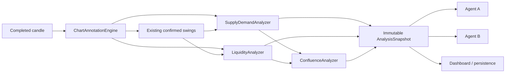
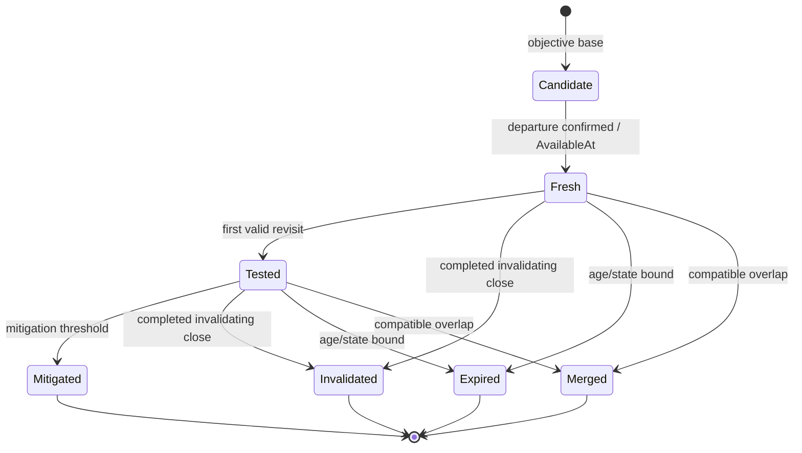
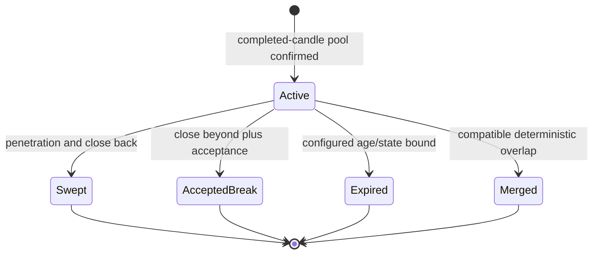
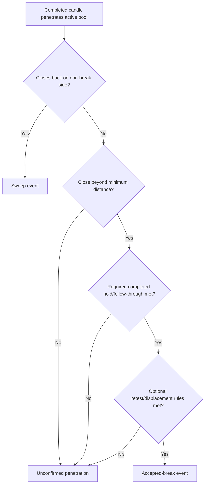
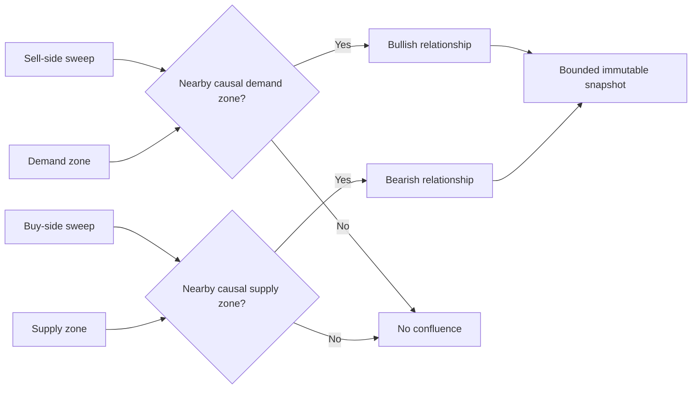
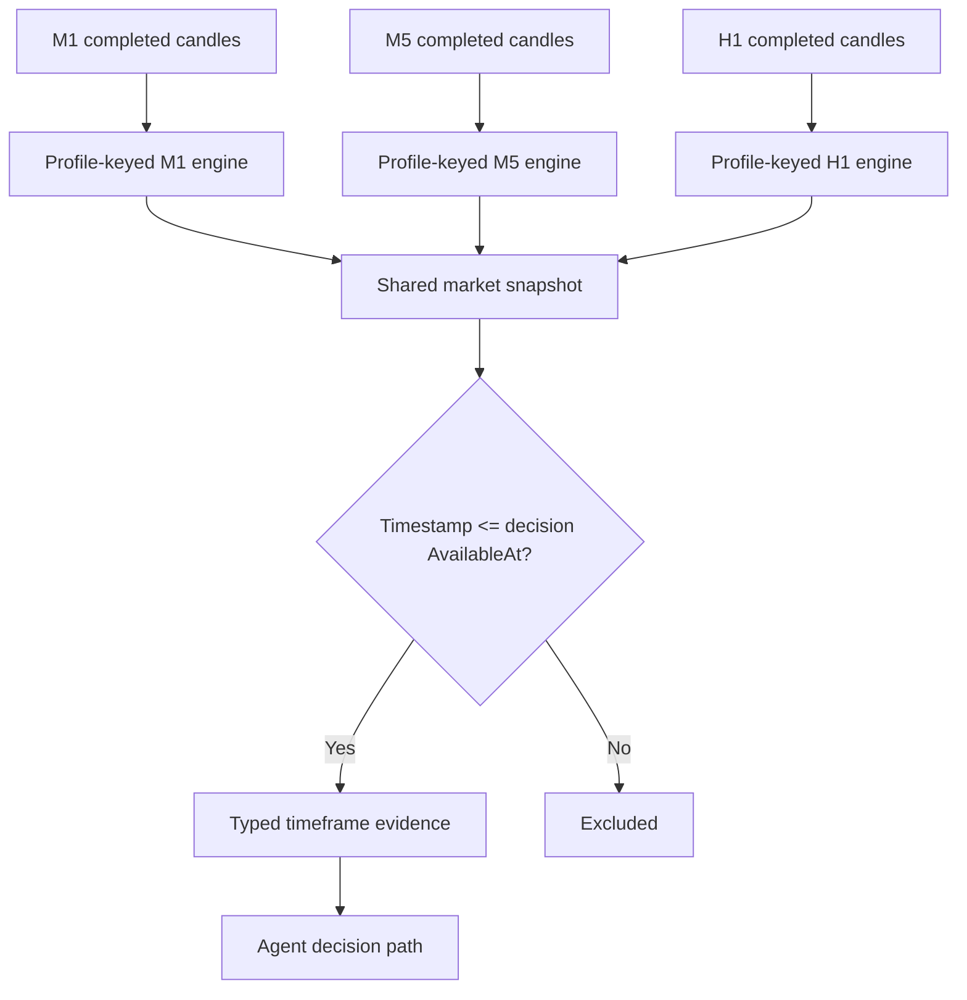
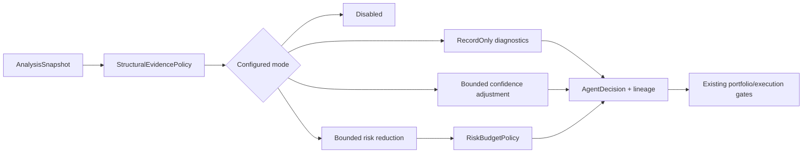
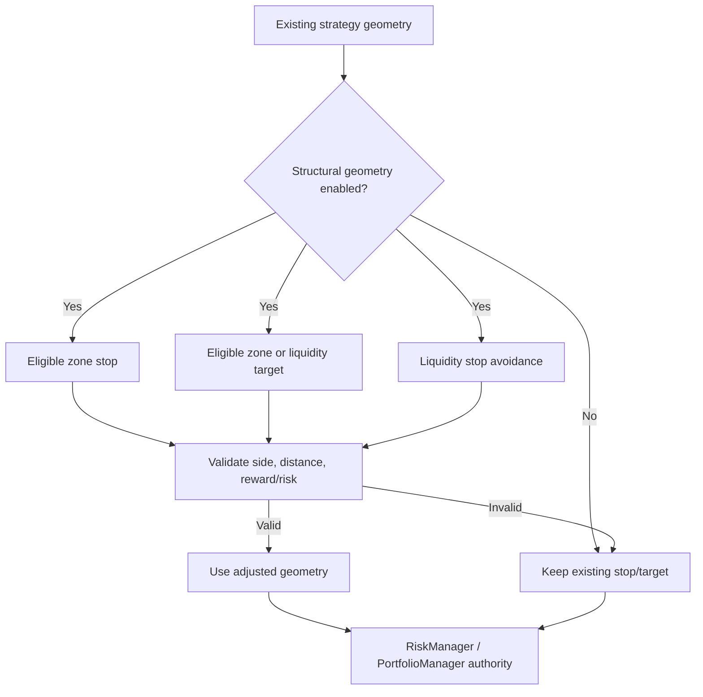
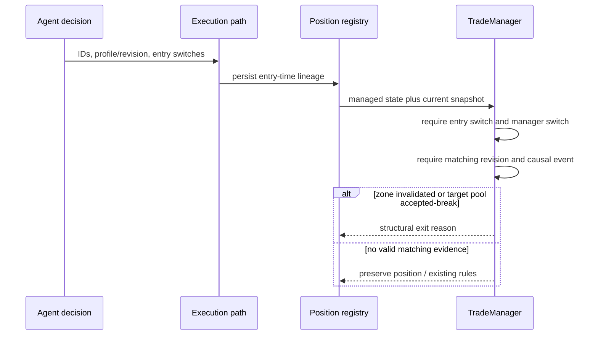
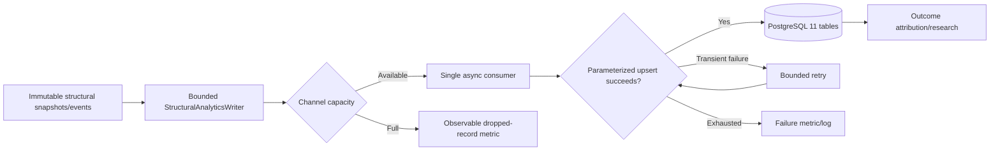

# Supply/Demand and Price-Inferred Liquidity Architecture Report

Date: 2026-07-18

The design extends `ChartAnnotationEngine` and existing execution paths. Analysis remains deterministic, causal, profile-isolated, and read-only with respect to trading. The diagrams below describe the delivered architecture.

## 1. Shared analysis pipeline

## 2. Supply/demand lifecycle

## 3. Liquidity lifecycle

## 4. Sweep versus accepted breakout

## 5. Confluence flow

## 6. Multi-timeframe flow

## 7. Agent evidence path

## 8. Stop/target path

## 9. Entry-pinned management lineage

## 10. PostgreSQL persistence flow

## Core guarantees

- Analyzer state belongs to a complete analysis-profile key; no mutable global detector state is introduced.
- Stable IDs are based on canonical source inputs and remain independent of thread scheduling.
- Origin, confirmation, and availability are distinct timestamps.
- Snapshots expose immutable, bounded collections.
- Agent policy and persistence consume snapshots; they do not mutate analysis.
- Trading remains under existing strategy, risk, portfolio, execution, and broker gates.
